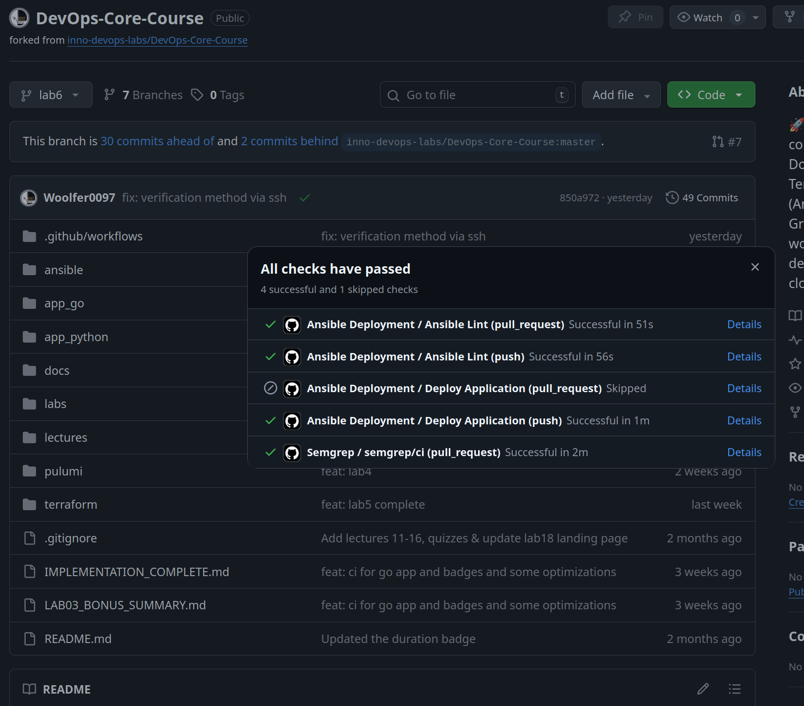

# Lab 6: Advanced Ansible & CI/CD - Submission

**Name:** Woolfer0097  
**Date:** 2026-03-03  
**Lab Points:** 10 (+ bonus not attempted)

---

## Overview

This lab upgrades the Ansible project to be more production-ready:

- Added **blocks + rescue/always** and a **tag strategy** to roles for selective execution and safer runs.
- Migrated app deployment from `docker_container` to **Docker Compose v2** using a **Jinja2 template**.
- Implemented **wipe logic** that is safe by default and supports both wipe-only and clean reinstall flows.
- Added **GitHub Actions** for `ansible-lint` + automated deployment + verification.

---

## Task 1: Blocks & Tags (2 pts)

### Blocks & tags implemented

- **`ansible/roles/common/tasks/main.yml`**
  - Packages block tagged `packages` with `rescue` and `always` logging
  - Users block tagged `users` with `always` logging
- **`ansible/roles/docker/tasks/main.yml`**
  - Install block tagged `docker_install` with retry-style `rescue` and `always` service enable/start
  - Config block tagged `docker_config` with `always` service enable/start
- **Role-level tags**
  - `ansible/playbooks/provision.yml` tags roles as `common` and `docker`

### Evidence 
```

woolfer0097@woolfer0097-Redmi-Book-Pro-15-2022 ~/C/D/ansible (lab6)> ansible-playbook playbooks/provision.yml --list-tags

playbook: playbooks/provision.yml

  play #1 (webservers): Provision web servers	TAGS: []
      TASK TAGS: [common, docker, docker_config, docker_install, packages, users]
woolfer0097@woolfer0097-Redmi-Book-Pro-15-2022 ~/C/D/ansible (lab6)> ansible-playbook playbooks/provision.yml --tags "docker"

PLAY [Provision web servers] *********************************************************************************************************************************

TASK [Gathering Facts] ***************************************************************************************************************************************
[WARNING]: Host 'woolfer-vm' is using the discovered Python interpreter at '/usr/bin/python3.12', but future installation of another Python interpreter could cause a different interpreter to be discovered. See https://docs.ansible.com/ansible-core/2.19/reference_appendices/interpreter_discovery.html for more information.
ok: [woolfer-vm]

TASK [docker : Install dependencies for Docker repo] *********************************************************************************************************
ok: [woolfer-vm]

TASK [docker : Add Docker GPG key] ***************************************************************************************************************************
changed: [woolfer-vm]

TASK [docker : Add Docker APT repository] ********************************************************************************************************************
changed: [woolfer-vm]

TASK [docker : Install Docker packages] **********************************************************************************************************************
changed: [woolfer-vm]

TASK [docker : Ensure Docker service is running and enabled] *************************************************************************************************
ok: [woolfer-vm]

TASK [docker : Add user to docker group] *********************************************************************************************************************
changed: [woolfer-vm]

TASK [docker : Install python3-docker (for Ansible docker modules)] ******************************************************************************************
changed: [woolfer-vm]

TASK [docker : Ensure Docker service is running and enabled] *************************************************************************************************
ok: [woolfer-vm]

RUNNING HANDLER [docker : restart docker] ********************************************************************************************************************
changed: [woolfer-vm]

PLAY RECAP ***************************************************************************************************************************************************
woolfer-vm                 : ok=10   changed=6    unreachable=0    failed=0    skipped=0    rescued=0    ignored=0   

woolfer0097@woolfer0097-Redmi-Book-Pro-15-2022 ~/C/D/ansible (lab6)> ansible-playbook playbooks/provision.yml --skip-tags "common"

PLAY [Provision web servers] *********************************************************************************************************************************

TASK [Gathering Facts] ***************************************************************************************************************************************
[WARNING]: Host 'woolfer-vm' is using the discovered Python interpreter at '/usr/bin/python3.12', but future installation of another Python interpreter could cause a different interpreter to be discovered. See https://docs.ansible.com/ansible-core/2.19/reference_appendices/interpreter_discovery.html for more information.
ok: [woolfer-vm]

TASK [docker : Install dependencies for Docker repo] *********************************************************************************************************
ok: [woolfer-vm]

TASK [docker : Add Docker GPG key] ***************************************************************************************************************************
ok: [woolfer-vm]

TASK [docker : Add Docker APT repository] ********************************************************************************************************************
ok: [woolfer-vm]

TASK [docker : Install Docker packages] **********************************************************************************************************************
ok: [woolfer-vm]

TASK [docker : Ensure Docker service is running and enabled] *************************************************************************************************
ok: [woolfer-vm]

TASK [docker : Add user to docker group] *********************************************************************************************************************
ok: [woolfer-vm]

TASK [docker : Install python3-docker (for Ansible docker modules)] ******************************************************************************************
ok: [woolfer-vm]

TASK [docker : Ensure Docker service is running and enabled] *************************************************************************************************
ok: [woolfer-vm]

PLAY RECAP ***************************************************************************************************************************************************
woolfer-vm                 : ok=9    changed=0    unreachable=0    failed=0    skipped=0    rescued=0    ignored=0   

woolfer0097@woolfer0097-Redmi-Book-Pro-15-2022 ~/C/D/ansible (lab6)> ansible-playbook playbooks/provision.yml --tags "packages"

PLAY [Provision web servers] *********************************************************************************************************************************

TASK [Gathering Facts] ***************************************************************************************************************************************
[WARNING]: Host 'woolfer-vm' is using the discovered Python interpreter at '/usr/bin/python3.12', but future installation of another Python interpreter could cause a different interpreter to be discovered. See https://docs.ansible.com/ansible-core/2.19/reference_appendices/interpreter_discovery.html for more information.
ok: [woolfer-vm]

TASK [common : Update apt cache] *****************************************************************************************************************************
ok: [woolfer-vm]

TASK [common : Install common packages] **********************************************************************************************************************
changed: [woolfer-vm]

TASK [common : Log packages block completion] ****************************************************************************************************************
changed: [woolfer-vm]

PLAY RECAP ***************************************************************************************************************************************************
woolfer-vm                 : ok=4    changed=2    unreachable=0    failed=0    skipped=0    rescued=0    ignored=0   
```

### Research answers (Task 1)

1. **What happens if rescue block also fails?**  
   The play fails (unless errors are explicitly ignored). `rescue` is still normal task execution; if it errors, Ansible stops and reports the failure.

2. **Can you have nested blocks?**  
   Yes. Blocks can be nested to create finer-grained grouping and error-handling scopes.

3. **How do tags inherit to tasks within blocks?**  
   Tags applied at the block level apply to tasks inside the block (and to `rescue`/`always` tasks too). Task-level tags can add additional tags.

---

## Task 2: Docker Compose (3 pts)

### Role rename

Renamed role from `app_deploy` → `web_app` and updated the deploy playbook:

- `ansible/playbooks/deploy.yml` now uses role `web_app`

### Docker Compose template

- **Template file:** `ansible/roles/web_app/templates/docker-compose.yml.j2`
- Supports variables:
  - `app_name`, `docker_image`, `docker_tag`
  - `app_port`, `app_internal_port`
  - `app_env` (optional)

### Role dependency

- **Dependency file:** `ansible/roles/web_app/meta/main.yml`
- Ensures `docker` role runs before `web_app`.

### Compose-based deployment

- **Main tasks:** `ansible/roles/web_app/tasks/main.yml`
  - Creates `compose_project_dir`
  - Templates `docker-compose.yml`
  - Uses `community.docker.docker_compose_v2` to bring the app up
  - Tags: `app_deploy`, `compose`

### Evidence

```

woolfer0097@woolfer0097-Redmi-Book-Pro-15-2022 ~/C/D/ansible (lab6) [4]> ansible-playbook playbooks/deploy.yml

PLAY [Deploy application] ************************************************************************************************************************************

TASK [Gathering Facts] ***************************************************************************************************************************************
[WARNING]: Host 'woolfer-vm' is using the discovered Python interpreter at '/usr/bin/python3.12', but future installation of another Python interpreter could cause a different interpreter to be discovered. See https://docs.ansible.com/ansible-core/2.19/reference_appendices/interpreter_discovery.html for more information.
ok: [woolfer-vm]

TASK [docker : Install dependencies for Docker repo] *********************************************************************************************************
ok: [woolfer-vm]

TASK [docker : Add Docker GPG key] ***************************************************************************************************************************
ok: [woolfer-vm]

TASK [docker : Add Docker APT repository] ********************************************************************************************************************
ok: [woolfer-vm]

TASK [docker : Install Docker packages] **********************************************************************************************************************
ok: [woolfer-vm]

TASK [docker : Ensure Docker service is running and enabled] *************************************************************************************************
ok: [woolfer-vm]

TASK [docker : Add user to docker group] *********************************************************************************************************************
ok: [woolfer-vm]

TASK [docker : Install python3-docker (for Ansible docker modules)] ******************************************************************************************
ok: [woolfer-vm]

TASK [docker : Ensure Docker service is running and enabled] *************************************************************************************************
ok: [woolfer-vm]

TASK [web_app : Include wipe tasks] **************************************************************************************************************************
included: /home/woolfer0097/Code/DevOps-Core-Course1/ansible/roles/web_app/tasks/wipe.yml for woolfer-vm

TASK [web_app : Check if docker-compose.yml exists] **********************************************************************************************************
skipping: [woolfer-vm]

TASK [web_app : Stop and remove containers] ******************************************************************************************************************
skipping: [woolfer-vm]

TASK [web_app : Remove docker-compose.yml file] **************************************************************************************************************
skipping: [woolfer-vm]

TASK [web_app : Remove application directory] ****************************************************************************************************************
skipping: [woolfer-vm]

TASK [web_app : Log wipe completion] *************************************************************************************************************************
skipping: [woolfer-vm]

TASK [web_app : Docker Hub login (optional)] *****************************************************************************************************************
changed: [woolfer-vm]

TASK [web_app : Create app directory] ************************************************************************************************************************
changed: [woolfer-vm]

TASK [web_app : Template docker-compose.yml] *****************************************************************************************************************
changed: [woolfer-vm]

TASK [web_app : Deploy with Docker Compose v2] ***************************************************************************************************************
[WARNING]: Docker compose: unknown None: /opt/devops-info-python/docker-compose.yml: the attribute `version` is obsolete, it will be ignored, please remove it to avoid potential confusion
changed: [woolfer-vm]

PLAY RECAP ***************************************************************************************************************************************************
woolfer-vm                 : ok=14   changed=4    unreachable=0    failed=0    skipped=5    rescued=0    ignored=0   

woolfer0097@woolfer0097-Redmi-Book-Pro-15-2022 ~/C/D/ansible (lab6)> ansible-playbook playbooks/deploy.yml

PLAY [Deploy application] ************************************************************************************************************************************

TASK [Gathering Facts] ***************************************************************************************************************************************
[WARNING]: Host 'woolfer-vm' is using the discovered Python interpreter at '/usr/bin/python3.12', but future installation of another Python interpreter could cause a different interpreter to be discovered. See https://docs.ansible.com/ansible-core/2.19/reference_appendices/interpreter_discovery.html for more information.
ok: [woolfer-vm]

TASK [docker : Install dependencies for Docker repo] *********************************************************************************************************
ok: [woolfer-vm]

TASK [docker : Add Docker GPG key] ***************************************************************************************************************************
ok: [woolfer-vm]

TASK [docker : Add Docker APT repository] ********************************************************************************************************************
ok: [woolfer-vm]

TASK [docker : Install Docker packages] **********************************************************************************************************************
ok: [woolfer-vm]

TASK [docker : Ensure Docker service is running and enabled] *************************************************************************************************
ok: [woolfer-vm]

TASK [docker : Add user to docker group] *********************************************************************************************************************
ok: [woolfer-vm]

TASK [docker : Install python3-docker (for Ansible docker modules)] ******************************************************************************************
ok: [woolfer-vm]

TASK [docker : Ensure Docker service is running and enabled] *************************************************************************************************
ok: [woolfer-vm]

TASK [web_app : Include wipe tasks] **************************************************************************************************************************
included: /home/woolfer0097/Code/DevOps-Core-Course1/ansible/roles/web_app/tasks/wipe.yml for woolfer-vm

TASK [web_app : Check if docker-compose.yml exists] **********************************************************************************************************
skipping: [woolfer-vm]

TASK [web_app : Stop and remove containers] ******************************************************************************************************************
skipping: [woolfer-vm]

TASK [web_app : Remove docker-compose.yml file] **************************************************************************************************************
skipping: [woolfer-vm]

TASK [web_app : Remove application directory] ****************************************************************************************************************
skipping: [woolfer-vm]

TASK [web_app : Log wipe completion] *************************************************************************************************************************
skipping: [woolfer-vm]

TASK [web_app : Docker Hub login (optional)] *****************************************************************************************************************
ok: [woolfer-vm]

TASK [web_app : Create app directory] ************************************************************************************************************************
ok: [woolfer-vm]

TASK [web_app : Template docker-compose.yml] *****************************************************************************************************************
ok: [woolfer-vm]

TASK [web_app : Deploy with Docker Compose v2] ***************************************************************************************************************
[WARNING]: Docker compose: unknown None: /opt/devops-info-python/docker-compose.yml: the attribute `version` is obsolete, it will be ignored, please remove it to avoid potential confusion
ok: [woolfer-vm]

PLAY RECAP ***************************************************************************************************************************************************
woolfer-vm                 : ok=14   changed=0    unreachable=0    failed=0    skipped=5    rescued=0    ignored=0   

woolfer0097@woolfer0097-Redmi-Book-Pro-15-2022 ~/C/D/ansible (lab6)> ansible-playbook playbooks/deploy.yml

PLAY [Deploy application] ************************************************************************************************************************************

TASK [Gathering Facts] ***************************************************************************************************************************************
[WARNING]: Host 'woolfer-vm' is using the discovered Python interpreter at '/usr/bin/python3.12', but future installation of another Python interpreter could cause a different interpreter to be discovered. See https://docs.ansible.com/ansible-core/2.19/reference_appendices/interpreter_discovery.html for more information.
ok: [woolfer-vm]

TASK [docker : Install dependencies for Docker repo] *********************************************************************************************************
ok: [woolfer-vm]

TASK [docker : Add Docker GPG key] ***************************************************************************************************************************
ok: [woolfer-vm]

TASK [docker : Add Docker APT repository] ********************************************************************************************************************
ok: [woolfer-vm]

TASK [docker : Install Docker packages] **********************************************************************************************************************
ok: [woolfer-vm]

TASK [docker : Ensure Docker service is running and enabled] *************************************************************************************************
sshok: [woolfer-vm]

TASK [docker : Add user to docker group] *********************************************************************************************************************
ok: [woolfer-vm]

TASK [docker : Install python3-docker (for Ansible docker modules)] ******************************************************************************************
ok: [woolfer-vm]

TASK [docker : Ensure Docker service is running and enabled] *************************************************************************************************
ok: [woolfer-vm]

TASK [web_app : Include wipe tasks] **************************************************************************************************************************
included: /home/woolfer0097/Code/DevOps-Core-Course1/ansible/roles/web_app/tasks/wipe.yml for woolfer-vm

TASK [web_app : Check if docker-compose.yml exists] **********************************************************************************************************
skipping: [woolfer-vm]

TASK [web_app : Stop and remove containers] ******************************************************************************************************************
skipping: [woolfer-vm]

TASK [web_app : Remove docker-compose.yml file] **************************************************************************************************************
skipping: [woolfer-vm]

TASK [web_app : Remove application directory] ****************************************************************************************************************
skipping: [woolfer-vm]

TASK [web_app : Log wipe completion] *************************************************************************************************************************
skipping: [woolfer-vm]

TASK [web_app : Docker Hub login (optional)] *****************************************************************************************************************
ok: [woolfer-vm]

TASK [web_app : Create app directory] ************************************************************************************************************************
ok: [woolfer-vm]

TASK [web_app : Template docker-compose.yml] *****************************************************************************************************************
ok: [woolfer-vm]

TASK [web_app : Deploy with Docker Compose v2] ***************************************************************************************************************
[WARNING]: Docker compose: unknown None: /opt/devops-info-python/docker-compose.yml: the attribute `version` is obsolete, it will be ignored, please remove it to avoid potential confusion
ok: [woolfer-vm]

PLAY RECAP ***************************************************************************************************************************************************
woolfer-vm                 : ok=14   changed=0    unreachable=0    failed=0    skipped=5    rescued=0    ignored=0   

woolfer0097@woolfer0097-Redmi-Book-Pro-15-2022 ~/C/D/ansible (lab6)> ssh ubuntu@158.160.56.244
Welcome to Ubuntu 24.04.4 LTS (GNU/Linux 6.8.0-100-generic x86_64)

 * Documentation:  https://help.ubuntu.com
 * Management:     https://landscape.canonical.com
 * Support:        https://ubuntu.com/pro

 System information as of Tue Mar  3 10:36:18 UTC 2026

  System load:  0.12              Processes:             109
  Usage of /:   34.8% of 9.04GB   Users logged in:       0
  Memory usage: 34%               IPv4 address for eth0: 10.128.0.28
  Swap usage:   0%


Expanded Security Maintenance for Applications is not enabled.

17 updates can be applied immediately.
15 of these updates are standard security updates.
To see these additional updates run: apt list --upgradable

Enable ESM Apps to receive additional future security updates.
See https://ubuntu.com/esm or run: sudo pro status


Last login: Tue Mar  3 10:34:35 2026 from 87.117.185.161
ubuntu@fhm9nrgvlota36vv51c6:~$ sudo cat /opt/devops-info-python/docker-compose.yml
version: "3.8"

services:
  devops-info-python:
    image: "woolfer0097kek/devops-info-python:latest"
    container_name: "devops-info-python"
    ports:
      - "5000:8000"
    restart: unless-stopped
ubuntu@fhm9nrgvlota36vv51c6:~$ docker ps
CONTAINER ID   IMAGE                                      COMMAND                  CREATED          STATUS          PORTS                                                   NAMES
953786eb8bab   woolfer0097kek/devops-info-python:latest   "uvicorn app:app --h…"   10 minutes ago   Up 10 minutes   5000/tcp, 0.0.0.0:5000->8000/tcp, [::]:5000->8000/tcp   devops-info-python
ubuntu@fhm9nrgvlota36vv51c6:~$ docker compose -f /opt/devops-info-python/docker-compose.yml ps
WARN[0000] /opt/devops-info-python/docker-compose.yml: the attribute `version` is obsolete, it will be ignored, please remove it to avoid potential confusion 
NAME                 IMAGE                                      COMMAND                  SERVICE              CREATED          STATUS          PORTS
devops-info-python   woolfer0097kek/devops-info-python:latest   "uvicorn app:app --h…"   devops-info-python   10 minutes ago   Up 10 minutes   5000/tcp, 0.0.0.0:5000->8000/tcp, [::]:5000->8000/tcp
```

### Research answers (Task 2)

1. **`restart: always` vs `restart: unless-stopped`**  
   `always` restarts the container whenever it exits (including after daemon restart).  
   `unless-stopped` does the same **unless** the container was manually stopped; in that case it stays stopped across daemon restarts.

2. **Docker Compose networks vs Docker bridge networks**  
   Compose creates and manages **project-scoped networks** (by default) and connects services by name with built-in DNS.  
   A plain Docker bridge network can be manually created/managed and attached to containers; Compose typically abstracts this and namespaces resources per project.

3. **Referencing Ansible Vault variables in templates**  
   Yes — Vault-encrypted variables decrypt at runtime (given the vault password) and can be used like normal variables inside Jinja2 templates (be careful not to leak secrets into logs/artifacts).

4. **`community.docker.docker_compose_v2` basics**  
   - `state: present` ensures the project is up (roughly “compose up”)  
   - `state: absent` brings it down (roughly “compose down”)  
   - `recreate` controls whether containers are recreated (`auto`, `always`, `never` depending on module support/version)

---

## Task 3: Wipe Logic (1 pt)

### Implementation

- **Defaults:** `ansible/roles/web_app/defaults/main.yml`
  - `web_app_wipe: false`
- **Wipe tasks:** `ansible/roles/web_app/tasks/wipe.yml`
  - Tagged `web_app_wipe`
  - Gated by `when: web_app_wipe | bool`
- **Included first:** `ansible/roles/web_app/tasks/main.yml`
  - Includes wipe before deployment so clean reinstall works (wipe → deploy)

### Test scenarios

```
woolfer0097@woolfer0097-Redmi-Book-Pro-15-2022 ~/C/D/ansible (lab6)> ansible-playbook playbooks/deploy.yml -e "web_app_wipe=true" --tags web_app_wipe

PLAY [Deploy application] ************************************************************************************************************************************

TASK [Gathering Facts] ***************************************************************************************************************************************
[WARNING]: Host 'woolfer-vm' is using the discovered Python interpreter at '/usr/bin/python3.12', but future installation of another Python interpreter could cause a different interpreter to be discovered. See https://docs.ansible.com/ansible-core/2.19/reference_appendices/interpreter_discovery.html for more information.
ok: [woolfer-vm]

TASK [web_app : Include wipe tasks] **************************************************************************************************************************
included: /home/woolfer0097/Code/DevOps-Core-Course1/ansible/roles/web_app/tasks/wipe.yml for woolfer-vm

TASK [web_app : Check if docker-compose.yml exists] **********************************************************************************************************
ok: [woolfer-vm]

TASK [web_app : Stop and remove containers] ******************************************************************************************************************
[WARNING]: Docker compose: unknown None: /opt/devops-info-python/docker-compose.yml: the attribute `version` is obsolete, it will be ignored, please remove it to avoid potential confusion
changed: [woolfer-vm]

TASK [web_app : Remove docker-compose.yml file] **************************************************************************************************************
changed: [woolfer-vm]

TASK [web_app : Remove application directory] ****************************************************************************************************************
changed: [woolfer-vm]

TASK [web_app : Log wipe completion] *************************************************************************************************************************
ok: [woolfer-vm] => {
    "msg": "Application devops-info-python wiped successfully"
}

PLAY RECAP ***************************************************************************************************************************************************
woolfer-vm                 : ok=7    changed=3    unreachable=0    failed=0    skipped=0    rescued=0    ignored=0   

woolfer0097@woolfer0097-Redmi-Book-Pro-15-2022 ~/C/D/ansible (lab6)> ansible-playbook playbooks/deploy.yml -e "web_app_wipe=true"

PLAY [Deploy application] ************************************************************************************************************************************

TASK [Gathering Facts] ***************************************************************************************************************************************
[WARNING]: Host 'woolfer-vm' is using the discovered Python interpreter at '/usr/bin/python3.12', but future installation of another Python interpreter could cause a different interpreter to be discovered. See https://docs.ansible.com/ansible-core/2.19/reference_appendices/interpreter_discovery.html for more information.
ok: [woolfer-vm]

TASK [docker : Install dependencies for Docker repo] *********************************************************************************************************
ok: [woolfer-vm]

TASK [docker : Add Docker GPG key] ***************************************************************************************************************************
ok: [woolfer-vm]

TASK [docker : Add Docker APT repository] ********************************************************************************************************************
ok: [woolfer-vm]

TASK [docker : Install Docker packages] **********************************************************************************************************************
ok: [woolfer-vm]

TASK [docker : Ensure Docker service is running and enabled] *************************************************************************************************
ok: [woolfer-vm]

TASK [docker : Add user to docker group] *********************************************************************************************************************
ok: [woolfer-vm]

TASK [docker : Install python3-docker (for Ansible docker modules)] ******************************************************************************************
ok: [woolfer-vm]

TASK [docker : Ensure Docker service is running and enabled] *************************************************************************************************
ok: [woolfer-vm]

TASK [web_app : Include wipe tasks] **************************************************************************************************************************
included: /home/woolfer0097/Code/DevOps-Core-Course1/ansible/roles/web_app/tasks/wipe.yml for woolfer-vm

TASK [web_app : Check if docker-compose.yml exists] **********************************************************************************************************
ok: [woolfer-vm]

TASK [web_app : Stop and remove containers] ******************************************************************************************************************
skipping: [woolfer-vm]

TASK [web_app : Remove docker-compose.yml file] **************************************************************************************************************
ok: [woolfer-vm]

TASK [web_app : Remove application directory] ****************************************************************************************************************
ok: [woolfer-vm]

TASK [web_app : Log wipe completion] *************************************************************************************************************************
ok: [woolfer-vm] => {
    "msg": "Application devops-info-python wiped successfully"
}

TASK [web_app : Docker Hub login (optional)] *****************************************************************************************************************
ok: [woolfer-vm]

TASK [web_app : Create app directory] ************************************************************************************************************************
changed: [woolfer-vm]

TASK [web_app : Template docker-compose.yml] *****************************************************************************************************************
changed: [woolfer-vm]

TASK [web_app : Deploy with Docker Compose v2] ***************************************************************************************************************
[WARNING]: Docker compose: unknown None: /opt/devops-info-python/docker-compose.yml: the attribute `version` is obsolete, it will be ignored, please remove it to avoid potential confusion
changed: [woolfer-vm]

PLAY RECAP ***************************************************************************************************************************************************
woolfer-vm                 : ok=18   changed=3    unreachable=0    failed=0    skipped=1    rescued=0    ignored=0   

woolfer0097@woolfer0097-Redmi-Book-Pro-15-2022 ~/C/D/ansible (lab6)> ansible-playbook playbooks/deploy.yml --tags web_app_wipe

PLAY [Deploy application] ************************************************************************************************************************************

TASK [Gathering Facts] ***************************************************************************************************************************************
[WARNING]: Host 'woolfer-vm' is using the discovered Python interpreter at '/usr/bin/python3.12', but future installation of another Python interpreter could cause a different interpreter to be discovered. See https://docs.ansible.com/ansible-core/2.19/reference_appendices/interpreter_discovery.html for more information.
ok: [woolfer-vm]

TASK [web_app : Include wipe tasks] **************************************************************************************************************************
included: /home/woolfer0097/Code/DevOps-Core-Course1/ansible/roles/web_app/tasks/wipe.yml for woolfer-vm

TASK [web_app : Check if docker-compose.yml exists] **********************************************************************************************************
skipping: [woolfer-vm]

TASK [web_app : Stop and remove containers] ******************************************************************************************************************
skipping: [woolfer-vm]

TASK [web_app : Remove docker-compose.yml file] **************************************************************************************************************
skipping: [woolfer-vm]

TASK [web_app : Remove application directory] ****************************************************************************************************************
skipping: [woolfer-vm]

TASK [web_app : Log wipe completion] *************************************************************************************************************************
skipping: [woolfer-vm]

PLAY RECAP ***************************************************************************************************************************************************
woolfer-vm                 : ok=2    changed=0    unreachable=0    failed=0    skipped=5    rescued=0    ignored=0   
```



### Research answers (Task 3)

1. **Why use both variable AND tag?**  
   The variable is a hard safety gate (wipe doesn’t happen unless explicitly enabled). The tag enables a “wipe-only” mode without running deployment tasks.

2. **Difference between `never` tag and this approach**  
   The `never` tag prevents execution unless explicitly tagged, but it’s easy to misread and can be overridden by tag selection. The variable+tag approach makes the wipe intent explicit in runtime configuration and supports both wipe-only and clean reinstall flows.

3. **Why must wipe logic come BEFORE deployment?**  
   For clean reinstall, you need a deterministic ordering: remove old deployment first, then deploy fresh. Putting wipe first guarantees that if enabled, it runs before compose up.

4. **Clean reinstall vs rolling update**  
   - Clean reinstall: when state/config drift is suspected, major configuration changes, corrupted volumes, or when you want a known-clean slate.  
   - Rolling update: when you want minimal downtime and preserve state/volumes while updating an image/version.

5. **Extending to wipe images/volumes**  
   Add optional flags/vars that (when enabled) call `docker image rm ...` and remove named volumes/networks; keep those as additional gated steps because they’re more destructive and may impact other apps.

---

## Task 4: CI/CD (3 pts)

### Workflow added

- **File:** `.github/workflows/ansible-deploy.yml`
- **Triggers:** Push/PR on changes under `ansible/**`
- **Jobs:**
  - `lint`: installs `ansible` + `ansible-lint`, runs `ansible-lint`
  - `deploy`: sets up SSH, writes vault password file, runs deployment, verifies with `curl`

### Required GitHub Secrets

Set these in GitHub repo Settings → Secrets and variables → Actions:

- `ANSIBLE_VAULT_PASSWORD`
- `SSH_PRIVATE_KEY`
- `VM_HOST`
- `VM_USER`
- Optional:
  - `APP_PORT` (defaults to `8000`)
  - `HEALTHCHECK_PATH` (defaults to `/health`)

### Evidence

- Screenshot of a successful run (lint + deploy + verify)
- Logs showing `ansible-lint` passing
- Logs showing `ansible-playbook` execution
- Verify step output showing `curl` succeeds

### Research answers (Task 4)

1. **Security implications of storing SSH keys in GitHub Secrets**  
   Secrets reduce accidental exposure, but compromise of repo admin permissions or CI runner environment could leak keys. Mitigations: least-privilege keys, short-lived keys/certs, IP allowlists, rotate regularly, and restrict who can trigger deployments.

2. **Staging → production pipeline**  
   Use separate environments (e.g., `staging` and `production`) with approvals for production, different inventories/vars, and gated promotion (deploy staging on push, deploy production on release/tag or manual approval).

3. **Adding rollbacks**  
   Pin versions (image tags), keep previous known-good tag, and add an explicit “rollback” workflow input that redeploys the last good version. Also store release metadata and validate health before promotion.

4. **How self-hosted runner improves security vs GitHub-hosted**  
   It avoids sending SSH keys to a shared runner environment and can run inside your trusted network perimeter. You can limit network egress/ingress and reduce exposure of long-lived credentials.

---

## Task 5: Documentation (1 pt)

This file (`ansible/docs/LAB06.md`) is the documentation and evidence record for Lab 6.

---

## Testing Results (fill in)

- Tag runs (`--tags`, `--skip-tags`)
- Docker Compose idempotency (2nd/3rd run mostly `ok`)
- Wipe scenarios 1–4
- GitHub Actions workflow run
- Application reachable via `curl`

---

## Challenges & Solutions (fill in)

- What broke?
- How it was diagnosed?
- What was changed to fix it?

---

## Summary

- **Key learnings:** blocks/rescue/always, tag-driven runs, Compose templating, dependency ordering, safe wipe patterns, CD via GitHub Actions.
- **Time spent:** 6 hours
