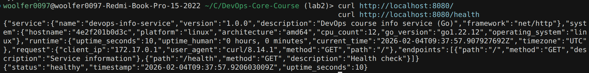

# Lab 2 Bonus — Go Multi-Stage Build

## 1. Multi-Stage Strategy

- **Builder stage (`golang:1.22-alpine`)**: has the Go toolchain and modules; compiles the app.
- **Runtime stage (`alpine:3.20`)**: minimal image with only the compiled binary and a non-root user.
- `CGO_ENABLED=0 GOOS=linux GOARCH=amd64 go build` produces a binary that runs fine on the tiny Alpine base.

Key idea: keep compilers and build tools only in the first stage; ship just the binary in the final image.

## 2. Size Comparison

Run these locally and record the numbers:

```bash
cd app_go

# Builder-style image (if you build a single-stage image for comparison)
docker build -t devops-info-go:single -f Dockerfile.single .
docker images devops-info-go:single

# Multi-stage image (this Dockerfile)
docker build -t devops-info-go:multi .
docker images devops-info-go:multi
```

**Your results (example format):**

- Single-stage: `<size>` (approx)
- Multi-stage: `<size>` (approx)
- **Reduction:** `<difference>` saved → smaller attack surface, faster pulls.

## 3. Why Multi-Stage Matters

- **Smaller images:** no Go toolchain, headers, or build cache in the final image.
- **Security:** fewer binaries and packages → fewer vulnerabilities and a tighter attack surface.
- **Clean separation of concerns:** build environment vs. runtime environment.

## 4. Build & Run

```bash
cd app_go
docker build -t devops-info-go:multi .
docker run -p 8080:8080 devops-info-go:multi
```

Test endpoints:

```bash
curl http://localhost:8080/
curl http://localhost:8080/health
```



## 5. Stage-by-Stage Explanation

- **Stage 1 (builder):**
  - Uses `golang:1.22-alpine`.
  - Downloads modules (`go mod download`) and builds the binary.
- **Stage 2 (runtime):**
  - Uses `alpine:3.20` with a non-root user (`appuser`).
  - Copies only `/app/devops-info-service-go` from the builder.
  - Exposes port `8080` and starts the binary as `ENTRYPOINT`.

