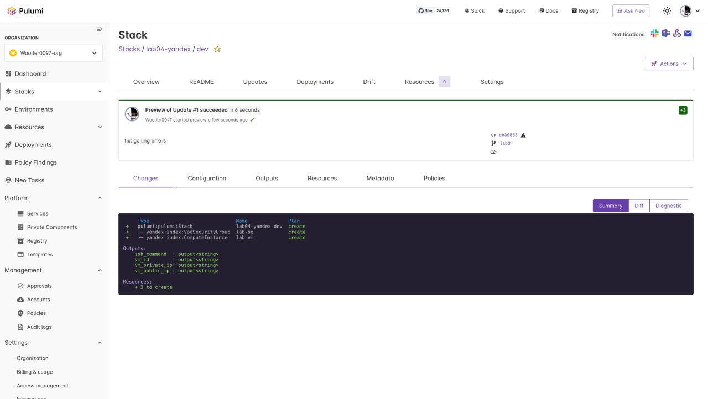
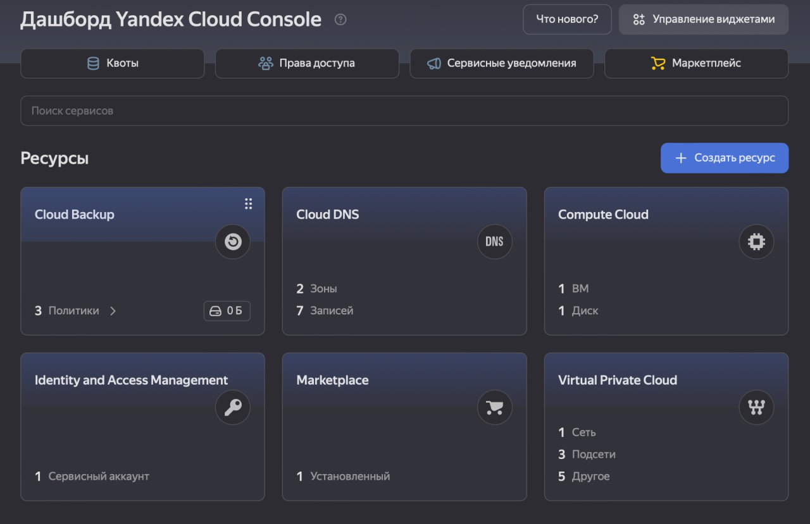
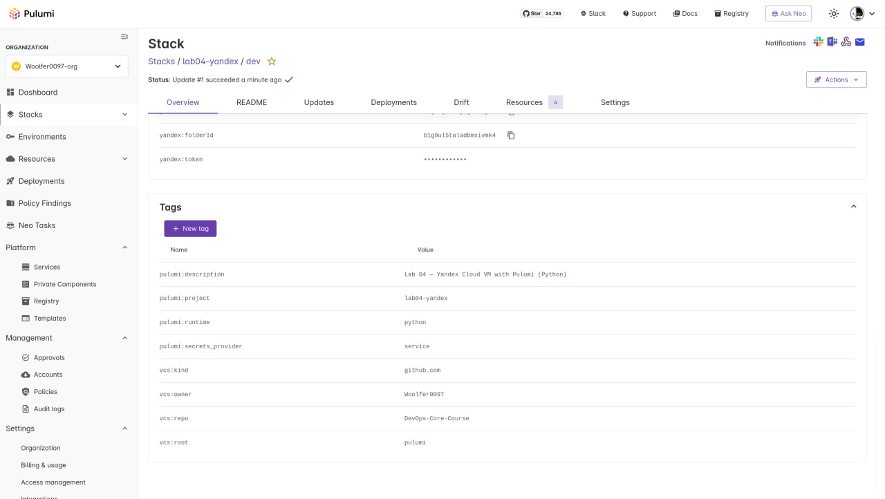

# Lab 04 — Infrastructure as Code

## 1. Cloud Provider & Infrastructure

- **Provider:** Yandex Cloud
- **Rationale:** Free tier available, accessible in Russia, good Terraform/Pulumi support
- **Instance:** standard-v2, 2 vCPU (20%), 1 GB RAM, 10 GB HDD
- **Zone:** ru-central1-a
- **OS:** Ubuntu 24.04 LTS
- **Cost:** $0 (free tier)
- **Resources created:**
  - VPC Network
  - Subnet (10.0.1.0/24)
  - Security Group (SSH:22, HTTP:80, App:5000)
  - Compute Instance with public IP

## 2. Terraform Implementation

- **Terraform version:** >= 1.9.0
- **Provider:** yandex-cloud/yandex >= 0.129.0

**Project structure:**
```
terraform/
├── main.tf          — provider, data sources, all resources
├── variables.tf     — input variables (token, cloud/folder IDs, zone, SSH key)
├── outputs.tf       — VM public/private IP, SSH command
├── .gitignore       — state files, tfvars, credentials
└── terraform.tfvars — actual secrets (gitignored)
```

**Key decisions:**
- Used `data.yandex_compute_image` to dynamically fetch latest Ubuntu 24.04 image
- `core_fraction = 20` for free tier eligibility
- `nat = true` on network interface for public IP
- SSH key injected via instance metadata

**Commands:**
```bash
cd terraform/
terraform init
terraform plan
terraform apply
ssh ubuntu@<PUBLIC_IP>
```

woolfer0097@woolfer0097-Redmi-Book-Pro-15-2022 ~/C/DevOps-Core-Course (lab3)> cd terraform/

woolfer0097@woolfer0097-Redmi-Book-Pro-15-2022 ~/C/D/terraform (lab3) [1]> terraform init
Initializing the backend...
Initializing provider plugins...
- Finding yandex-cloud/yandex versions matching ">= 0.129.0"...
╷
│ Error: Invalid provider registry host
│ 
│ The host "registry.terraform.io" given in provider source address "registry.terraform.io/yandex-cloud/yandex" does not
│ offer a Terraform provider registry.
╵
woolfer0097@woolfer0097-Redmi-Book-Pro-15-2022 ~/C/D/terraform (lab3) [1]> terraform init
Initializing the backend...
Initializing provider plugins...
- Finding yandex-cloud/yandex versions matching ">= 0.129.0"...
- Installing yandex-cloud/yandex v0.187.0...
- Installed yandex-cloud/yandex v0.187.0 (self-signed, key ID E40F590B50BB8E40)
Partner and community providers are signed by their developers.
If you'd like to know more about provider signing, you can read about it here:
https://developer.hashicorp.com/terraform/cli/plugins/signing
Terraform has created a lock file .terraform.lock.hcl to record the provider
selections it made above. Include this file in your version control repository
so that Terraform can guarantee to make the same selections by default when
you run "terraform init" in the future.

Terraform has been successfully initialized!

You may now begin working with Terraform. Try running "terraform plan" to see
any changes that are required for your infrastructure. All Terraform commands
should now work.

If you ever set or change modules or backend configuration for Terraform,
rerun this command to reinitialize your working directory. If you forget, other
commands will detect it and remind you to do so if necessary.
woolfer0097@woolfer0097-Redmi-Book-Pro-15-2022 ~/C/D/terraform (lab3)> terraform plan
data.yandex_compute_image.ubuntu: Reading...
data.yandex_compute_image.ubuntu: Read complete after 2s [id=fd8q1krrgc5pncjckeht]

Terraform used the selected providers to generate the following execution plan. Resource actions are indicated with the
following symbols:
  + create

Terraform will perform the following actions:

  # yandex_compute_instance.lab will be created
  + resource "yandex_compute_instance" "lab" {
      + created_at                = (known after apply)
      + folder_id                 = (known after apply)
      + fqdn                      = (known after apply)
      + gpu_cluster_id            = (known after apply)
      + hardware_generation       = (known after apply)
      + hostname                  = (known after apply)
      + id                        = (known after apply)
      + labels                    = {
          + "project" = "devops-lab04"
          + "tool"    = "terraform"
        }
      + maintenance_grace_period  = (known after apply)
      + maintenance_policy        = (known after apply)
      + metadata                  = {
          + "ssh-keys" = <<-EOT
                woolfer:ssh-rsa [REDACTED-SSH-PUBLIC-KEY] vpn-backend
            EOT
        }
      + name                      = "lab-vm"
      + network_acceleration_type = "standard"
      + platform_id               = "standard-v2"
      + status                    = (known after apply)
      + zone                      = "ru-central1-a"

      + boot_disk {
          + auto_delete = true
          + device_name = (known after apply)
          + disk_id     = (known after apply)
          + mode        = (known after apply)

          + initialize_params {
              + block_size  = (known after apply)
              + description = (known after apply)
              + image_id    = "fd8q1krrgc5pncjckeht"
              + name        = (known after apply)
              + size        = 10
              + snapshot_id = (known after apply)
              + type        = "network-hdd"
            }
        }

      + metadata_options (known after apply)

      + network_interface {
          + index              = (known after apply)
          + ip_address         = (known after apply)
          + ipv4               = true
          + ipv6               = (known after apply)
          + ipv6_address       = (known after apply)
          + mac_address        = (known after apply)
          + nat                = true
          + nat_ip_address     = (known after apply)
          + nat_ip_version     = (known after apply)
          + security_group_ids = (known after apply)
          + subnet_id          = (known after apply)
        }

      + placement_policy (known after apply)

      + resources {
          + core_fraction = 20
          + cores         = 2
          + memory        = 1
        }

      + scheduling_policy (known after apply)
    }

  # yandex_vpc_network.lab will be created
  + resource "yandex_vpc_network" "lab" {
      + created_at                = (known after apply)
      + default_security_group_id = (known after apply)
      + folder_id                 = (known after apply)
      + id                        = (known after apply)
      + labels                    = (known after apply)
      + name                      = "lab-network"
      + subnet_ids                = (known after apply)
    }

  # yandex_vpc_security_group.lab will be created
  + resource "yandex_vpc_security_group" "lab" {
      + created_at = (known after apply)
      + folder_id  = (known after apply)
      + id         = (known after apply)
      + labels     = (known after apply)
      + name       = "lab-sg"
      + network_id = (known after apply)
      + status     = (known after apply)

      + egress {
          + description       = "Allow all outbound"
          + from_port         = -1
          + id                = (known after apply)
          + labels            = (known after apply)
          + port              = -1
          + protocol          = "ANY"
          + to_port           = -1
          + v4_cidr_blocks    = [
              + "0.0.0.0/0",
            ]
          + v6_cidr_blocks    = []
            # (2 unchanged attributes hidden)
        }

      + ingress {
          + description       = "App"
          + from_port         = -1
          + id                = (known after apply)
          + labels            = (known after apply)
          + port              = 5000
          + protocol          = "TCP"
          + to_port           = -1
          + v4_cidr_blocks    = [
              + "0.0.0.0/0",
            ]
          + v6_cidr_blocks    = []
            # (2 unchanged attributes hidden)
        }
      + ingress {
          + description       = "HTTP"
          + from_port         = -1
          + id                = (known after apply)
          + labels            = (known after apply)
          + port              = 80
          + protocol          = "TCP"
          + to_port           = -1
          + v4_cidr_blocks    = [
              + "0.0.0.0/0",
            ]
          + v6_cidr_blocks    = []
            # (2 unchanged attributes hidden)
        }
      + ingress {
          + description       = "SSH"
          + from_port         = -1
          + id                = (known after apply)
          + labels            = (known after apply)
          + port              = 22
          + protocol          = "TCP"
          + to_port           = -1
          + v4_cidr_blocks    = [
              + "0.0.0.0/0",
            ]
          + v6_cidr_blocks    = []
            # (2 unchanged attributes hidden)
        }
    }

  # yandex_vpc_subnet.lab will be created
  + resource "yandex_vpc_subnet" "lab" {
      + created_at     = (known after apply)
      + folder_id      = (known after apply)
      + id             = (known after apply)
      + labels         = (known after apply)
      + name           = "lab-subnet"
      + network_id     = (known after apply)
      + v4_cidr_blocks = [
          + "10.0.1.0/24",
        ]
      + v6_cidr_blocks = (known after apply)
      + zone           = "ru-central1-a"
    }

Plan: 4 to add, 0 to change, 0 to destroy.

Changes to Outputs:
  + ssh_command   = (known after apply)
  + vm_id         = (known after apply)
  + vm_private_ip = (known after apply)
  + vm_public_ip  = (known after apply)

────────────────────────────────────────────────────────────────────────────────────────────────────────────────────────

Note: You didn't use the -out option to save this plan, so Terraform can't guarantee to take exactly these actions if
you run "terraform apply" now.

woolfer0097@woolfer0097-Redmi-Book-Pro-15-2022 ~/C/D/terraform (lab3) [1]> terraform apply
data.yandex_vpc_subnet.default: Reading...
data.yandex_vpc_network.default: Reading...
data.yandex_compute_image.ubuntu: Reading...
data.yandex_vpc_subnet.default: Read complete after 2s [id=e9bu69enu1ev2gcl79nl]
data.yandex_compute_image.ubuntu: Read complete after 2s [id=fd8q1krrgc5pncjckeht]
data.yandex_vpc_network.default: Read complete after 3s [id=enp93sgg09cutu4hr44s]

Terraform used the selected providers to generate the following execution plan. Resource actions are indicated with the
following symbols:
  + create

Terraform will perform the following actions:

  # yandex_compute_instance.lab will be created
  + resource "yandex_compute_instance" "lab" {
      + created_at                = (known after apply)
      + folder_id                 = (known after apply)
      + fqdn                      = (known after apply)
      + gpu_cluster_id            = (known after apply)
      + hardware_generation       = (known after apply)
      + hostname                  = (known after apply)
      + id                        = (known after apply)
      + labels                    = {
          + "project" = "devops-lab04"
          + "tool"    = "terraform"
        }
      + maintenance_grace_period  = (known after apply)
      + maintenance_policy        = (known after apply)
      + metadata                  = {
          + "ssh-keys" = <<-EOT
                woolfer:ssh-rsa [REDACTED-SSH-PUBLIC-KEY] vpn-backend
            EOT
        }
      + name                      = "lab-vm"
      + network_acceleration_type = "standard"
      + platform_id               = "standard-v2"
      + status                    = (known after apply)
      + zone                      = "ru-central1-a"

      + boot_disk {
          + auto_delete = true
          + device_name = (known after apply)
          + disk_id     = (known after apply)
          + mode        = (known after apply)

          + initialize_params {
              + block_size  = (known after apply)
              + description = (known after apply)
              + image_id    = "fd8q1krrgc5pncjckeht"
              + name        = (known after apply)
              + size        = 10
              + snapshot_id = (known after apply)
              + type        = "network-hdd"
            }
        }

      + metadata_options (known after apply)

      + network_interface {
          + index              = (known after apply)
          + ip_address         = (known after apply)
          + ipv4               = true
          + ipv6               = (known after apply)
          + ipv6_address       = (known after apply)
          + mac_address        = (known after apply)
          + nat                = true
          + nat_ip_address     = (known after apply)
          + nat_ip_version     = (known after apply)
          + security_group_ids = (known after apply)
          + subnet_id          = "e9bu69enu1ev2gcl79nl"
        }

      + placement_policy (known after apply)

      + resources {
          + core_fraction = 20
          + cores         = 2
          + memory        = 1
        }

      + scheduling_policy (known after apply)
    }

  # yandex_vpc_security_group.lab will be created
  + resource "yandex_vpc_security_group" "lab" {
      + created_at = (known after apply)
      + folder_id  = (known after apply)
      + id         = (known after apply)
      + labels     = (known after apply)
      + name       = "lab-sg"
      + network_id = "enp93sgg09cutu4hr44s"
      + status     = (known after apply)

      + egress {
          + description       = "Allow all outbound"
          + from_port         = -1
          + id                = (known after apply)
          + labels            = (known after apply)
          + port              = -1
          + protocol          = "ANY"
          + to_port           = -1
          + v4_cidr_blocks    = [
              + "0.0.0.0/0",
            ]
          + v6_cidr_blocks    = []
            # (2 unchanged attributes hidden)
        }

      + ingress {
          + description       = "App"
          + from_port         = -1
          + id                = (known after apply)
          + labels            = (known after apply)
          + port              = 5000
          + protocol          = "TCP"
          + to_port           = -1
          + v4_cidr_blocks    = [
              + "0.0.0.0/0",
            ]
          + v6_cidr_blocks    = []
            # (2 unchanged attributes hidden)
        }
      + ingress {
          + description       = "HTTP"
          + from_port         = -1
          + id                = (known after apply)
          + labels            = (known after apply)
          + port              = 80
          + protocol          = "TCP"
          + to_port           = -1
          + v4_cidr_blocks    = [
              + "0.0.0.0/0",
            ]
          + v6_cidr_blocks    = []
            # (2 unchanged attributes hidden)
        }
      + ingress {
          + description       = "SSH"
          + from_port         = -1
          + id                = (known after apply)
          + labels            = (known after apply)
          + port              = 22
          + protocol          = "TCP"
          + to_port           = -1
          + v4_cidr_blocks    = [
              + "0.0.0.0/0",
            ]
          + v6_cidr_blocks    = []
            # (2 unchanged attributes hidden)
        }
    }

Plan: 2 to add, 0 to change, 0 to destroy.

Changes to Outputs:
  + ssh_command   = (known after apply)
  + vm_id         = (known after apply)
  + vm_private_ip = (known after apply)
  + vm_public_ip  = (known after apply)

Do you want to perform these actions?
  Terraform will perform the actions described above.
  Only 'yes' will be accepted to approve.

  Enter a value: yes

yandex_vpc_security_group.lab: Creating...
yandex_vpc_security_group.lab: Creation complete after 4s [id=enpv2jral15230nueiao]
yandex_compute_instance.lab: Creating...
yandex_compute_instance.lab: Still creating... [00m10s elapsed]
yandex_compute_instance.lab: Still creating... [00m20s elapsed]
yandex_compute_instance.lab: Still creating... [00m30s elapsed]
yandex_compute_instance.lab: Still creating... [00m40s elapsed]
yandex_compute_instance.lab: Still creating... [00m50s elapsed]
yandex_compute_instance.lab: Still creating... [01m00s elapsed]
yandex_compute_instance.lab: Creation complete after 1m3s [id=fhmq8grtsk3nrutmg9fk]

Apply complete! Resources: 2 added, 0 changed, 0 destroyed.

Outputs:

ssh_command = "ssh woolfer@93.77.191.92"
vm_id = "fhmq8grtsk3nrutmg9fk"
vm_private_ip = "10.128.0.31"
vm_public_ip = "93.77.191.92"
woolfer0097@woolfer0097-Redmi-Book-Pro-15-2022 ~/C/D/terraform (lab3)> ssh woolfer@93.77.191.92
The authenticity of host '93.77.191.92 (93.77.191.92)' can't be established.
ED25519 key fingerprint is SHA256:x/2e4CPj8xScs7id/FlX00HkeVWPMv5Lw2WDbZu4MZs.
This key is not known by any other names.
Are you sure you want to continue connecting (yes/no/[fingerprint])? yes
Warning: Permanently added '93.77.191.92' (ED25519) to the list of known hosts.
Welcome to Ubuntu 24.04.4 LTS (GNU/Linux 6.8.0-100-generic x86_64)

 * Documentation:  https://help.ubuntu.com
 * Management:     https://landscape.canonical.com
 * Support:        https://ubuntu.com/pro

 System information as of Thu Feb 19 16:22:53 UTC 2026

  System load:  0.29              Processes:             103
  Usage of /:   22.1% of 9.04GB   Users logged in:       0
  Memory usage: 20%               IPv4 address for eth0: 10.128.0.31
  Swap usage:   0%


Expanded Security Maintenance for Applications is not enabled.

0 updates can be applied immediately.

Enable ESM Apps to receive additional future security updates.
See https://ubuntu.com/esm or run: sudo pro status
 


The programs included with the Ubuntu system are free software;
the exact distribution terms for each program are described in the
individual files in /usr/share/doc/*/copyright.

Ubuntu comes with ABSOLUTELY NO WARRANTY, to the extent permitted by
applicable law.

woolfer@fhmq8grtsk3nrutmg9fk:~$ ls
woolfer@fhmq8grtsk3nrutmg9fk:~$ 

## 3. Pulumi Implementation

- **Pulumi version:** 3.x
- **Language:** Python
- **Provider package:** pulumi-yandex

**How code differs from Terraform:**
- Resources defined as Python objects instead of HCL blocks
- Config read via `pulumi.Config()` instead of `variable` blocks
- Outputs via `pulumi.export()` instead of `output` blocks
- Native Python features (f-strings, file reading, imports)

**Commands:**
```bash
cd pulumi/
python -m venv venv && source venv/bin/activate
pip install -r requirements.txt
pulumi stack init dev
pulumi config set yandex:token <TOKEN> --secret
pulumi config set yandex:cloudId <CLOUD_ID>
pulumi config set yandex:folderId <FOLDER_ID>
pulumi preview
pulumi up
```

oolfer0097@woolfer0097-Redmi-Book-Pro-15-2022 ~/C/DevOps-Core-Course (lab3)> cd pulumi && python3 -m venv venv && source venv/bin/activate.fish &&
                                                                                  pip install -r requirements.txt && 
                                                                                  pulumi stack init dev &&
                                                                                  pulumi config set yandex:token <TOKEN> --secret &&
                                                                                  pulumi config set yandex:cloudId <CLOUD_ID> &&
                                                                                  pulumi config set yandex:folderId <FOLDER_ID> &&
                                                                                  pulumi preview &&
                                                                                  pulumi up
Collecting pulumi>=3.0.0 (from -r requirements.txt (line 1))
  Using cached pulumi-3.222.0-py3-none-any.whl.metadata (3.8 kB)
Collecting pulumi-yandex>=0.13.0 (from -r requirements.txt (line 2))
  Using cached pulumi_yandex-0.13.0-py3-none-any.whl
Collecting debugpy~=1.8.7 (from pulumi>=3.0.0->-r requirements.txt (line 1))
  Using cached debugpy-1.8.20-cp313-cp313-manylinux_2_34_x86_64.whl.metadata (1.4 kB)
Collecting dill~=0.4 (from pulumi>=3.0.0->-r requirements.txt (line 1))
  Using cached dill-0.4.1-py3-none-any.whl.metadata (10 kB)
Collecting grpcio<2,>=1.68.1 (from pulumi>=3.0.0->-r requirements.txt (line 1))
  Using cached grpcio-1.78.0-cp313-cp313-manylinux2014_x86_64.manylinux_2_17_x86_64.whl.metadata (3.8 kB)
Requirement already satisfied: pip>=24.3.1 in ./venv/lib/python3.13/site-packages (from pulumi>=3.0.0->-r requirements.txt (line 1)) (25.1.1)
Collecting protobuf<7,>=3.20.3 (from pulumi>=3.0.0->-r requirements.txt (line 1))
  Using cached protobuf-6.33.5-cp39-abi3-manylinux2014_x86_64.whl.metadata (593 bytes)
Collecting pyyaml~=6.0 (from pulumi>=3.0.0->-r requirements.txt (line 1))
  Using cached pyyaml-6.0.3-cp313-cp313-manylinux2014_x86_64.manylinux_2_17_x86_64.manylinux_2_28_x86_64.whl.metadata (2.4 kB)
Collecting semver~=3.0 (from pulumi>=3.0.0->-r requirements.txt (line 1))
  Using cached semver-3.0.4-py3-none-any.whl.metadata (6.8 kB)
Collecting typing-extensions~=4.12 (from grpcio<2,>=1.68.1->pulumi>=3.0.0->-r requirements.txt (line 1))
  Using cached typing_extensions-4.15.0-py3-none-any.whl.metadata (3.3 kB)
Collecting parver>=0.2.1 (from pulumi-yandex>=0.13.0->-r requirements.txt (line 2))
  Using cached parver-0.5-py3-none-any.whl.metadata (2.7 kB)
Collecting arpeggio>=1.7 (from parver>=0.2.1->pulumi-yandex>=0.13.0->-r requirements.txt (line 2))
  Using cached Arpeggio-2.0.3-py2.py3-none-any.whl.metadata (2.4 kB)
Collecting attrs>=19.2 (from parver>=0.2.1->pulumi-yandex>=0.13.0->-r requirements.txt (line 2))
  Using cached attrs-25.4.0-py3-none-any.whl.metadata (10 kB)
Using cached pulumi-3.222.0-py3-none-any.whl (390 kB)
Using cached debugpy-1.8.20-cp313-cp313-manylinux_2_34_x86_64.whl (4.3 MB)
Using cached dill-0.4.1-py3-none-any.whl (120 kB)
Using cached grpcio-1.78.0-cp313-cp313-manylinux2014_x86_64.manylinux_2_17_x86_64.whl (6.7 MB)
Using cached protobuf-6.33.5-cp39-abi3-manylinux2014_x86_64.whl (323 kB)
Using cached pyyaml-6.0.3-cp313-cp313-manylinux2014_x86_64.manylinux_2_17_x86_64.manylinux_2_28_x86_64.whl (801 kB)
Using cached semver-3.0.4-py3-none-any.whl (17 kB)
Using cached typing_extensions-4.15.0-py3-none-any.whl (44 kB)
Using cached parver-0.5-py3-none-any.whl (15 kB)
Using cached Arpeggio-2.0.3-py2.py3-none-any.whl (54 kB)
Using cached attrs-25.4.0-py3-none-any.whl (67 kB)
Installing collected packages: arpeggio, typing-extensions, semver, pyyaml, protobuf, dill, debugpy, attrs, parver, grpcio, pulumi, pulumi-yandex
Successfully installed arpeggio-2.0.3 attrs-25.4.0 debugpy-1.8.20 dill-0.4.1 grpcio-1.78.0 parver-0.5 protobuf-6.33.5 pulumi-3.222.0 pulumi-yandex-0.13.0 pyyaml-6.0.3 semver-3.0.4 typing-extensions-4.15.0
Manage your Pulumi stacks by logging in.
Run `pulumi login --help` for alternative login options.
Enter your access token from https://app.pulumi.com/account/tokens
    or hit <ENTER> to log in using your browser                   :  


  Welcome to Pulumi!

  Pulumi helps you create, deploy, and manage infrastructure on any cloud using
  your favorite language. You can get started today with Pulumi at:

      https://www.pulumi.com/docs/get-started/

  Tip: Resources you create with Pulumi are given unique names (a randomly
  generated suffix) by default. To learn more about auto-naming or customizing resource
  names see https://www.pulumi.com/docs/intro/concepts/resources/#autonaming.


Previewing update (dev)

View in Browser (Ctrl+O): https://app.pulumi.com/Woolfer0097-org/lab04-yandex/dev/previews/48425e72-2d5b-47ce-aa48-a9f6e72a7283

     Type                 Name              Plan       Info
 +   pulumi:pulumi:Stack  lab04-yandex-dev  create     1 error

Diagnostics:
  pulumi:pulumi:Stack (lab04-yandex-dev):
    error: Program failed with an unhandled exception:
    Traceback (most recent call last):
      File "/home/woolfer0097/Code/DevOps-Core-Course/pulumi/__main__.py", line 2, in <module>
        import pulumi_yandex as yandex
      File "/home/woolfer0097/Code/DevOps-Core-Course/pulumi/venv/lib/python3.13/site-packages/pulumi_yandex/__init__.py", line 5, in <module>
        from . import _utilities
      File "/home/woolfer0097/Code/DevOps-Core-Course/pulumi/venv/lib/python3.13/site-packages/pulumi_yandex/_utilities.py", line 10, in <module>
        import pkg_resources
    ModuleNotFoundError: No module named 'pkg_resources'

Resources:
    + 1 to create
    1 errored

(venv) woolfer0097@woolfer0097-Redmi-Book-Pro-15-2022 ~/C/D/pulumi (lab3) [0|255]> pip install setuptools && pulumi preview
Collecting setuptools
  Using cached setuptools-82.0.0-py3-none-any.whl.metadata (6.6 kB)
Using cached setuptools-82.0.0-py3-none-any.whl (1.0 MB)
Installing collected packages: setuptools
Successfully installed setuptools-82.0.0
Previewing update (dev)

View in Browser (Ctrl+O): https://app.pulumi.com/Woolfer0097-org/lab04-yandex/dev/previews/46a9564e-19cc-40b7-b4d5-fe53de49434c

     Type                 Name              Plan       Info
 +   pulumi:pulumi:Stack  lab04-yandex-dev  create     1 error

Diagnostics:
  pulumi:pulumi:Stack (lab04-yandex-dev):
    error: Program failed with an unhandled exception:
    Traceback (most recent call last):
      File "/home/woolfer0097/Code/DevOps-Core-Course/pulumi/__main__.py", line 2, in <module>
        import pulumi_yandex as yandex
      File "/home/woolfer0097/Code/DevOps-Core-Course/pulumi/venv/lib/python3.13/site-packages/pulumi_yandex/__init__.py", line 5, in <module>
        from . import _utilities
      File "/home/woolfer0097/Code/DevOps-Core-Course/pulumi/venv/lib/python3.13/site-packages/pulumi_yandex/_utilities.py", line 10, in <module>
        import pkg_resources
    ModuleNotFoundError: No module named 'pkg_resources'

Resources:
    + 1 to create
    1 errored

(venv) woolfer0097@woolfer0097-Redmi-Book-Pro-15-2022 ~/C/D/pulumi (lab3) [0|255]> pip uninstall pulumi-yandex -y && pip install pulumi-yandex>=0.13.0
Found existing installation: pulumi_yandex 0.13.0
Uninstalling pulumi_yandex-0.13.0:
  Successfully uninstalled pulumi_yandex-0.13.0
(venv) woolfer0097@woolfer0097-Redmi-Book-Pro-15-2022 ~/C/D/pulumi (lab3)> pulumi preview
Previewing update (dev)

View in Browser (Ctrl+O): https://app.pulumi.com/Woolfer0097-org/lab04-yandex/dev/previews/e74e2dae-16e6-4f31-aa6f-f84383ea2c09

     Type                 Name              Plan       Info
 +   pulumi:pulumi:Stack  lab04-yandex-dev  create     1 error

Diagnostics:
  pulumi:pulumi:Stack (lab04-yandex-dev):
    error: Program failed with an unhandled exception:
    Traceback (most recent call last):
      File "/home/woolfer0097/Code/DevOps-Core-Course/pulumi/__main__.py", line 1, in <module>
        import pkg_resources  # Required for pulumi-yandex compatibility
        ^^^^^^^^^^^^^^^^^^^^
    ModuleNotFoundError: No module named 'pkg_resources'

Resources:
    + 1 to create
    1 errored

(venv) woolfer0097@woolfer0097-Redmi-Book-Pro-15-2022 ~/C/D/pulumi (lab3)> pip install "setuptools<70"

Collecting setuptools<70
  Downloading setuptools-69.5.1-py3-none-any.whl.metadata (6.2 kB)
Downloading setuptools-69.5.1-py3-none-any.whl (894 kB)
   ━━━━━━━━━━━━━━━━━━━━━━━━━━━━━━━━━━━━━━━━ 894.6/894.6 kB 439.8 kB/s eta 0:00:00
Installing collected packages: setuptools
  Attempting uninstall: setuptools
    Found existing installation: setuptools 82.0.0
    Uninstalling setuptools-82.0.0:
      Successfully uninstalled setuptools-82.0.0
Successfully installed setuptools-69.5.1
(venv) woolfer0097@woolfer0097-Redmi-Book-Pro-15-2022 ~/C/D/pulumi (lab3)> pulumi preview
Previewing update (dev)

View in Browser (Ctrl+O): https://app.pulumi.com/Woolfer0097-org/lab04-yandex/dev/previews/7a32598b-c5de-40b1-8b88-fb680301fa0a

     Type                              Name              Plan       
 +   pulumi:pulumi:Stack               lab04-yandex-dev  create     
 +   ├─ yandex:index:VpcSecurityGroup  lab-sg            create     
 +   └─ yandex:index:ComputeInstance   lab-vm            create     

Outputs:
    ssh_command  : [unknown]
    vm_id        : [unknown]
    vm_private_ip: [unknown]
    vm_public_ip : [unknown]

Resources:
    + 3 to create


(venv) woolfer0097@woolfer0097-Redmi-Book-Pro-15-2022 ~/C/D/pulumi (lab3)> pulumi up
Previewing update (dev)

View in Browser (Ctrl+O): https://app.pulumi.com/Woolfer0097-org/lab04-yandex/dev/previews/474ce988-9ad2-4f36-bab8-6ad0740e651a

     Type                              Name              Plan       
 +   pulumi:pulumi:Stack               lab04-yandex-dev  create     
 +   ├─ yandex:index:VpcSecurityGroup  lab-sg            create     
 +   └─ yandex:index:ComputeInstance   lab-vm            create     

Outputs:
    ssh_command  : [unknown]
    vm_id        : [unknown]
    vm_private_ip: [unknown]
    vm_public_ip : [unknown]

Resources:
    + 3 to create

Do you want to perform this update? yes
Updating (dev)

View in Browser (Ctrl+O): https://app.pulumi.com/Woolfer0097-org/lab04-yandex/dev/updates/1

     Type                              Name              Status            
 +   pulumi:pulumi:Stack               lab04-yandex-dev  created (45s)     
 +   ├─ yandex:index:VpcSecurityGroup  lab-sg            created (2s)      
 +   └─ yandex:index:ComputeInstance   lab-vm            created (37s)     

Outputs:
    ssh_command  : "ssh ubuntu@89.169.156.165"
    vm_id        : "fhm3j98nn1kf46hrogld"
    vm_private_ip: "10.128.0.9"
    vm_public_ip : "89.169.156.165"

Resources:
    + 3 created

Duration: 47s
venv) woolfer0097@woolfer0097-Redmi-Book-Pro-15-2022 ~/C/D/pulumi (lab3) [0|255]> ssh ubuntu@89.169.156.165
The authenticity of host '89.169.156.165 (89.169.156.165)' can't be established.
ED25519 key fingerprint is SHA256:ODpBg45/v36nW1toz3U9IhKoq7qp6d9ftskZgVuf3wo.
This key is not known by any other names.
Are you sure you want to continue connecting (yes/no/[fingerprint])? yes
Warning: Permanently added '89.169.156.165' (ED25519) to the list of known hosts.
Welcome to Ubuntu 24.04.4 LTS (GNU/Linux 6.8.0-100-generic x86_64)

 * Documentation:  https://help.ubuntu.com
 * Management:     https://landscape.canonical.com
 * Support:        https://ubuntu.com/pro

 System information as of Thu Feb 19 16:59:40 UTC 2026

  System load:  0.09              Processes:             104
  Usage of /:   22.1% of 9.04GB   Users logged in:       0
  Memory usage: 19%               IPv4 address for eth0: 10.128.0.9
  Swap usage:   0%


Expanded Security Maintenance for Applications is not enabled.

0 updates can be applied immediately.

Enable ESM Apps to receive additional future security updates.
See https://ubuntu.com/esm or run: sudo pro status


The programs included with the Ubuntu system are free software;
the exact distribution terms for each program are described in the
individual files in /usr/share/doc/*/copyright.

Ubuntu comes with ABSOLUTELY NO WARRANTY, to the extent permitted by
applicable law.

To run a command as administrator (user "root"), use "sudo <command>".
See "man sudo_root" for details.

ubuntu@fhm3j98nn1kf46hrogld:~$ ls -la
total 28
drwxr-x--- 4 ubuntu ubuntu 4096 Feb 19 16:59 .
drwxr-xr-x 3 root   root   4096 Feb 19 16:57 ..
-rw-r--r-- 1 ubuntu ubuntu  220 Mar 31  2024 .bash_logout
-rw-r--r-- 1 ubuntu ubuntu 3771 Mar 31  2024 .bashrc
drwx------ 2 ubuntu ubuntu 4096 Feb 19 16:59 .cache
-rw-r--r-- 1 ubuntu ubuntu  807 Mar 31  2024 .profile
drwx------ 2 ubuntu ubuntu 4096 Feb 19 16:57 .ssh
ubuntu@fhm3j98nn1kf46hrogld:~$ 





## 4. Terraform vs Pulumi Comparison

**Ease of Learning:** Terraform's HCL is simpler for basic infra — fewer concepts and a clear declarative model. Pulumi requires knowing both the IaC concepts and a programming language, but if you already know Python it feels natural.

**Code Readability:** Terraform is more concise for simple resources. Pulumi's Python code is more verbose due to `*Args` classes, but offers better IDE support with autocomplete and type hints.

**Debugging:** Pulumi errors include Python stack traces which are familiar. Terraform errors reference HCL line numbers and can be cryptic for complex expressions.

**Documentation:** Terraform has a larger community and more examples online. Pulumi docs are good but fewer community examples exist, especially for Yandex Cloud.

**Use Case:** Terraform for straightforward infra with broad team adoption. Pulumi when you need complex logic, reuse via functions/classes, or your team already uses Python/TypeScript heavily.

## 5. Lab 5 Preparation & Cleanup

- **Keeping VM for Lab 5:** Yes / No (choose one)
- **Which VM:** Pulumi-created (or Terraform — pick one)
- **Cleanup:** `terraform destroy` / `pulumi destroy` run for the other tool

<!-- TODO: fill in actual decisions and paste destroy output -->
