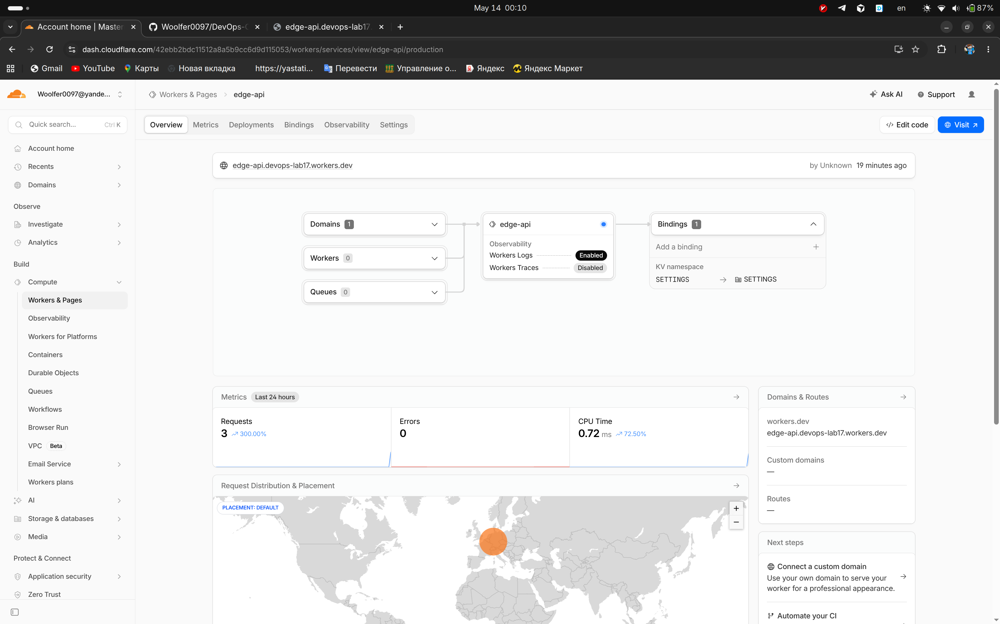
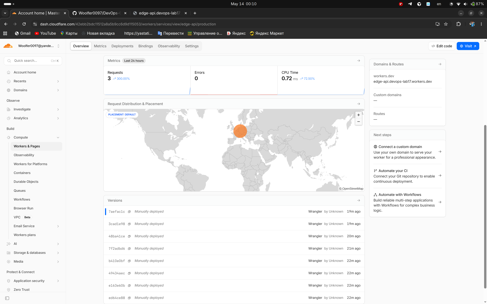
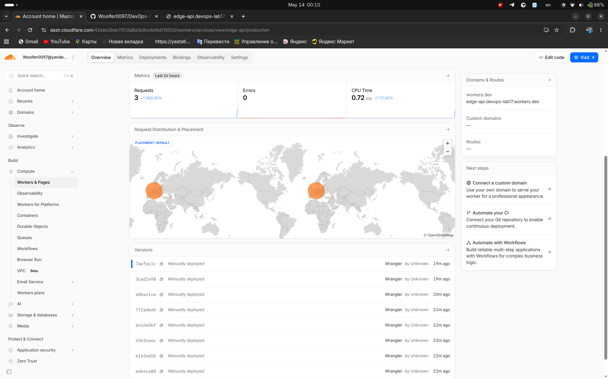
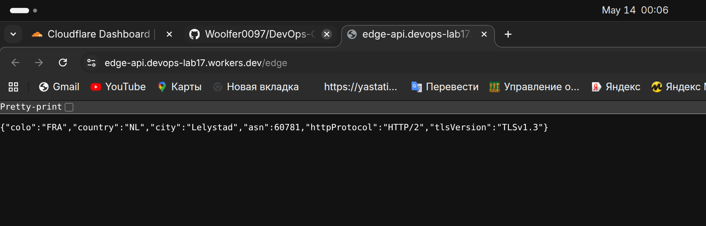
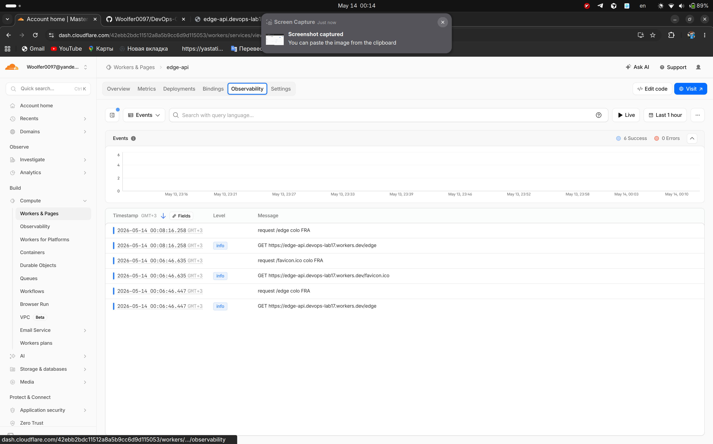
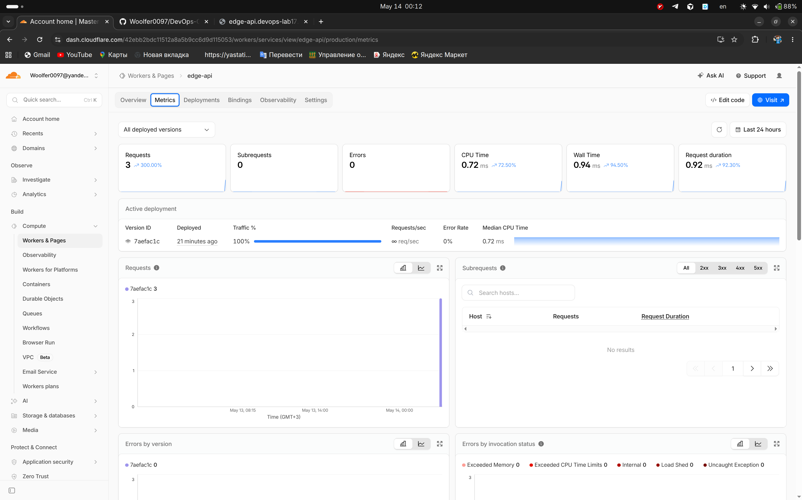
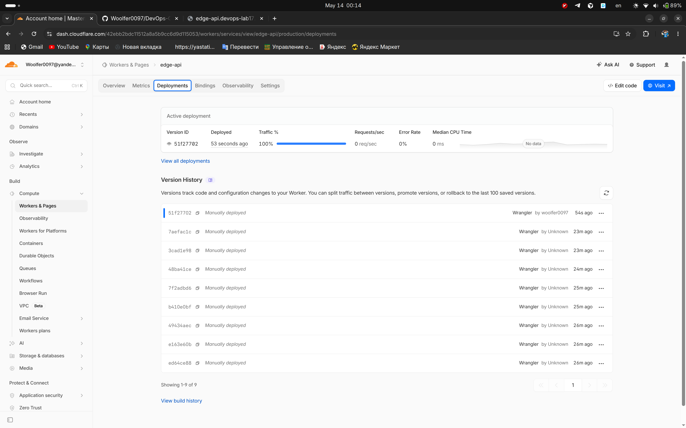
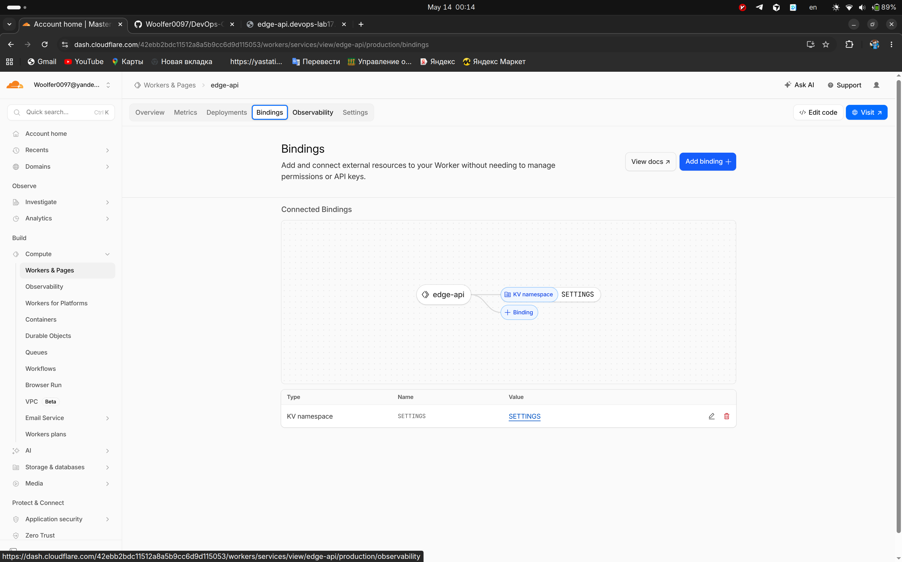

# Lab 17 — Workers deployment summary

## Deployment

| Item | Value |
|------|--------|
| **Worker URL** | `https://edge-api.devops-lab17.workers.dev` |
| **Account workers.dev subdomain** | `devops-lab17.workers.dev` (registered via dashboard/API) |
| **Worker name** | `edge-api` |
| **KV namespace** | `SETTINGS` → binding `SETTINGS` (id in `wrangler.jsonc`) |

### Routes

| Path | Purpose |
|------|--------|
| `GET /` | App info and route list |
| `GET /health` | Liveness JSON |
| `GET /edge` | Cloudflare request metadata (`request.cf`) |
| `GET /deploy` | Deployment-oriented JSON (uses plaintext `vars` + masked secret-derived contact) |
| `GET /counter` | Increment persisted visit counter in KV (`visits`) |
| `POST /counter?reset=1` | Reset counter (requires `Authorization: Bearer <API_TOKEN>` secret) |

### Configuration

- **Plaintext vars** (`wrangler.jsonc` → `vars`): `APP_NAME`, `COURSE_NAME`, `DEPLOYMENT_LABEL`. These are visible in the dashboard and in the uploaded bundle metadata; they must not hold credentials (anyone with config access can read them).
- **Secrets** (Wrangler, not in Git): `API_TOKEN`, `ADMIN_EMAIL` — used in code for auth and masked display on `/deploy`.
- **KV**: `SETTINGS` stores key `visits` for `/counter`.

### Persistence check

1. Call `GET /counter` several times and note `visits`.
2. Run `npx wrangler deploy` again (or change only `DEPLOYMENT_LABEL` and redeploy).
3. Call `GET /counter` again: the counter continues from the stored value (KV is not tied to a single Worker version). Rollbacks also do not revert KV data.

---

## Evidence

### Dashboard




### Example `GET /edge` JSON

```
woolfer0097@woolfer0097-Redmi-Book-Pro-15-2022 ~/C/DevOps-Core-Course1 (lab17)> curl -sS https://edge-api.devops-lab17.workers.dev/edge
{"colo":"FRA","country":"NL","city":"Lelystad","asn":60781,"httpProtocol":"HTTP/2","tlsVersion":"TLSv1.3"}⏎
```


### Logs / metrics

```
woolfer0097@woolfer0097-Redmi-Book-Pro-15-2022 ~/C/D/edge-api (lab17)> npx wrangler tail

 ⛅️ wrangler 4.90.1
───────────────────
Successfully created tail, expires at 2026-05-14T03:11:34Z
Connected to edge-api, waiting for logs...
GET https://edge-api.devops-lab17.workers.dev/edge - Ok @ 5/14/2026, 12:11:43 AM
  (log) request /edge colo FRA
GET https://edge-api.devops-lab17.workers.dev/edge - Ok @ 5/14/2026, 12:11:47 AM
  (log) request /edge colo FRA
GET https://edge-api.devops-lab17.workers.dev/edge - Ok @ 5/14/2026, 12:11:47 AM
  (log) request /edge colo FRA
GET https://edge-api.devops-lab17.workers.dev/edge - Ok @ 5/14/2026, 12:11:47 AM
  (log) request /edge colo FRA
GET https://edge-api.devops-lab17.workers.dev/edge - Ok @ 5/14/2026, 12:11:47 AM
  (log) request /edge colo FRA
GET https://edge-api.devops-lab17.workers.dev/edge - Ok @ 5/14/2026, 12:11:48 AM
  (log) request /edge colo FRA
```



### Deployments / rollback
```
woolfer0097@woolfer0097-Redmi-Book-Pro-15-2022 ~/C/D/edge-api (lab17) [SIGINT]> npx wrangler deployments list

 ⛅️ wrangler 4.90.1
───────────────────
Created:     2026-05-13T20:48:22.338Z
Author:      undefined
Source:      Upload
Message:     Automatic deployment on upload.
Version(s):  (100%) ed64ce88-38ff-460a-a936-47956b815992
                 Created:  2026-05-13T20:48:22.338Z
                     Tag:  -
                 Message:  -

Created:     2026-05-13T20:48:23.453Z
Author:      undefined
Source:      Secret Change
Message:     -
Version(s):  (100%) e163e60b-13c5-4245-b4b3-798faf0b9016
                 Created:  2026-05-13T20:48:23.453Z
                     Tag:  -
                 Message:  -

Created:     2026-05-13T20:48:26.005Z
Author:      undefined
Source:      Secret Change
Message:     -
Version(s):  (100%) 49434aec-bdee-4ce1-a6e0-83e127ff085f
                 Created:  2026-05-13T20:48:26.005Z
                     Tag:  -
                 Message:  -

Created:     2026-05-13T20:48:35.976Z
Author:      undefined
Source:      Unknown (deployment)
Message:     -
Version(s):  (100%) b410e0bf-6519-42cd-9de6-582da317e3cd
                 Created:  2026-05-13T20:48:34.264Z
                     Tag:  -
                 Message:  -

Created:     2026-05-13T20:49:00.011Z
Author:      undefined
Source:      Unknown (deployment)
Message:     -
Version(s):  (100%) 7f2adbd6-e027-4cfe-9a54-7c82e69ba3fb
                 Created:  2026-05-13T20:48:59.139Z
                     Tag:  -
                 Message:  -

Created:     2026-05-13T20:50:17.188Z
Author:      undefined
Source:      Unknown (deployment)
Message:     -
Version(s):  (100%) 48ba41ce-150d-40f7-965e-d1bb5f14c4e9
                 Created:  2026-05-13T20:50:13.700Z
                     Tag:  -
                 Message:  -

Created:     2026-05-13T20:50:51.614Z
Author:      undefined
Source:      Unknown (deployment)
Message:     -
Version(s):  (100%) 3cad1e98-ee98-4670-8e0e-57577cb945b2
                 Created:  2026-05-13T20:50:50.752Z
                     Tag:  -
                 Message:  -

Created:     2026-05-13T20:51:09.675Z
Author:      undefined
Source:      Unknown (deployment)
Message:     Lab 17 rollback demo
Version(s):  (100%) 48ba41ce-150d-40f7-965e-d1bb5f14c4e9
                 Created:  2026-05-13T20:50:13.700Z
                     Tag:  -
                 Message:  -

Created:     2026-05-13T20:51:17.001Z
Author:      undefined
Source:      Unknown (deployment)
Message:     -
Version(s):  (100%) 7aefac1c-1191-4d36-ada1-ca79f9a38911
                 Created:  2026-05-13T20:51:16.140Z
                     Tag:  -
                 Message:  -
woolfer0097@woolfer0097-Redmi-Book-Pro-15-2022 ~/C/D/edge-api (lab17)> npx wrangler rollback 48ba41ce-150d-40f7-965e-d1bb5f14c4e9 -y -m "Lab 17 rollback demo"

 ⛅️ wrangler 4.90.1
───────────────────
├ Your current deployment has 1 version(s):
│
│ (100%) 7aefac1c-1191-4d36-ada1-ca79f9a38911
│       Created:  2026-05-13T20:51:16.140884Z
│           Tag:  -
│       Message:  -
│
✔ Please provide an optional message for this rollback (120 characters max) … Lab 17 rollback demo
│
├  WARNING  You are about to rollback to Worker Version 48ba41ce-150d-40f7-965e-d1bb5f14c4e9.
│ This will immediately replace the current deployment and become the active deployment across all your deployed triggers.
│ However, your local development environment will not be affected by this rollback.
│ Rolling back to a previous deployment will not rollback any of the bound resources (Durable Object, D1, R2, KV, etc).
│
│ (100%) 48ba41ce-150d-40f7-965e-d1bb5f14c4e9
│       Created:  2026-05-13T20:50:13.700185Z
│           Tag:  -
│       Message:  -
│
✔ Are you sure you want to deploy this Worker Version to 100% of traffic? … yes
Performing rollback...

│
╰  SUCCESS  Worker Version 48ba41ce-150d-40f7-965e-d1bb5f14c4e9 has been deployed to 100% of traffic.

Current Version ID: 48ba41ce-150d-40f7-965e-d1bb5f14c4e9
woolfer0097@woolfer0097-Redmi-Book-Pro-15-2022 ~/C/D/edge-api (lab17)>
woolfer0097@woolfer0097-Redmi-Book-Pro-15-2022 ~/C/D/edge-api (lab17)> npx wrangler deploy

 ⛅️ wrangler 4.90.1
───────────────────
Total Upload: 2.48 KiB / gzip: 1.04 KiB
Worker Startup Time: 4 ms
Your Worker has access to the following bindings:
Binding                                                      Resource
env.SETTINGS (3e647774aa0f4df5b99d61a4905ded61)              KV Namespace
env.APP_NAME ("edge-api")                                    Environment Variable
env.COURSE_NAME ("devops-core")                              Environment Variable
env.DEPLOYMENT_LABEL ("v2")                                  Environment Variable

Uploaded edge-api (4.00 sec)
Deployed edge-api triggers (1.32 sec)
  https://edge-api.devops-lab17.workers.dev
Current Version ID: 51f27702-2472-4334-9a29-5179a7ec224d
woolfer0097@woolfer0097-Redmi-Book-Pro-15-2022 ~/C/D/edge-api (lab17)>
```




---

## Global distribution (Task 3)

Workers run in Cloudflare’s **isolate runtime** close to the user: each HTTP request is handled at an edge location (a **colo**) that already received the TLS connection. You do not pick “regions” per deploy; the platform schedules execution where traffic enters. That differs from VMs or many PaaS flows where you choose regions and replicate.

**`workers.dev` vs Routes vs Custom Domains**

- **`workers.dev`**: Quick public URL `https://<worker-name>.<account-subdomain>.workers.dev` with no DNS zone on your side.
- **Routes**: Attach a Worker to URLs on a **zone already on Cloudflare** (path patterns, etc.).
- **Custom Domains**: Worker as origin for your hostname (often with managed DNS in the zone).

This lab uses **`workers.dev`** only.

---

## Kubernetes vs Cloudflare Workers

| Aspect | Kubernetes | Cloudflare Workers |
|--------|------------|-------------------|
| Setup complexity | Higher (cluster, networking, ingress, often GitOps) | Low (Wrangler + bindings; no servers) |
| Deployment speed | Minutes typical; image pull + roll | Seconds; lightweight bundle upload |
| Global distribution | You design multi-region / anycast / CDN | Automatic edge execution per request |
| Cost (small apps) | Cluster + nodes + load balancers add up | Generous free tier; pay per request/storage |
| State/persistence | You choose DB, volumes, operators | External bindings (KV, D1, R2, etc.), not local disk |
| Control/flexibility | Full OS, language, sidecars, CRDs | Sandboxed runtime, platform limits |
| Best use case | Long-lived services, batch, stateful systems, custom networking | HTTP APIs, auth at edge, redirects, fan-out |

### When to use which

- **Kubernetes:** Long-running containers, heavy dependencies, private networking, custom kernels, large teams operating clusters.
- **Workers:** Latency-sensitive HTTP/HTTPS logic, global APIs, JWT validation, A/B at edge, small JSON services.

**Recommendation:** Use Workers for this lab’s style of edge API; use Kubernetes when you need container-native workloads and full control over orchestration.

### Reflection

- **Easier than Kubernetes:** No nodes, images, or ingress to operate; deploy and URL in one command.
- **More constrained:** No arbitrary TCP servers, no traditional file system, CPU/memory/time limits per invocation.
- **Not Docker:** You ship a **Worker bundle**, not an OCI image; the platform supplies the runtime and scaling.
