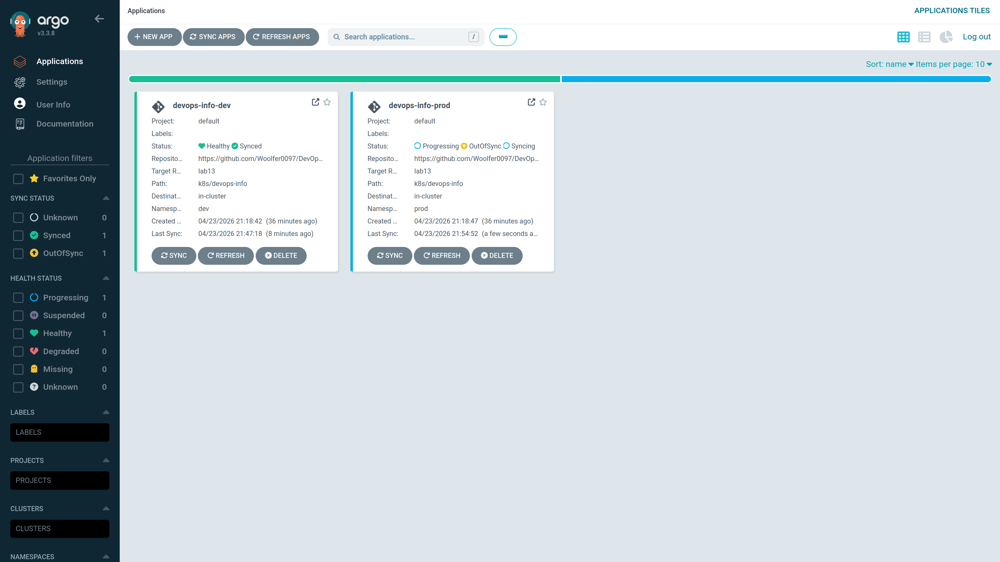

# Lab 13 — GitOps with ArgoCD

## 1) ArgoCD Setup

Install:

```bash
helm repo add argo https://argoproj.github.io/argo-helm
helm repo update
kubectl create namespace argocd
helm upgrade --install argocd argo/argo-cd -n argocd
kubectl get pods -n argocd
```

Access UI:

```bash
kubectl port-forward svc/argocd-server -n argocd 8080:443
kubectl -n argocd get secret argocd-initial-admin-secret \
  -o jsonpath="{.data.password}" | base64 -d && echo
```

CLI:

```bash
argocd login localhost:8080 --insecure
argocd app list
```

Evidence:
First Terminal:
```bash
woolfer0097@woolfer0097-Redmi-Book-Pro-15-2022 ~/C/D/k8s (lab13)> docker compose exec k8s-dev bash
root@woolfer0097-Redmi-Book-Pro-15-2022:/workspace/k8s# helm repo add argo https://argoproj.github.io/argo-helm
bash: helm: command not found
root@woolfer0097-Redmi-Book-Pro-15-2022:/workspace/k8s# curl -fsSL https://get.helm.sh/helm-v3.15.4-linux-amd64.tar.gz -o /tmp/helm.tgz
tar -xzf /tmp/helm.tgz -C /tmp
install -m 0755 /tmp/linux-amd64/helm /usr/local/bin/helm
helm version --short
v3.15.4+gfa9efb0
root@woolfer0097-Redmi-Book-Pro-15-2022:/workspace/k8s# install -m 0755 /tmp/linux-amd64/helm /usr/local/bin/helm
root@woolfer0097-Redmi-Book-Pro-15-2022:/workspace/k8s# helm repo add argo https://argoproj.github.io/argo-helm
"argo" has been added to your repositories
root@woolfer0097-Redmi-Book-Pro-15-2022:/workspace/k8s# helm repo update
Hang tight while we grab the latest from your chart repositories...
...Successfully got an update from the "argo" chart repository
Update Complete. ⎈Happy Helming!⎈
root@woolfer0097-Redmi-Book-Pro-15-2022:/workspace/k8s# kubectl create namespace argocd
The connection to the server localhost:8080 was refused - did you specify the right host or port?
root@woolfer0097-Redmi-Book-Pro-15-2022:/workspace/k8s# kind get clusters
No kind clusters found.
root@woolfer0097-Redmi-Book-Pro-15-2022:/workspace/k8s# kind create cluster --name devops-lab   # only if missing
Creating cluster "devops-lab" ...
 ✓ Ensuring node image (kindest/node:v1.35.1) 🖼
 ✓ Preparing nodes 📦  
 ✓ Writing configuration 📜 
 ✓ Starting control-plane 🕹️ 
 ✓ Installing CNI 🔌 
 ✓ Installing StorageClass 💾 
Set kubectl context to "kind-devops-lab"
You can now use your cluster with:

kubectl cluster-info --context kind-devops-lab

Have a question, bug, or feature request? Let us know! https://kind.sigs.k8s.io/#community 🙂
root@woolfer0097-Redmi-Book-Pro-15-2022:/workspace/k8s# kubectl create namespace argocd
namespace/argocd created
root@woolfer0097-Redmi-Book-Pro-15-2022:/workspace/k8s# helm upgrade --install argocd argo/argo-cd -n argocd
Release "argocd" does not exist. Installing it now.
NAME: argocd
LAST DEPLOYED: Thu Apr 23 18:06:29 2026
NAMESPACE: argocd
STATUS: deployed
REVISION: 1
TEST SUITE: None
NOTES:
In order to access the server UI you have the following options:

1. kubectl port-forward service/argocd-server -n argocd 8080:443

    and then open the browser on http://localhost:8080 and accept the certificate

2. enable ingress in the values file `server.ingress.enabled` and either
      - Add the annotation for ssl passthrough: https://argo-cd.readthedocs.io/en/stable/operator-manual/ingress/#option-1-ssl-passthrough
      - Set the `configs.params."server.insecure"` in the values file and terminate SSL at your ingress: https://argo-cd.readthedocs.io/en/stable/operator-manual/ingress/#option-2-multiple-ingress-objects-and-hosts


After reaching the UI the first time you can login with username: admin and the random password generated during the installation. You can find the password by running:

kubectl -n argocd get secret argocd-initial-admin-secret -o jsonpath="{.data.password}" | base64 -d

(You should delete the initial secret afterwards as suggested by the Getting Started Guide: https://argo-cd.readthedocs.io/en/stable/getting_started/#4-login-using-the-cli)
root@woolfer0097-Redmi-Book-Pro-15-2022:/workspace/k8s# kubectl get pods -n argocd
NAME                                                READY   STATUS            RESTARTS   AGE
argocd-application-controller-0                     1/1     Running           0          19s
argocd-applicationset-controller-559566846f-nxjzr   1/1     Running           0          19s
argocd-dex-server-8f5687997-qctxl                   0/1     PodInitializing   0          19s
argocd-notifications-controller-56c7d65875-27pwh    1/1     Running           0          19s
argocd-redis-fcd76bcfb-fhcsc                        1/1     Running           0          19s
argocd-redis-secret-init-84pp6                      0/1     Completed         0          60s
argocd-repo-server-7b8447858f-77v2q                 1/1     Running           0          19s
argocd-server-7f857f54f-5wgzs                       1/1     Running           0          19s
root@woolfer0097-Redmi-Book-Pro-15-2022:/workspace/k8s# kubectl get pods -n argocd
NAME                                                READY   STATUS            RESTARTS   AGE
argocd-application-controller-0                     1/1     Running           0          29s
argocd-applicationset-controller-559566846f-nxjzr   1/1     Running           0          29s
argocd-dex-server-8f5687997-qctxl                   0/1     PodInitializing   0          29s
argocd-notifications-controller-56c7d65875-27pwh    1/1     Running           0          29s
argocd-redis-fcd76bcfb-fhcsc                        1/1     Running           0          29s
argocd-redis-secret-init-84pp6                      0/1     Completed         0          70s
argocd-repo-server-7b8447858f-77v2q                 1/1     Running           0          29s
argocd-server-7f857f54f-5wgzs                       1/1     Running           0          29s
root@woolfer0097-Redmi-Book-Pro-15-2022:/workspace/k8s# kubectl get pods -n argocd
NAME                                                READY   STATUS            RESTARTS   AGE
argocd-application-controller-0                     1/1     Running           0          30s
argocd-applicationset-controller-559566846f-nxjzr   1/1     Running           0          30s
argocd-dex-server-8f5687997-qctxl                   0/1     PodInitializing   0          30s
argocd-notifications-controller-56c7d65875-27pwh    1/1     Running           0          30s
argocd-redis-fcd76bcfb-fhcsc                        1/1     Running           0          30s
argocd-redis-secret-init-84pp6                      0/1     Completed         0          71s
argocd-repo-server-7b8447858f-77v2q                 1/1     Running           0          30s
argocd-server-7f857f54f-5wgzs                       1/1     Running           0          30s
root@woolfer0097-Redmi-Book-Pro-15-2022:/workspace/k8s# 
kubectl port-forward svc/argocd-server -n argocd 8080:443
Forwarding from 127.0.0.1:8080 -> 8080
Forwarding from [::1]:8080 -> 8080
Handling connection for 8080
Handling connection for 8080
Handling connection for 8080
Handling connection for 8080
E0423 18:10:51.021665     738 portforward.go:489] "Unhandled Error" err="error copying from remote stream to local connection: readfrom tcp4 127.0.0.1:8080->127.0.0.1:48190: write tcp4 127.0.0.1:8080->127.0.0.1:48190: write: broken pipe"
Handling connection for 8080
E0423 18:10:51.941692     738 portforward.go:489] "Unhandled Error" err="error copying from remote stream to local connection: readfrom tcp4 127.0.0.1:8080->127.0.0.1:48240: write tcp4 127.0.0.1:8080->127.0.0.1:48240: write: broken pipe"
Handling connection for 8080
Handling connection for 8080
E0423 18:10:59.231686     738 portforward.go:489] "Unhandled Error" err="error copying from remote stream to local connection: readfrom tcp4 127.0.0.1:8080->127.0.0.1:46158: write tcp4 127.0.0.1:8080->127.0.0.1:46158: write: broken pipe"
Handling connection for 8080
Handling connection for 8080
E0423 18:18:52.899933     738 portforward.go:489] "Unhandled Error" err="error copying from remote stream to local connection: readfrom tcp4 127.0.0.1:8080->127.0.0.1:36260: write tcp4 127.0.0.1:8080->127.0.0.1:36260: write: broken pipe"
Handling connection for 8080
Handling connection for 8080
E0423 18:19:00.793804     738 portforward.go:489] "Unhandled Error" err="error copying from remote stream to local connection: readfrom tcp4 127.0.0.1:8080->127.0.0.1:36568: write tcp4 127.0.0.1:8080->127.0.0.1:36568: write: broken pipe"
Handling connection for 8080
Handling connection for 8080
E0423 18:19:00.806737     738 portforward.go:489] "Unhandled Error" err="error copying from remote stream to local connection: readfrom tcp4 127.0.0.1:8080->127.0.0.1:36604: write tcp4 127.0.0.1:8080->127.0.0.1:36604: write: broken pipe"
Handling connection for 8080
E0423 18:19:00.818793     738 portforward.go:489] "Unhandled Error" err="error copying from remote stream to local connection: readfrom tcp4 127.0.0.1:8080->127.0.0.1:36638: write tcp4 127.0.0.1:8080->127.0.0.1:36638: write: broken pipe"
Handling connection for 8080
Handling connection for 8080
E0423 18:19:07.111204     738 portforward.go:489] "Unhandled Error" err="error copying from remote stream to local connection: readfrom tcp4 127.0.0.1:8080->127.0.0.1:56776: write tcp4 127.0.0.1:8080->127.0.0.1:56776: write: broken pipe"
Handling connection for 8080
Handling connection for 8080
Handling connection for 8080
E0423 18:19:07.139810     738 portforward.go:489] "Unhandled Error" err="error copying from remote stream to local connection: readfrom tcp4 127.0.0.1:8080->127.0.0.1:56870: write tcp4 127.0.0.1:8080->127.0.0.1:56870: write: broken pipe"
Handling connection for 8080
Handling connection for 8080
E0423 18:19:12.006185     738 portforward.go:489] "Unhandled Error" err="error copying from remote stream to local connection: readfrom tcp4 127.0.0.1:8080->127.0.0.1:56974: write tcp4 127.0.0.1:8080->127.0.0.1:56974: write: broken pipe"
Handling connection for 8080
Handling connection for 8080
E0423 18:19:20.225160     738 portforward.go:489] "Unhandled Error" err="error copying from remote stream to local connection: readfrom tcp4 127.0.0.1:8080->127.0.0.1:38858: write tcp4 127.0.0.1:8080->127.0.0.1:38858: write: broken pipe"
Handling connection for 8080
Handling connection for 8080
E0423 18:20:04.848136     738 portforward.go:489] "Unhandled Error" err="error copying from remote stream to local connection: readfrom tcp4 127.0.0.1:8080->127.0.0.1:43152: write tcp4 127.0.0.1:8080->127.0.0.1:43152: write: broken pipe"
E0423 18:20:10.825359     738 portforward.go:489] "Unhandled Error" err="error copying from remote stream to local connection: readfrom tcp4 127.0.0.1:8080->127.0.0.1:43176: write tcp4 127.0.0.1:8080->127.0.0.1:43176: write: broken pipe"
Handling connection for 8080
Handling connection for 8080
E0423 18:22:29.936153     738 portforward.go:489] "Unhandled Error" err="error copying from remote stream to local connection: readfrom tcp4 127.0.0.1:8080->127.0.0.1:43910: write tcp4 127.0.0.1:8080->127.0.0.1:43910: write: broken pipe"
E0423 18:22:31.618870     738 portforward.go:489] "Unhandled Error" err="error copying from remote stream to local connection: readfrom tcp4 127.0.0.1:8080->127.0.0.1:43932: write tcp4 127.0.0.1:8080->127.0.0.1:43932: write: broken pipe"
Handling connection for 8080
Handling connection for 8080
E0423 18:22:38.379004     738 portforward.go:489] "Unhandled Error" err="error copying from remote stream to local connection: readfrom tcp4 127.0.0.1:8080->127.0.0.1:49224: write tcp4 127.0.0.1:8080->127.0.0.1:49224: write: broken pipe"
Handling connection for 8080
Handling connection for 8080
E0423 18:22:39.009077     738 portforward.go:489] "Unhandled Error" err="error copying from remote stream to local connection: readfrom tcp4 127.0.0.1:8080->127.0.0.1:49270: write tcp4 127.0.0.1:8080->127.0.0.1:49270: write: broken pipe"
Handling connection for 8080
Handling connection for 8080
E0423 18:22:59.376813     738 portforward.go:489] "Unhandled Error" err="error copying from remote stream to local connection: readfrom tcp4 127.0.0.1:8080->127.0.0.1:59072: write tcp4 127.0.0.1:8080->127.0.0.1:59072: write: broken pipe"
Handling connection for 8080
Handling connection for 8080
E0423 18:23:03.533096     738 portforward.go:489] "Unhandled Error" err="error copying from remote stream to local connection: readfrom tcp4 127.0.0.1:8080->127.0.0.1:59188: write tcp4 127.0.0.1:8080->127.0.0.1:59188: write: broken pipe"
Handling connection for 8080
Handling connection for 8080
E0423 18:23:04.200958     738 portforward.go:489] "Unhandled Error" err="error copying from remote stream to local connection: readfrom tcp4 127.0.0.1:8080->127.0.0.1:59248: write tcp4 127.0.0.1:8080->127.0.0.1:59248: write: broken pipe"
Handling connection for 8080
```

Second terminal:
```bash
woolfer0097@woolfer0097-Redmi-Book-Pro-15-2022 ~/C/D/k8s (lab13)> docker compose exec k8s-dev bash
root@woolfer0097-Redmi-Book-Pro-15-2022:/workspace/k8s# kubectl -n argocd get secret argocd-initial-admin-secret \
  -o jsonpath="{.data.password}" | base64 -d && echo
CbbkZYjo1f-WJT89
root@woolfer0097-Redmi-Book-Pro-15-2022:/workspace/k8s# argocd login localhost:8080 --insecure
bash: argocd: command not found
root@woolfer0097-Redmi-Book-Pro-15-2022:/workspace/k8s# curl -sSL -o /usr/local/bin/argocd \
  https://github.com/argoproj/argo-cd/releases/latest/download/argocd-linux-amd64
chmod +x /usr/local/bin/argocd
argocd version --client
argocd: v3.3.8+7ae7d2c
  BuildDate: 2026-04-21T17:45:55Z
  GitCommit: 7ae7d2cc723f5408b080a31263e705198af08613
  GitTreeState: clean
  GoVersion: go1.25.5
  Compiler: gc
  Platform: linux/amd64
root@woolfer0097-Redmi-Book-Pro-15-2022:/workspace/k8s# argocd login localhost:8080 --insecure --username admin --password 'CbbkZYjo1f-WJT89'
'admin:login' logged in successfully
Context 'localhost:8080' updated
root@woolfer0097-Redmi-Book-Pro-15-2022:/workspace/k8s# argocd app list
NAME  CLUSTER  NAMESPACE  PROJECT  STATUS  HEALTH  SYNCPOLICY  CONDITIONS  REPO  PATH  TARGET
root@woolfer0097-Redmi-Book-Pro-15-2022:/workspace/k8s# kubectl create namespace dev || true
namespace/dev created
root@woolfer0097-Redmi-Book-Pro-15-2022:/workspace/k8s# kubectl create namespace prod || true
namespace/prod created
root@woolfer0097-Redmi-Book-Pro-15-2022:/workspace/k8s# kubectl apply -f /workspace/k8s/argocd/application-dev.yaml
application.argoproj.io/devops-info-dev created
root@woolfer0097-Redmi-Book-Pro-15-2022:/workspace/k8s# kubectl apply -f /workspace/k8s/argocd/application-prod.yaml
application.argoproj.io/devops-info-prod created
root@woolfer0097-Redmi-Book-Pro-15-2022:/workspace/k8s# argocd app list
NAME                     CLUSTER                         NAMESPACE  PROJECT  STATUS   HEALTH   SYNCPOLICY  CONDITIONS       REPO                                                   PATH             TARGET
argocd/devops-info-dev   https://kubernetes.default.svc  dev        default  Unknown  Healthy  Auto-Prune  ComparisonError  https://github.com/Woolfer0097/DevOps-Core-Course.git  k8s/devops-info  lab13
argocd/devops-info-prod  https://kubernetes.default.svc  prod       default  Unknown  Healthy  Manual      ComparisonError  https://github.com/Woolfer0097/DevOps-Core-Course.git  k8s/devops-info  lab13
root@woolfer0097-Redmi-Book-Pro-15-2022:/workspace/k8s# argocd app get devops-info-dev
Name:               argocd/devops-info-dev
Project:            default
Server:             https://kubernetes.default.svc
Namespace:          dev
URL:                https://argocd.example.com/applications/devops-info-dev
Source:
- Repo:             https://github.com/Woolfer0097/DevOps-Core-Course.git
  Target:           lab13
  Path:             k8s/devops-info
  Helm Values:      values-dev.yaml
SyncWindow:         Sync Allowed
Sync Policy:        Automated (Prune)
Sync Status:        Unknown
Health Status:      Healthy

CONDITION        MESSAGE                                                                                                                                                 LAST TRANSITION
ComparisonError  Failed to load target state: failed to generate manifest for source 1 of 1: rpc error: code = Unknown desc = unable to resolve 'lab13' to a commit SHA  2026-04-23 18:18:42 +0000 UTC

root@woolfer0097-Redmi-Book-Pro-15-2022:/workspace/k8s# argocd app get devops-info-prod
Name:               argocd/devops-info-prod
Project:            default
Server:             https://kubernetes.default.svc
Namespace:          prod
URL:                https://argocd.example.com/applications/devops-info-prod
Source:
- Repo:             https://github.com/Woolfer0097/DevOps-Core-Course.git
  Target:           lab13
  Path:             k8s/devops-info
  Helm Values:      values-prod.yaml
SyncWindow:         Sync Allowed
Sync Policy:        Manual
Sync Status:        Unknown
Health Status:      Healthy

CONDITION        MESSAGE                                                                                                                                                 LAST TRANSITION
ComparisonError  Failed to load target state: failed to generate manifest for source 1 of 1: rpc error: code = Unknown desc = unable to resolve 'lab13' to a commit SHA  2026-04-23 18:18:47 +0000 UTC

root@woolfer0097-Redmi-Book-Pro-15-2022:/workspace/k8s# argocd app sync devops-info-dev
{"level":"fatal","msg":"rpc error: code = FailedPrecondition desc = error resolving repo revision: rpc error: code = Unknown desc = unable to resolve 'lab13' to a commit SHA","time":"2026-04-23T18:19:12Z"}
root@woolfer0097-Redmi-Book-Pro-15-2022:/workspace/k8s# argocd app sync devops-info-prod
{"level":"fatal","msg":"rpc error: code = FailedPrecondition desc = error resolving repo revision: rpc error: code = Unknown desc = unable to resolve 'lab13' to a commit SHA","time":"2026-04-23T18:19:21Z"}
root@woolfer0097-Redmi-Book-Pro-15-2022:/workspace/k8s# argocd app set devops-info-dev --revision master
root@woolfer0097-Redmi-Book-Pro-15-2022:/workspace/k8s# argocd app set devops-info-prod --revision master
root@woolfer0097-Redmi-Book-Pro-15-2022:/workspace/k8s# argocd app sync devops-info-dev
TIMESTAMP                  GROUP        KIND              NAMESPACE                  NAME      STATUS   HEALTH        HOOK  MESSAGE
2026-04-23T18:22:39+00:00          ConfigMap                    dev   devops-info-dev-env      Synced                       
2026-04-23T18:22:39+00:00         PersistentVolumeClaim         dev  devops-info-dev-data      Synced  Healthy              
2026-04-23T18:22:39+00:00             Secret                    dev  devops-info-dev-secret    Synced                       
2026-04-23T18:22:39+00:00            Service                    dev       devops-info-dev      Synced  Healthy              
2026-04-23T18:22:39+00:00         ServiceAccount                dev       devops-info-dev      Synced                       
2026-04-23T18:22:39+00:00   apps  Deployment                    dev       devops-info-dev      Synced  Healthy              
2026-04-23T18:22:39+00:00          ConfigMap                    dev  devops-info-dev-config    Synced                       
2026-04-23T18:22:39+00:00  batch         Job         dev  devops-info-dev-pre-install            Progressing              
2026-04-23T18:22:41+00:00  batch         Job         dev  devops-info-dev-pre-install   Running   Synced     PreSync  job.batch/devops-info-dev-pre-install created
2026-04-23T18:22:50+00:00            Service                    dev       devops-info-dev           Synced   Healthy              service/devops-info-dev unchanged
2026-04-23T18:22:50+00:00   apps  Deployment                    dev       devops-info-dev           Synced   Healthy              deployment.apps/devops-info-dev unchanged
2026-04-23T18:22:50+00:00  batch         Job                    dev  devops-info-dev-pre-install  Succeeded   Synced     PreSync  Reached expected number of succeeded pods
2026-04-23T18:22:50+00:00         ServiceAccount                dev       devops-info-dev           Synced                        serviceaccount/devops-info-dev unchanged
2026-04-23T18:22:50+00:00             Secret                    dev  devops-info-dev-secret         Synced                        secret/devops-info-dev-secret configured
2026-04-23T18:22:50+00:00          ConfigMap                    dev   devops-info-dev-env           Synced                        configmap/devops-info-dev-env unchanged
2026-04-23T18:22:50+00:00          ConfigMap                    dev  devops-info-dev-config         Synced                        configmap/devops-info-dev-config unchanged
2026-04-23T18:22:50+00:00         PersistentVolumeClaim         dev  devops-info-dev-data           Synced   Healthy              persistentvolumeclaim/devops-info-dev-data unchanged
2026-04-23T18:22:50+00:00  batch         Job         dev  devops-info-dev-post-install   Running   Synced    PostSync  job.batch/devops-info-dev-post-install created
2026-04-23T18:22:57+00:00  batch         Job         dev  devops-info-dev-post-install  Succeeded   Synced    PostSync  Reached expected number of succeeded pods

Name:               argocd/devops-info-dev
Project:            default
Server:             https://kubernetes.default.svc
Namespace:          dev
URL:                https://argocd.example.com/applications/devops-info-dev
Source:
- Repo:             https://github.com/Woolfer0097/DevOps-Core-Course.git
  Target:           master
  Path:             k8s/devops-info
  Helm Values:      values-dev.yaml
SyncWindow:         Sync Allowed
Sync Policy:        Automated (Prune)
Sync Status:        Synced to master (9f67875)
Health Status:      Healthy

Operation:          Sync
Sync Revision:      9f67875d4ec6dba0b694125011bca56d308fe37b
Phase:              Succeeded
Start:              2026-04-23 18:22:39 +0000 UTC
Finished:           2026-04-23 18:22:57 +0000 UTC
Duration:           18s
Message:            successfully synced (no more tasks)

GROUP  KIND                   NAMESPACE  NAME                          STATUS     HEALTH   HOOK      MESSAGE
batch  Job                    dev        devops-info-dev-pre-install   Succeeded           PreSync   Reached expected number of succeeded pods
       ServiceAccount         dev        devops-info-dev               Synced                        serviceaccount/devops-info-dev unchanged
       Secret                 dev        devops-info-dev-secret        Synced                        secret/devops-info-dev-secret configured
       ConfigMap              dev        devops-info-dev-env           Synced                        configmap/devops-info-dev-env unchanged
       ConfigMap              dev        devops-info-dev-config        Synced                        configmap/devops-info-dev-config unchanged
       PersistentVolumeClaim  dev        devops-info-dev-data          Synced     Healthy            persistentvolumeclaim/devops-info-dev-data unchanged
       Service                dev        devops-info-dev               Synced     Healthy            service/devops-info-dev unchanged
apps   Deployment             dev        devops-info-dev               Synced     Healthy            deployment.apps/devops-info-dev unchanged
batch  Job                    dev        devops-info-dev-post-install  Succeeded           PostSync  Reached expected number of succeeded pods
root@woolfer0097-Redmi-Book-Pro-15-2022:/workspace/k8s# argocd app sync devops-info-prod
TIMESTAMP                  GROUP        KIND              NAMESPACE                  NAME       STATUS    HEALTH        HOOK  MESSAGE
2026-04-23T18:23:04+00:00             Secret                   prod  devops-info-prod-secret  OutOfSync  Missing              
2026-04-23T18:23:04+00:00            Service                   prod      devops-info-prod     OutOfSync  Missing              
2026-04-23T18:23:04+00:00         ServiceAccount               prod      devops-info-prod     OutOfSync  Missing              
2026-04-23T18:23:04+00:00   apps  Deployment                   prod      devops-info-prod     OutOfSync  Missing              
2026-04-23T18:23:04+00:00          ConfigMap                   prod  devops-info-prod-config  OutOfSync  Missing              
2026-04-23T18:23:04+00:00          ConfigMap                   prod  devops-info-prod-env     OutOfSync  Missing              
2026-04-23T18:23:04+00:00         PersistentVolumeClaim        prod  devops-info-prod-data    OutOfSync  Missing              
2026-04-23T18:23:04+00:00  batch         Job        prod  devops-info-prod-pre-install            Progressing              
2026-04-23T18:23:06+00:00  batch         Job        prod  devops-info-prod-pre-install   Running   Synced     PreSync  job.batch/devops-info-prod-pre-install created
2026-04-23T18:23:13+00:00         ServiceAccount        prod      devops-info-prod    Synced  Missing              
2026-04-23T18:23:13+00:00          ConfigMap                   prod  devops-info-prod-config    Synced  Missing                  
2026-04-23T18:23:13+00:00          ConfigMap                   prod  devops-info-prod-env       Synced  Missing                  
2026-04-23T18:23:13+00:00         PersistentVolumeClaim        prod  devops-info-prod-data      Synced  Progressing              
2026-04-23T18:23:13+00:00             Secret                   prod  devops-info-prod-secret    Synced  Missing                  
2026-04-23T18:23:13+00:00            Service        prod      devops-info-prod    Synced  Progressing              
2026-04-23T18:23:13+00:00   apps  Deployment        prod      devops-info-prod    Synced  Progressing              
2026-04-23T18:23:15+00:00   apps  Deployment                   prod      devops-info-prod            Synced   Progressing              deployment.apps/devops-info-prod created
2026-04-23T18:23:15+00:00  batch         Job                   prod  devops-info-prod-pre-install  Succeeded   Synced         PreSync  Reached expected number of succeeded pods
2026-04-23T18:23:15+00:00         ServiceAccount               prod      devops-info-prod            Synced   Missing                  serviceaccount/devops-info-prod created
2026-04-23T18:23:15+00:00             Secret                   prod  devops-info-prod-secret         Synced   Missing                  secret/devops-info-prod-secret created
2026-04-23T18:23:15+00:00          ConfigMap                   prod  devops-info-prod-env            Synced   Missing                  configmap/devops-info-prod-env created
2026-04-23T18:23:15+00:00          ConfigMap                   prod  devops-info-prod-config         Synced   Missing                  configmap/devops-info-prod-config created
2026-04-23T18:23:15+00:00         PersistentVolumeClaim        prod  devops-info-prod-data           Synced   Progressing              persistentvolumeclaim/devops-info-prod-data created
2026-04-23T18:23:15+00:00            Service                   prod      devops-info-prod            Synced   Progressing              service/devops-info-prod created
2026-04-23T18:23:16+00:00         PersistentVolumeClaim        prod  devops-info-prod-data    Synced  Healthy              persistentvolumeclaim/devops-info-prod-data created
```

## 2) Application Configuration

Manifests created:
- `k8s/argocd/application.yaml` (single app, manual sync).
- `k8s/argocd/application-dev.yaml` (dev, auto-sync + self-heal + prune).
- `k8s/argocd/application-prod.yaml` (prod, manual sync).
- `k8s/argocd/applicationset.yaml` (bonus template-based generation).

Chart source:
- Repo URL: set in each manifest (`spec.source.repoURL`) - replace placeholder with your repo.
- Path: `k8s/devops-info`.
- Values:
  - dev -> `values-dev.yaml`
  - prod -> `values-prod.yaml`

Deploy manifests:

```bash
kubectl create namespace dev || true
kubectl create namespace prod || true
kubectl apply -f k8s/argocd/application.yaml
kubectl apply -f k8s/argocd/application-dev.yaml
kubectl apply -f k8s/argocd/application-prod.yaml
argocd app list
```

## 3) Multi-Environment

Differences:
- `devops-info-dev` deploys to namespace `dev` with `values-dev.yaml`.
- `devops-info-prod` deploys to namespace `prod` with `values-prod.yaml`.
- Dev has auto-sync (`automated.prune=true`, `automated.selfHeal=true`).
- Prod is manual sync (no `automated` block).

Why manual for prod:
- Keeps explicit approval gate before production rollout.
- Allows controlled release windows and rollback planning.

Verify:

```bash
kubectl get all -n dev
kubectl get all -n prod
argocd app get devops-info-dev
argocd app get devops-info-prod
```

Evidence:
```bash
root@woolfer0097-Redmi-Book-Pro-15-2022:/workspace/k8s# # 1) Check rollout reason
kubectl describe deploy devops-info-prod -n prod | rg "ProgressDeadline|Failed|Available|Replica|Image"

# 2) Check pod-level failure (most important)
kubectl get pods -n prod -o wide
kubectl describe pod -n prod $(kubectl get pod -n prod -o jsonpath='{.items[0].metadata.name}') | rg "Failed|BackOff|pull|Image|Err"

# 3) Check app container logs (if container starts at all)
kubectl logs -n prod deploy/devops-info-prod --tail=100
bash: rg: command not found
NAME                               READY   STATUS    RESTARTS   AGE   IP            NODE                       NOMINATED NODE   READINESS GATES
devops-info-prod-7d4df9ff4-b57nw   1/1     Running   0          16m   10.244.0.25   devops-lab-control-plane   <none>           <none>
devops-info-prod-7d4df9ff4-dzmqg   1/1     Running   0          16m   10.244.0.22   devops-lab-control-plane   <none>           <none>
devops-info-prod-7d4df9ff4-mg2kf   1/1     Running   0          16m   10.244.0.24   devops-lab-control-plane   <none>           <none>
devops-info-prod-7d4df9ff4-r8fcb   1/1     Running   0          16m   10.244.0.23   devops-lab-control-plane   <none>           <none>
devops-info-prod-7d4df9ff4-x22vp   1/1     Running   0          16m   10.244.0.21   devops-lab-control-plane   <none>           <none>
bash: rg: command not found
Found 5 pods, using pod/devops-info-prod-7d4df9ff4-r8fcb
INFO:     10.244.0.1:41716 - "GET /health HTTP/1.1" 200 OK
{"timestamp": "2026-04-23T18:37:52.091280+00:00", "level": "INFO", "message": "HTTP request completed", "logger": "app", "method": "GET", "path": "/health", "status_code": 200, "client_ip": "10.244.0.1", "duration": 0.0002547570002207067}
INFO:     10.244.0.1:41728 - "GET /health HTTP/1.1" 200 OK
{"timestamp": "2026-04-23T18:37:52.350701+00:00", "level": "INFO", "message": "HTTP request completed", "logger": "app", "method": "GET", "path": "/health", "status_code": 200, "client_ip": "10.244.0.1", "duration": 0.0004477049997149152}
INFO:     10.244.0.1:41744 - "GET /health HTTP/1.1" 200 OK
{"timestamp": "2026-04-23T18:37:55.090278+00:00", "level": "INFO", "message": "HTTP request completed", "logger": "app", "method": "GET", "path": "/health", "status_code": 200, "client_ip": "10.244.0.1", "duration": 0.00027448499986348907}
INFO:     10.244.0.1:46682 - "GET /health HTTP/1.1" 200 OK
{"timestamp": "2026-04-23T18:37:57.350820+00:00", "level": "INFO", "message": "HTTP request completed", "logger": "app", "method": "GET", "path": "/health", "status_code": 200, "client_ip": "10.244.0.1", "duration": 0.0005223729999670468}
{"timestamp": "2026-04-23T18:37:58.091380+00:00", "level": "INFO", "message": "HTTP request completed", "logger": "app", "method": "GET", "path": "/health", "status_code": 200, "client_ip": "10.244.0.1", "duration": 0.0006415630000446981}
INFO:     10.244.0.1:46684 - "GET /health HTTP/1.1" 200 OK
INFO:     10.244.0.1:46700 - "GET /health HTTP/1.1" 200 OK
{"timestamp": "2026-04-23T18:38:01.090828+00:00", "level": "INFO", "message": "HTTP request completed", "logger": "app", "method": "GET", "path": "/health", "status_code": 200, "client_ip": "10.244.0.1", "duration": 0.0003338699998494121}
INFO:     10.244.0.1:46714 - "GET /health HTTP/1.1" 200 OK
{"timestamp": "2026-04-23T18:38:02.350492+00:00", "level": "INFO", "message": "HTTP request completed", "logger": "app", "method": "GET", "path": "/health", "status_code": 200, "client_ip": "10.244.0.1", "duration": 0.0002588050001577358}
{"timestamp": "2026-04-23T18:38:04.090489+00:00", "level": "INFO", "message": "HTTP request completed", "logger": "app", "method": "GET", "path": "/health", "status_code": 200, "client_ip": "10.244.0.1", "duration": 0.0003536799999892537}
INFO:     10.244.0.1:46718 - "GET /health HTTP/1.1" 200 OK
{"timestamp": "2026-04-23T18:38:07.090920+00:00", "level": "INFO", "message": "HTTP request completed", "logger": "app", "method": "GET", "path": "/health", "status_code": 200, "client_ip": "10.244.0.1", "duration": 0.00025022500039995066}
INFO:     10.244.0.1:44690 - "GET /health HTTP/1.1" 200 OK
INFO:     10.244.0.1:44696 - "GET /health HTTP/1.1" 200 OK
{"timestamp": "2026-04-23T18:38:07.350060+00:00", "level": "INFO", "message": "HTTP request completed", "logger": "app", "method": "GET", "path": "/health", "status_code": 200, "client_ip": "10.244.0.1", "duration": 0.00023018699994281633}
{"timestamp": "2026-04-23T18:38:10.090583+00:00", "level": "INFO", "message": "HTTP request completed", "logger": "app", "method": "GET", "path": "/health", "status_code": 200, "client_ip": "10.244.0.1", "duration": 0.0002569939997556503}
INFO:     10.244.0.1:44702 - "GET /health HTTP/1.1" 200 OK
{"timestamp": "2026-04-23T18:38:12.350382+00:00", "level": "INFO", "message": "HTTP request completed", "logger": "app", "method": "GET", "path": "/health", "status_code": 200, "client_ip": "10.244.0.1", "duration": 0.00035037800034842803}
INFO:     10.244.0.1:44716 - "GET /health HTTP/1.1" 200 OK
{"timestamp": "2026-04-23T18:38:13.090669+00:00", "level": "INFO", "message": "HTTP request completed", "logger": "app", "method": "GET", "path": "/health", "status_code": 200, "client_ip": "10.244.0.1", "duration": 0.0002549760001784307}
INFO:     10.244.0.1:44730 - "GET /health HTTP/1.1" 200 OK
INFO:     10.244.0.1:48764 - "GET /health HTTP/1.1" 200 OK
{"timestamp": "2026-04-23T18:38:16.090809+00:00", "level": "INFO", "message": "HTTP request completed", "logger": "app", "method": "GET", "path": "/health", "status_code": 200, "client_ip": "10.244.0.1", "duration": 0.0002378290000706329}
INFO:     10.244.0.1:48772 - "GET /health HTTP/1.1" 200 OK
{"timestamp": "2026-04-23T18:38:17.349769+00:00", "level": "INFO", "message": "HTTP request completed", "logger": "app", "method": "GET", "path": "/health", "status_code": 200, "client_ip": "10.244.0.1", "duration": 0.0002417689997855632}
{"timestamp": "2026-04-23T18:38:19.090839+00:00", "level": "INFO", "message": "HTTP request completed", "logger": "app", "method": "GET", "path": "/health", "status_code": 200, "client_ip": "10.244.0.1", "duration": 0.0002562639997449878}
INFO:     10.244.0.1:48780 - "GET /health HTTP/1.1" 200 OK
{"timestamp": "2026-04-23T18:38:22.090569+00:00", "level": "INFO", "message": "HTTP request completed", "logger": "app", "method": "GET", "path": "/health", "status_code": 200, "client_ip": "10.244.0.1", "duration": 0.0003530020003381651}
INFO:     10.244.0.1:48790 - "GET /health HTTP/1.1" 200 OK
INFO:     10.244.0.1:48800 - "GET /health HTTP/1.1" 200 OK
{"timestamp": "2026-04-23T18:38:22.349658+00:00", "level": "INFO", "message": "HTTP request completed", "logger": "app", "method": "GET", "path": "/health", "status_code": 200, "client_ip": "10.244.0.1", "duration": 0.0003569810000954021}
{"timestamp": "2026-04-23T18:38:25.091130+00:00", "level": "INFO", "message": "HTTP request completed", "logger": "app", "method": "GET", "path": "/health", "status_code": 200, "client_ip": "10.244.0.1", "duration": 0.00034021600004052743}
INFO:     10.244.0.1:48812 - "GET /health HTTP/1.1" 200 OK
{"timestamp": "2026-04-23T18:38:27.350574+00:00", "level": "INFO", "message": "HTTP request completed", "logger": "app", "method": "GET", "path": "/health", "status_code": 200, "client_ip": "10.244.0.1", "duration": 0.0003590530000110448}
INFO:     10.244.0.1:41894 - "GET /health HTTP/1.1" 200 OK
{"timestamp": "2026-04-23T18:38:28.090703+00:00", "level": "INFO", "message": "HTTP request completed", "logger": "app", "method": "GET", "path": "/health", "status_code": 200, "client_ip": "10.244.0.1", "duration": 0.0003690940002343268}
INFO:     10.244.0.1:41904 - "GET /health HTTP/1.1" 200 OK
INFO:     10.244.0.1:41906 - "GET /health HTTP/1.1" 200 OK
{"timestamp": "2026-04-23T18:38:31.090329+00:00", "level": "INFO", "message": "HTTP request completed", "logger": "app", "method": "GET", "path": "/health", "status_code": 200, "client_ip": "10.244.0.1", "duration": 0.0002487269998709962}
{"timestamp": "2026-04-23T18:38:32.350179+00:00", "level": "INFO", "message": "HTTP request completed", "logger": "app", "method": "GET", "path": "/health", "status_code": 200, "client_ip": "10.244.0.1", "duration": 0.00022080200005802908}
INFO:     10.244.0.1:41916 - "GET /health HTTP/1.1" 200 OK
{"timestamp": "2026-04-23T18:38:34.090685+00:00", "level": "INFO", "message": "HTTP request completed", "logger": "app", "method": "GET", "path": "/health", "status_code": 200, "client_ip": "10.244.0.1", "duration": 0.0003776120001930394}
INFO:     10.244.0.1:41928 - "GET /health HTTP/1.1" 200 OK
{"timestamp": "2026-04-23T18:38:37.090927+00:00", "level": "INFO", "message": "HTTP request completed", "logger": "app", "method": "GET", "path": "/health", "status_code": 200, "client_ip": "10.244.0.1", "duration": 0.0003248900002290611}
INFO:     10.244.0.1:40714 - "GET /health HTTP/1.1" 200 OK
{"timestamp": "2026-04-23T18:38:37.350673+00:00", "level": "INFO", "message": "HTTP request completed", "logger": "app", "method": "GET", "path": "/health", "status_code": 200, "client_ip": "10.244.0.1", "duration": 0.0003642180004135298}
INFO:     10.244.0.1:40720 - "GET /health HTTP/1.1" 200 OK
{"timestamp": "2026-04-23T18:38:40.091202+00:00", "level": "INFO", "message": "HTTP request completed", "logger": "app", "method": "GET", "path": "/health", "status_code": 200, "client_ip": "10.244.0.1", "duration": 0.000246976999733306}
INFO:     10.244.0.1:40724 - "GET /health HTTP/1.1" 200 OK
{"timestamp": "2026-04-23T18:38:42.350328+00:00", "level": "INFO", "message": "HTTP request completed", "logger": "app", "method": "GET", "path": "/health", "status_code": 200, "client_ip": "10.244.0.1", "duration": 0.0003218589999960386}
INFO:     10.244.0.1:40736 - "GET /health HTTP/1.1" 200 OK
{"timestamp": "2026-04-23T18:38:43.090604+00:00", "level": "INFO", "message": "HTTP request completed", "logger": "app", "method": "GET", "path": "/health", "status_code": 200, "client_ip": "10.244.0.1", "duration": 0.00033871799996632035}
INFO:     10.244.0.1:40740 - "GET /health HTTP/1.1" 200 OK
INFO:     10.244.0.1:51018 - "GET /health HTTP/1.1" 200 OK
{"timestamp": "2026-04-23T18:38:46.090914+00:00", "level": "INFO", "message": "HTTP request completed", "logger": "app", "method": "GET", "path": "/health", "status_code": 200, "client_ip": "10.244.0.1", "duration": 0.00023197300015453948}
INFO:     10.244.0.1:51022 - "GET /health HTTP/1.1" 200 OK
{"timestamp": "2026-04-23T18:38:47.350645+00:00", "level": "INFO", "message": "HTTP request completed", "logger": "app", "method": "GET", "path": "/health", "status_code": 200, "client_ip": "10.244.0.1", "duration": 0.00033269699997617863}
INFO:     10.244.0.1:51024 - "GET /health HTTP/1.1" 200 OK
{"timestamp": "2026-04-23T18:38:49.091407+00:00", "level": "INFO", "message": "HTTP request completed", "logger": "app", "method": "GET", "path": "/health", "status_code": 200, "client_ip": "10.244.0.1", "duration": 0.00036472600004344713}
INFO:     10.244.0.1:51026 - "GET /health HTTP/1.1" 200 OK
{"timestamp": "2026-04-23T18:38:52.090905+00:00", "level": "INFO", "message": "HTTP request completed", "logger": "app", "method": "GET", "path": "/health", "status_code": 200, "client_ip": "10.244.0.1", "duration": 0.0003469140001470805}
{"timestamp": "2026-04-23T18:38:52.349921+00:00", "level": "INFO", "message": "HTTP request completed", "logger": "app", "method": "GET", "path": "/health", "status_code": 200, "client_ip": "10.244.0.1", "duration": 0.00032910699974308955}
INFO:     10.244.0.1:51032 - "GET /health HTTP/1.1" 200 OK
INFO:     10.244.0.1:51048 - "GET /health HTTP/1.1" 200 OK
{"timestamp": "2026-04-23T18:38:55.091305+00:00", "level": "INFO", "message": "HTTP request completed", "logger": "app", "method": "GET", "path": "/health", "status_code": 200, "client_ip": "10.244.0.1", "duration": 0.0003469599996606121}
{"timestamp": "2026-04-23T18:38:57.350336+00:00", "level": "INFO", "message": "HTTP request completed", "logger": "app", "method": "GET", "path": "/health", "status_code": 200, "client_ip": "10.244.0.1", "duration": 0.00024859199993443326}
INFO:     10.244.0.1:58980 - "GET /health HTTP/1.1" 200 OK
{"timestamp": "2026-04-23T18:38:58.090553+00:00", "level": "INFO", "message": "HTTP request completed", "logger": "app", "method": "GET", "path": "/health", "status_code": 200, "client_ip": "10.244.0.1", "duration": 0.00025742900015757186}
INFO:     10.244.0.1:58986 - "GET /health HTTP/1.1" 200 OK
INFO:     10.244.0.1:58998 - "GET /health HTTP/1.1" 200 OK
{"timestamp": "2026-04-23T18:39:01.090942+00:00", "level": "INFO", "message": "HTTP request completed", "logger": "app", "method": "GET", "path": "/health", "status_code": 200, "client_ip": "10.244.0.1", "duration": 0.00034586999981911504}
{"timestamp": "2026-04-23T18:39:02.350245+00:00", "level": "INFO", "message": "HTTP request completed", "logger": "app", "method": "GET", "path": "/health", "status_code": 200, "client_ip": "10.244.0.1", "duration": 0.00033539600008225534}
INFO:     10.244.0.1:59004 - "GET /health HTTP/1.1" 200 OK
INFO:     10.244.0.1:59012 - "GET /health HTTP/1.1" 200 OK
{"timestamp": "2026-04-23T18:39:04.091314+00:00", "level": "INFO", "message": "HTTP request completed", "logger": "app", "method": "GET", "path": "/health", "status_code": 200, "client_ip": "10.244.0.1", "duration": 0.0002523319999454543}
INFO:     10.244.0.1:35088 - "GET /health HTTP/1.1" 200 OK
{"timestamp": "2026-04-23T18:39:07.090260+00:00", "level": "INFO", "message": "HTTP request completed", "logger": "app", "method": "GET", "path": "/health", "status_code": 200, "client_ip": "10.244.0.1", "duration": 0.00026747499987322954}
{"timestamp": "2026-04-23T18:39:07.349817+00:00", "level": "INFO", "message": "HTTP request completed", "logger": "app", "method": "GET", "path": "/health", "status_code": 200, "client_ip": "10.244.0.1", "duration": 0.0002630009998938476}
INFO:     10.244.0.1:35090 - "GET /health HTTP/1.1" 200 OK
{"timestamp": "2026-04-23T18:39:10.090721+00:00", "level": "INFO", "message": "HTTP request completed", "logger": "app", "method": "GET", "path": "/health", "status_code": 200, "client_ip": "10.244.0.1", "duration": 0.0003431700001783611}
INFO:     10.244.0.1:35096 - "GET /health HTTP/1.1" 200 OK
INFO:     10.244.0.1:35102 - "GET /health HTTP/1.1" 200 OK
{"timestamp": "2026-04-23T18:39:12.350517+00:00", "level": "INFO", "message": "HTTP request completed", "logger": "app", "method": "GET", "path": "/health", "status_code": 200, "client_ip": "10.244.0.1", "duration": 0.00028429999974832754}
INFO:     10.244.0.1:35114 - "GET /health HTTP/1.1" 200 OK
{"timestamp": "2026-04-23T18:39:13.090686+00:00", "level": "INFO", "message": "HTTP request completed", "logger": "app", "method": "GET", "path": "/health", "status_code": 200, "client_ip": "10.244.0.1", "duration": 0.0005217819998506457}
{"timestamp": "2026-04-23T18:39:16.090984+00:00", "level": "INFO", "message": "HTTP request completed", "logger": "app", "method": "GET", "path": "/health", "status_code": 200, "client_ip": "10.244.0.1", "duration": 0.00035492899996825145}
INFO:     10.244.0.1:46098 - "GET /health HTTP/1.1" 200 OK
INFO:     10.244.0.1:46114 - "GET /health HTTP/1.1" 200 OK
{"timestamp": "2026-04-23T18:39:17.350301+00:00", "level": "INFO", "message": "HTTP request completed", "logger": "app", "method": "GET", "path": "/health", "status_code": 200, "client_ip": "10.244.0.1", "duration": 0.0003399639999770443}
INFO:     10.244.0.1:46124 - "GET /health HTTP/1.1" 200 OK
{"timestamp": "2026-04-23T18:39:19.090975+00:00", "level": "INFO", "message": "HTTP request completed", "logger": "app", "method": "GET", "path": "/health", "status_code": 200, "client_ip": "10.244.0.1", "duration": 0.00034855700005209656}
{"timestamp": "2026-04-23T18:39:22.090431+00:00", "level": "INFO", "message": "HTTP request completed", "logger": "app", "method": "GET", "path": "/health", "status_code": 200, "client_ip": "10.244.0.1", "duration": 0.0002704329999687616}
INFO:     10.244.0.1:46136 - "GET /health HTTP/1.1" 200 OK
INFO:     10.244.0.1:46144 - "GET /health HTTP/1.1" 200 OK
{"timestamp": "2026-04-23T18:39:22.349886+00:00", "level": "INFO", "message": "HTTP request completed", "logger": "app", "method": "GET", "path": "/health", "status_code": 200, "client_ip": "10.244.0.1", "duration": 0.0004781880002155958}
root@woolfer0097-Redmi-Book-Pro-15-2022:/workspace/k8s# argocd app get devops-info-prod
argocd app wait devops-info-prod --health --sync --timeout 120
argocd app list
Name:               argocd/devops-info-prod
Project:            default
Server:             https://kubernetes.default.svc
Namespace:          prod
URL:                https://argocd.example.com/applications/devops-info-prod
Source:
- Repo:             https://github.com/Woolfer0097/DevOps-Core-Course.git
  Target:           master
  Path:             k8s/devops-info
  Helm Values:      values-prod.yaml
SyncWindow:         Sync Allowed
Sync Policy:        Manual
Sync Status:        Synced to master (9f67875)
Health Status:      Progressing

GROUP  KIND                   NAMESPACE  NAME                          STATUS     HEALTH       HOOK     MESSAGE
batch  Job                    prod       devops-info-prod-pre-install  Succeeded               PreSync  Reached expected number of succeeded pods
       ServiceAccount         prod       devops-info-prod              Synced                           serviceaccount/devops-info-prod created
       Secret                 prod       devops-info-prod-secret       Synced                           secret/devops-info-prod-secret created
       ConfigMap              prod       devops-info-prod-env          Synced                           configmap/devops-info-prod-env created
       ConfigMap              prod       devops-info-prod-config       Synced                           configmap/devops-info-prod-config created
       PersistentVolumeClaim  prod       devops-info-prod-data         Synced     Healthy               persistentvolumeclaim/devops-info-prod-data created
       Service                prod       devops-info-prod              Synced     Progressing           service/devops-info-prod created
apps   Deployment             prod       devops-info-prod              Synced     Healthy               Deployment "devops-info-prod" exceeded its progress deadline
TIMESTAMP                  GROUP        KIND              NAMESPACE                  NAME            STATUS    HEALTH            HOOK  MESSAGE
2026-04-23T18:41:11+00:00         ServiceAccount               prod      devops-info-prod            Synced                            serviceaccount/devops-info-prod created
2026-04-23T18:41:11+00:00             Secret                   prod  devops-info-prod-secret         Synced                            secret/devops-info-prod-secret created
2026-04-23T18:41:11+00:00          ConfigMap                   prod  devops-info-prod-env            Synced                            configmap/devops-info-prod-env created
2026-04-23T18:41:11+00:00          ConfigMap                   prod  devops-info-prod-config         Synced                            configmap/devops-info-prod-config created
2026-04-23T18:41:11+00:00         PersistentVolumeClaim        prod  devops-info-prod-data           Synced   Healthy                  persistentvolumeclaim/devops-info-prod-data created
2026-04-23T18:41:11+00:00            Service                   prod      devops-info-prod            Synced   Progressing              service/devops-info-prod created
2026-04-23T18:41:11+00:00   apps  Deployment                   prod      devops-info-prod            Synced   Healthy                  Deployment "devops-info-prod" exceeded its progress deadline
2026-04-23T18:41:11+00:00  batch         Job                   prod  devops-info-prod-pre-install  Succeeded                  PreSync  Reached expected number of succeeded pods
^C
NAME                     CLUSTER                         NAMESPACE  PROJECT  STATUS  HEALTH       SYNCPOLICY  CONDITIONS  REPO                                                   PATH             TARGET
argocd/devops-info-dev   https://kubernetes.default.svc  dev        default  Synced  Healthy      Auto-Prune  <none>      https://github.com/Woolfer0097/DevOps-Core-Course.git  k8s/devops-info  master
argocd/devops-info-prod  https://kubernetes.default.svc  prod       default  Synced  Progressing  Manual      <none>      https://github.com/Woolfer0097/DevOps-Core-Course.git  k8s/devops-info  master
root@woolfer0097-Redmi-Book-Pro-15-2022:/workspace/k8s# 
root@woolfer0097-Redmi-Book-Pro-15-2022:/workspace/k8s# argocd app set devops-info-dev --revision lab13
argocd app set devops-info-prod --revision lab13
argocd app sync devops-info-dev
argocd app sync devops-info-prod
argocd app wait devops-info-prod --health --sync --timeout 180
argocd app list
TIMESTAMP                  GROUP        KIND              NAMESPACE                  NAME      STATUS   HEALTH        HOOK  MESSAGE
2026-04-23T18:45:02+00:00         PersistentVolumeClaim         dev  devops-info-dev-data      Synced  Healthy              
2026-04-23T18:45:02+00:00             Secret                    dev  devops-info-dev-secret    Synced                       
2026-04-23T18:45:02+00:00            Service                    dev       devops-info-dev      Synced  Healthy              
2026-04-23T18:45:02+00:00         ServiceAccount                dev       devops-info-dev      Synced                       
2026-04-23T18:45:02+00:00   apps  Deployment                    dev       devops-info-dev      Synced  Healthy              
2026-04-23T18:45:02+00:00          ConfigMap                    dev  devops-info-dev-config    Synced                       
2026-04-23T18:45:02+00:00          ConfigMap                    dev   devops-info-dev-env      Synced                       
2026-04-23T18:45:02+00:00  batch         Job         dev  devops-info-dev-pre-install            Progressing              
2026-04-23T18:45:04+00:00  batch         Job         dev  devops-info-dev-pre-install   Running   Synced     PreSync  job.batch/devops-info-dev-pre-install created
2026-04-23T18:45:13+00:00            Service                    dev       devops-info-dev           Synced   Healthy              service/devops-info-dev unchanged
2026-04-23T18:45:13+00:00   apps  Deployment                    dev       devops-info-dev           Synced   Healthy              deployment.apps/devops-info-dev unchanged
2026-04-23T18:45:13+00:00  batch         Job                    dev  devops-info-dev-pre-install  Succeeded   Synced     PreSync  Reached expected number of succeeded pods
2026-04-23T18:45:13+00:00         ServiceAccount                dev       devops-info-dev           Synced                        serviceaccount/devops-info-dev unchanged
2026-04-23T18:45:13+00:00             Secret                    dev  devops-info-dev-secret         Synced                        secret/devops-info-dev-secret configured
2026-04-23T18:45:13+00:00          ConfigMap                    dev   devops-info-dev-env           Synced                        configmap/devops-info-dev-env unchanged
2026-04-23T18:45:13+00:00          ConfigMap                    dev  devops-info-dev-config         Synced                        configmap/devops-info-dev-config unchanged
2026-04-23T18:45:13+00:00         PersistentVolumeClaim         dev  devops-info-dev-data           Synced   Healthy              persistentvolumeclaim/devops-info-dev-data unchanged
2026-04-23T18:45:13+00:00  batch         Job         dev  devops-info-dev-post-install   Running   Synced    PostSync  job.batch/devops-info-dev-post-install created
2026-04-23T18:45:22+00:00  batch         Job         dev  devops-info-dev-post-install  Succeeded   Synced    PostSync  Reached expected number of succeeded pods

Name:               argocd/devops-info-dev
Project:            default
Server:             https://kubernetes.default.svc
Namespace:          dev
URL:                https://argocd.example.com/applications/devops-info-dev
Source:
- Repo:             https://github.com/Woolfer0097/DevOps-Core-Course.git
  Target:           lab13
  Path:             k8s/devops-info
  Helm Values:      values-dev.yaml
SyncWindow:         Sync Allowed
Sync Policy:        Automated (Prune)
Sync Status:        Synced to lab13 (4f3873d)
Health Status:      Healthy

Operation:          Sync
Sync Revision:      4f3873dcee8858a5d43decca498d839f278c2dbd
Phase:              Succeeded
Start:              2026-04-23 18:45:02 +0000 UTC
Finished:           2026-04-23 18:45:22 +0000 UTC
Duration:           20s
Message:            successfully synced (no more tasks)

GROUP  KIND                   NAMESPACE  NAME                          STATUS     HEALTH   HOOK      MESSAGE
batch  Job                    dev        devops-info-dev-pre-install   Succeeded           PreSync   Reached expected number of succeeded pods
       ServiceAccount         dev        devops-info-dev               Synced                        serviceaccount/devops-info-dev unchanged
       Secret                 dev        devops-info-dev-secret        Synced                        secret/devops-info-dev-secret configured
       ConfigMap              dev        devops-info-dev-env           Synced                        configmap/devops-info-dev-env unchanged
       ConfigMap              dev        devops-info-dev-config        Synced                        configmap/devops-info-dev-config unchanged
       PersistentVolumeClaim  dev        devops-info-dev-data          Synced     Healthy            persistentvolumeclaim/devops-info-dev-data unchanged
       Service                dev        devops-info-dev               Synced     Healthy            service/devops-info-dev unchanged
apps   Deployment             dev        devops-info-dev               Synced     Healthy            deployment.apps/devops-info-dev unchanged
batch  Job                    dev        devops-info-dev-post-install  Succeeded           PostSync  Reached expected number of succeeded pods
{"level":"fatal","msg":"rpc error: code = FailedPrecondition desc = another operation is already in progress","time":"2026-04-23T18:45:24Z"}
TIMESTAMP                  GROUP        KIND              NAMESPACE                  NAME            STATUS    HEALTH            HOOK  MESSAGE
2026-04-23T18:45:24+00:00  batch         Job                   prod  devops-info-prod-pre-install  Succeeded                  PreSync  Reached expected number of succeeded pods
2026-04-23T18:45:24+00:00         ServiceAccount               prod      devops-info-prod            Synced                            serviceaccount/devops-info-prod created
2026-04-23T18:45:24+00:00             Secret                   prod  devops-info-prod-secret         Synced                            secret/devops-info-prod-secret created
2026-04-23T18:45:24+00:00          ConfigMap                   prod  devops-info-prod-env            Synced                            configmap/devops-info-prod-env created
2026-04-23T18:45:24+00:00          ConfigMap                   prod  devops-info-prod-config         Synced                            configmap/devops-info-prod-config created
2026-04-23T18:45:24+00:00         PersistentVolumeClaim        prod  devops-info-prod-data           Synced   Healthy                  persistentvolumeclaim/devops-info-prod-data created
2026-04-23T18:45:24+00:00            Service                   prod      devops-info-prod          OutOfSync  Progressing              service/devops-info-prod created
2026-04-23T18:45:24+00:00   apps  Deployment                   prod      devops-info-prod            Synced   Healthy                  Deployment "devops-info-prod" exceeded its progress deadline
^C
NAME                     CLUSTER                         NAMESPACE  PROJECT  STATUS     HEALTH       SYNCPOLICY  CONDITIONS  REPO                                                   PATH             TARGET
argocd/devops-info-dev   https://kubernetes.default.svc  dev        default  Synced     Healthy      Auto-Prune  <none>      https://github.com/Woolfer0097/DevOps-Core-Course.git  k8s/devops-info  lab13
argocd/devops-info-prod  https://kubernetes.default.svc  prod       default  OutOfSync  Progressing  Manual      <none>      https://github.com/Woolfer0097/DevOps-Core-Course.git  k8s/devops-info  lab13
root@woolfer0097-Redmi-Book-Pro-15-2022:/workspace/k8s# 
```

## 4) Self-Healing Evidence

### A) Manual scale drift (ArgoCD self-heal)

```bash
kubectl scale deployment devops-info-dev -n dev --replicas=5
argocd app get devops-info-dev
kubectl get deploy devops-info-dev -n dev -w
```

Expected:
- ArgoCD marks app `OutOfSync`.
- ArgoCD reconciles and returns replicas to value from `values-dev.yaml`.

Evidence:
```bash
root@woolfer0097-Redmi-Book-Pro-15-2022:/workspace/k8s# kubectl scale deployment devops-info-dev -n dev --replicas=5
argocd app get devops-info-dev
kubectl get deploy devops-info-dev -n dev -w
deployment.apps/devops-info-dev scaled
Name:               argocd/devops-info-dev
Project:            default
Server:             https://kubernetes.default.svc
Namespace:          dev
URL:                https://argocd.example.com/applications/devops-info-dev
Source:
- Repo:             https://github.com/Woolfer0097/DevOps-Core-Course.git
  Target:           lab13
  Path:             k8s/devops-info
  Helm Values:      values-dev.yaml
SyncWindow:         Sync Allowed
Sync Policy:        Automated (Prune)
Sync Status:        Synced to lab13 (4f3873d)
Health Status:      Healthy

GROUP  KIND                   NAMESPACE  NAME                          STATUS     HEALTH   HOOK      MESSAGE
batch  Job                    dev        devops-info-dev-pre-install   Succeeded           PreSync   Reached expected number of succeeded pods
       ServiceAccount         dev        devops-info-dev               Synced                        serviceaccount/devops-info-dev unchanged
       Secret                 dev        devops-info-dev-secret        Synced                        secret/devops-info-dev-secret configured
       ConfigMap              dev        devops-info-dev-env           Synced                        configmap/devops-info-dev-env unchanged
       ConfigMap              dev        devops-info-dev-config        Synced                        configmap/devops-info-dev-config unchanged
       PersistentVolumeClaim  dev        devops-info-dev-data          Synced     Healthy            persistentvolumeclaim/devops-info-dev-data unchanged
       Service                dev        devops-info-dev               Synced     Healthy            service/devops-info-dev unchanged
apps   Deployment             dev        devops-info-dev               Synced     Healthy            deployment.apps/devops-info-dev unchanged
batch  Job                    dev        devops-info-dev-post-install  Succeeded           PostSync  Reached expected number of succeeded pods
NAME              READY   UP-TO-DATE   AVAILABLE   AGE
devops-info-dev   1/5     5            1           26m
devops-info-dev   1/1     5            1           26m
devops-info-dev   1/1     5            1           26m
devops-info-dev   1/1     5            1           26m
devops-info-dev   1/1     1            1           26m
devops-info-dev   1/1     1            1           26m
devops-info-dev   1/1     1            1           26m
devops-info-dev   1/1     1            1           26m
devops-info-dev   1/1     1            1           26m

```

### B) Pod deletion (Kubernetes self-heal)

```bash
kubectl delete pod -n dev -l app.kubernetes.io/instance=devops-info-dev
kubectl get pods -n dev -w
```

Expected:
- Deployment/ReplicaSet recreates pod immediately.
- This behavior is Kubernetes controller healing, not ArgoCD drift correction.

Evidence:

```bash
root@woolfer0097-Redmi-Book-Pro-15-2022:/workspace/k8s# kubectl delete pod -n dev -l app.kubernetes.io/instance=devops-info-dev
kubectl get pods -n dev -w
pod "devops-info-dev-7975c9854d-p52xt" deleted from dev namespace
NAME                               READY   STATUS              RESTARTS   AGE
devops-info-dev-7975c9854d-bhmjq   0/1     ContainerCreating   0          2s
devops-info-dev-7975c9854d-bhmjq   0/1     Running             0          2s
devops-info-dev-7975c9854d-bhmjq   1/1     Running             0          8s
```

### C) Config drift correction

```bash
kubectl patch deployment devops-info-dev -n dev \
  --type='merge' \
  -p '{"spec":{"template":{"metadata":{"labels":{"drift-test":"manual"}}}}}'
argocd app diff devops-info-dev
argocd app get devops-info-dev
```

Expected:
- ArgoCD detects drift and removes manual label because Git is source of truth.

Sync behavior notes:
- ArgoCD checks Git on a polling interval (default ~3 min), unless webhook/manual sync triggers earlier.
- Kubernetes heals failed/missing pods; ArgoCD heals spec/state drift from Git.

```bash
root@woolfer0097-Redmi-Book-Pro-15-2022:/workspace/k8s# kubectl patch deployment devops-info-dev -n dev \
  --type='merge' \
  -p '{"spec":{"template":{"metadata":{"labels":{"drift-test":"manual"}}}}}'

argocd app diff devops-info-dev
argocd app get devops-info-dev
deployment.apps/devops-info-dev patched
Name:               argocd/devops-info-dev
Project:            default
Server:             https://kubernetes.default.svc
Namespace:          dev
URL:                https://argocd.example.com/applications/devops-info-dev
Source:
- Repo:             https://github.com/Woolfer0097/DevOps-Core-Course.git
  Target:           lab13
  Path:             k8s/devops-info
  Helm Values:      values-dev.yaml
SyncWindow:         Sync Allowed
Sync Policy:        Automated (Prune)
Sync Status:        Synced to lab13 (4f3873d)
Health Status:      Progressing

GROUP  KIND                   NAMESPACE  NAME                    STATUS  HEALTH       HOOK  MESSAGE
apps   Deployment             dev        devops-info-dev         Synced  Progressing        deployment.apps/devops-info-dev configured
       ConfigMap              dev        devops-info-dev-config  Synced                     
       ConfigMap              dev        devops-info-dev-env     Synced                     
       PersistentVolumeClaim  dev        devops-info-dev-data    Synced  Healthy            
       Secret                 dev        devops-info-dev-secret  Synced                     
       Service                dev        devops-info-dev         Synced  Healthy            
       ServiceAccount         dev        devops-info-dev         Synced                     
root@woolfer0097-Redmi-Book-Pro-15-2022:/workspace/k8s# 
```

## 5) Screenshots

Add screenshots to your report:
- ArgoCD UI with both apps (`devops-info-dev`, `devops-info-prod`).
- One app in `OutOfSync` and then `Synced`.
- Application details/diff view.

evidence:
```bash
oot@woolfer0097-Redmi-Book-Pro-15-2022:/workspace/k8s# argocd app list
argocd app get devops-info-dev
argocd app get devops-info-prod
kubectl get pods -n dev
kubectl get pods -n prod
NAME                     CLUSTER                         NAMESPACE  PROJECT  STATUS     HEALTH       SYNCPOLICY  CONDITIONS  REPO                                                   PATH             TARGET
argocd/devops-info-dev   https://kubernetes.default.svc  dev        default  Synced     Healthy      Auto-Prune  <none>      https://github.com/Woolfer0097/DevOps-Core-Course.git  k8s/devops-info  lab13
argocd/devops-info-prod  https://kubernetes.default.svc  prod       default  OutOfSync  Progressing  Manual      <none>      https://github.com/Woolfer0097/DevOps-Core-Course.git  k8s/devops-info  lab13
Name:               argocd/devops-info-dev
Project:            default
Server:             https://kubernetes.default.svc
Namespace:          dev
URL:                https://argocd.example.com/applications/devops-info-dev
Source:
- Repo:             https://github.com/Woolfer0097/DevOps-Core-Course.git
  Target:           lab13
  Path:             k8s/devops-info
  Helm Values:      values-dev.yaml
SyncWindow:         Sync Allowed
Sync Policy:        Automated (Prune)
Sync Status:        Synced to lab13 (4f3873d)
Health Status:      Healthy

GROUP  KIND                   NAMESPACE  NAME                    STATUS  HEALTH   HOOK  MESSAGE
apps   Deployment             dev        devops-info-dev         Synced  Healthy        deployment.apps/devops-info-dev configured
       ConfigMap              dev        devops-info-dev-config  Synced                 
       ConfigMap              dev        devops-info-dev-env     Synced                 
       PersistentVolumeClaim  dev        devops-info-dev-data    Synced  Healthy        
       Secret                 dev        devops-info-dev-secret  Synced                 
       Service                dev        devops-info-dev         Synced  Healthy        
       ServiceAccount         dev        devops-info-dev         Synced                 
Name:               argocd/devops-info-prod
Project:            default
Server:             https://kubernetes.default.svc
Namespace:          prod
URL:                https://argocd.example.com/applications/devops-info-prod
Source:
- Repo:             https://github.com/Woolfer0097/DevOps-Core-Course.git
  Target:           lab13
  Path:             k8s/devops-info
  Helm Values:      values-prod.yaml
SyncWindow:         Sync Allowed
Sync Policy:        Manual
Sync Status:        OutOfSync from lab13 (4f3873d)
Health Status:      Progressing

GROUP  KIND                   NAMESPACE  NAME                          STATUS     HEALTH       HOOK     MESSAGE
batch  Job                    prod       devops-info-prod-pre-install  Succeeded               PreSync  Reached expected number of succeeded pods
       ServiceAccount         prod       devops-info-prod              Synced                           serviceaccount/devops-info-prod created
       Secret                 prod       devops-info-prod-secret       Synced                           secret/devops-info-prod-secret created
       ConfigMap              prod       devops-info-prod-env          Synced                           configmap/devops-info-prod-env created
       ConfigMap              prod       devops-info-prod-config       Synced                           configmap/devops-info-prod-config created
       PersistentVolumeClaim  prod       devops-info-prod-data         Synced     Healthy               persistentvolumeclaim/devops-info-prod-data created
       Service                prod       devops-info-prod              OutOfSync  Progressing           service/devops-info-prod created
apps   Deployment             prod       devops-info-prod              Synced     Healthy               Deployment "devops-info-prod" exceeded its progress deadline
NAME                               READY   STATUS    RESTARTS   AGE
devops-info-dev-84b75b9f54-k6w87   1/1     Running   0          29s
NAME                               READY   STATUS    RESTARTS   AGE
devops-info-prod-7d4df9ff4-b57nw   1/1     Running   0          28m
devops-info-prod-7d4df9ff4-dzmqg   1/1     Running   0          28m
devops-info-prod-7d4df9ff4-mg2kf   1/1     Running   0          28m
devops-info-prod-7d4df9ff4-r8fcb   1/1     Running   0          28m
devops-info-prod-7d4df9ff4-x22vp   1/1     Running   0          28m
root@woolfer0097-Redmi-Book-Pro-15-2022:/workspace/k8s# 
```



## 6) Bonus — ApplicationSet

Apply:

```bash
# Optional: remove separate app manifests first to avoid name conflicts
# kubectl delete -f k8s/argocd/application-dev.yaml
# kubectl delete -f k8s/argocd/application-prod.yaml

kubectl apply -f k8s/argocd/applicationset.yaml
kubectl get applications -n argocd
```

evidence:

```bash
root@woolfer0097-Redmi-Book-Pro-15-2022:/workspace# kubectl delete -f k8s/argocd/application-dev.yaml
application.argoproj.io "devops-info-dev" deleted from argocd namespace
root@woolfer0097-Redmi-Book-Pro-15-2022:/workspace# kubectl delete -f k8s/argocd/application-prod.yaml
application.argoproj.io "devops-info-prod" deleted from argocd namespace
root@woolfer0097-Redmi-Book-Pro-15-2022:/workspace# kubectl apply -f k8s/argocd/applicationset.yaml
kubectl get applications -n argocd
applicationset.argoproj.io/devops-info-set created
No resources found in argocd namespace.
root@woolfer0097-Redmi-Book-Pro-15-2022:/workspace# kubectl get applications -n argocd
NAME               SYNC STATUS   HEALTH STATUS
devops-info-dev    Synced        Healthy
devops-info-prod   OutOfSync     Progressing
root@woolfer0097-Redmi-Book-Pro-15-2022:/workspace# kubectl get applications -n argocd
NAME               SYNC STATUS   HEALTH STATUS
devops-info-dev    Synced        Healthy
devops-info-prod   OutOfSync     Progressing
root@woolfer0097-Redmi-Book-Pro-15-2022:/workspace# argocd app sync devops-info-prod
argocd app wait devops-info-prod --health --sync --timeout 180
kubectl get applications -n argocd
TIMESTAMP                  GROUP        KIND              NAMESPACE                  NAME       STATUS    HEALTH            HOOK  MESSAGE
2026-04-23T18:57:55+00:00          ConfigMap                   prod  devops-info-prod-env       Synced                            
2026-04-23T18:57:55+00:00         PersistentVolumeClaim        prod  devops-info-prod-data      Synced   Healthy                  
2026-04-23T18:57:55+00:00             Secret                   prod  devops-info-prod-secret    Synced                            
2026-04-23T18:57:55+00:00            Service                   prod      devops-info-prod     OutOfSync  Progressing              
2026-04-23T18:57:55+00:00         ServiceAccount               prod      devops-info-prod       Synced                            
2026-04-23T18:57:55+00:00   apps  Deployment                   prod      devops-info-prod       Synced   Healthy                  
2026-04-23T18:57:55+00:00          ConfigMap                   prod  devops-info-prod-config    Synced                            
2026-04-23T18:57:55+00:00  batch         Job        prod  devops-info-prod-pre-install            Progressing              
2026-04-23T18:57:57+00:00  batch         Job        prod  devops-info-prod-pre-install   Running   Synced     PreSync  job.batch/devops-info-prod-pre-install created
2026-04-23T18:58:04+00:00            Service        prod      devops-info-prod    Synced  Healthy              
2026-04-23T18:58:05+00:00  batch         Job                   prod  devops-info-prod-pre-install  Succeeded   Synced     PreSync  Reached expected number of succeeded pods
2026-04-23T18:58:05+00:00         ServiceAccount               prod      devops-info-prod            Synced                        serviceaccount/devops-info-prod unchanged
2026-04-23T18:58:05+00:00             Secret                   prod  devops-info-prod-secret         Synced                        secret/devops-info-prod-secret configured
2026-04-23T18:58:05+00:00          ConfigMap                   prod  devops-info-prod-config         Synced                        configmap/devops-info-prod-config unchanged
2026-04-23T18:58:05+00:00          ConfigMap                   prod  devops-info-prod-env            Synced                        configmap/devops-info-prod-env unchanged
2026-04-23T18:58:05+00:00         PersistentVolumeClaim        prod  devops-info-prod-data           Synced   Healthy              persistentvolumeclaim/devops-info-prod-data unchanged
2026-04-23T18:58:05+00:00            Service                   prod      devops-info-prod            Synced   Healthy              service/devops-info-prod configured
2026-04-23T18:58:05+00:00   apps  Deployment                   prod      devops-info-prod            Synced   Healthy              deployment.apps/devops-info-prod unchanged
2026-04-23T18:58:06+00:00  batch         Job        prod  devops-info-prod-post-install   Running   Synced    PostSync  job.batch/devops-info-prod-post-install created
2026-04-23T18:58:13+00:00  batch         Job        prod  devops-info-prod-post-install  Succeeded   Synced    PostSync  Reached expected number of succeeded pods

Name:               argocd/devops-info-prod
Project:            default
Server:             https://kubernetes.default.svc
Namespace:          prod
URL:                https://argocd.example.com/applications/devops-info-prod
Source:
- Repo:             https://github.com/Woolfer0097/DevOps-Core-Course.git
  Target:           lab13
  Path:             k8s/devops-info
  Helm Values:      values-prod.yaml
SyncWindow:         Sync Allowed
Sync Policy:        Manual
Sync Status:        Synced to lab13 (4f3873d)
Health Status:      Healthy

Operation:          Sync
Sync Revision:      4f3873dcee8858a5d43decca498d839f278c2dbd
Phase:              Succeeded
Start:              2026-04-23 18:57:55 +0000 UTC
Finished:           2026-04-23 18:58:13 +0000 UTC
Duration:           18s
Message:            successfully synced (no more tasks)

GROUP  KIND                   NAMESPACE  NAME                           STATUS     HEALTH   HOOK      MESSAGE
batch  Job                    prod       devops-info-prod-pre-install   Succeeded           PreSync   Reached expected number of succeeded pods
       ServiceAccount         prod       devops-info-prod               Synced                        serviceaccount/devops-info-prod unchanged
       Secret                 prod       devops-info-prod-secret        Synced                        secret/devops-info-prod-secret configured
       ConfigMap              prod       devops-info-prod-config        Synced                        configmap/devops-info-prod-config unchanged
       ConfigMap              prod       devops-info-prod-env           Synced                        configmap/devops-info-prod-env unchanged
       PersistentVolumeClaim  prod       devops-info-prod-data          Synced     Healthy            persistentvolumeclaim/devops-info-prod-data unchanged
       Service                prod       devops-info-prod               Synced     Healthy            service/devops-info-prod configured
apps   Deployment             prod       devops-info-prod               Synced     Healthy            deployment.apps/devops-info-prod unchanged
batch  Job                    prod       devops-info-prod-post-install  Succeeded           PostSync  Reached expected number of succeeded pods

Name:               argocd/devops-info-prod
Project:            default
Server:             https://kubernetes.default.svc
Namespace:          prod
URL:                https://argocd.example.com/applications/devops-info-prod
Source:
- Repo:             https://github.com/Woolfer0097/DevOps-Core-Course.git
  Target:           lab13
  Path:             k8s/devops-info
  Helm Values:      values-prod.yaml
SyncWindow:         Sync Allowed
Sync Policy:        Manual
Sync Status:        Synced to lab13 (4f3873d)
Health Status:      Healthy


GROUP  KIND                   NAMESPACE  NAME                           STATUS     HEALTH   HOOK      MESSAGE
batch  Job                    prod       devops-info-prod-pre-install   Succeeded           PreSync   Reached expected number of succeeded pods
       ServiceAccount         prod       devops-info-prod               Synced                        serviceaccount/devops-info-prod unchanged
       Secret                 prod       devops-info-prod-secret        Synced                        secret/devops-info-prod-secret configured
       ConfigMap              prod       devops-info-prod-config        Synced                        configmap/devops-info-prod-config unchanged
       ConfigMap              prod       devops-info-prod-env           Synced                        configmap/devops-info-prod-env unchanged
       PersistentVolumeClaim  prod       devops-info-prod-data          Synced     Healthy            persistentvolumeclaim/devops-info-prod-data unchanged
       Service                prod       devops-info-prod               Synced     Healthy            service/devops-info-prod configured
apps   Deployment             prod       devops-info-prod               Synced     Healthy            deployment.apps/devops-info-prod unchanged
batch  Job                    prod       devops-info-prod-post-install  Succeeded           PostSync  Reached expected number of succeeded pods
NAME               SYNC STATUS   HEALTH STATUS
devops-info-dev    Synced        Healthy
devops-info-prod   Synced        Healthy
root@woolfer0097-Redmi-Book-Pro-15-2022:/workspace# 
```

Benefits:
- One template controls multiple environments.
- Easier scaling when environments/apps grow.
- Less duplicated YAML than individual Application manifests.

When to use:
- Few apps/environments -> individual Application manifests are simple enough.
- Many environments/clusters -> ApplicationSet is better for consistency and scale.
