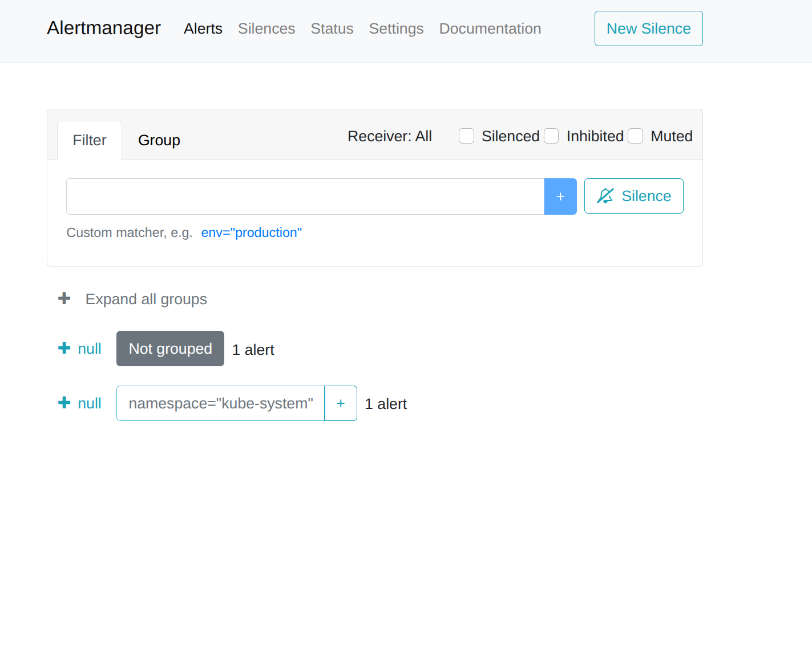
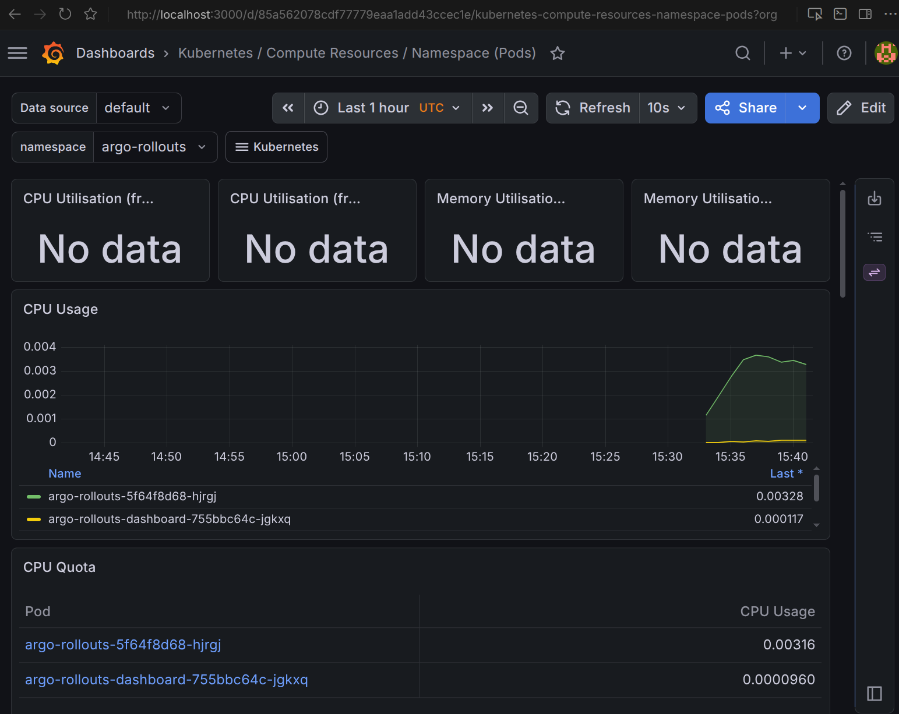
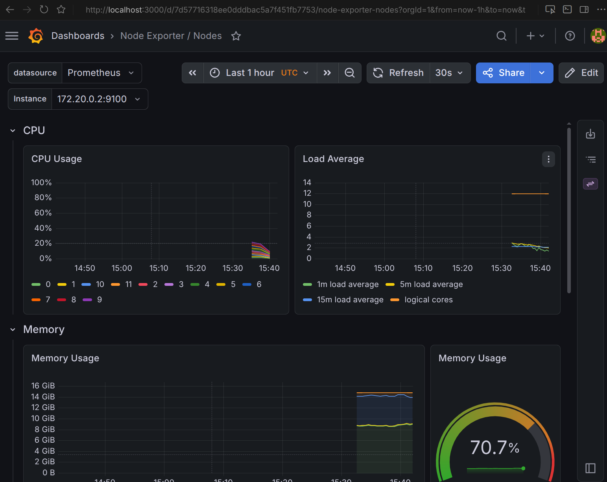
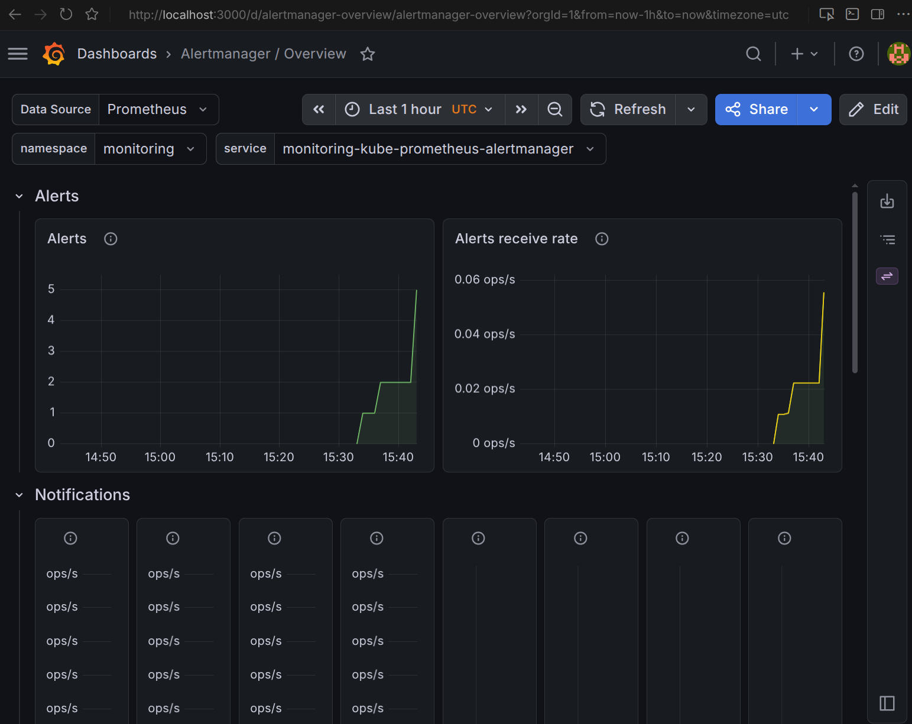
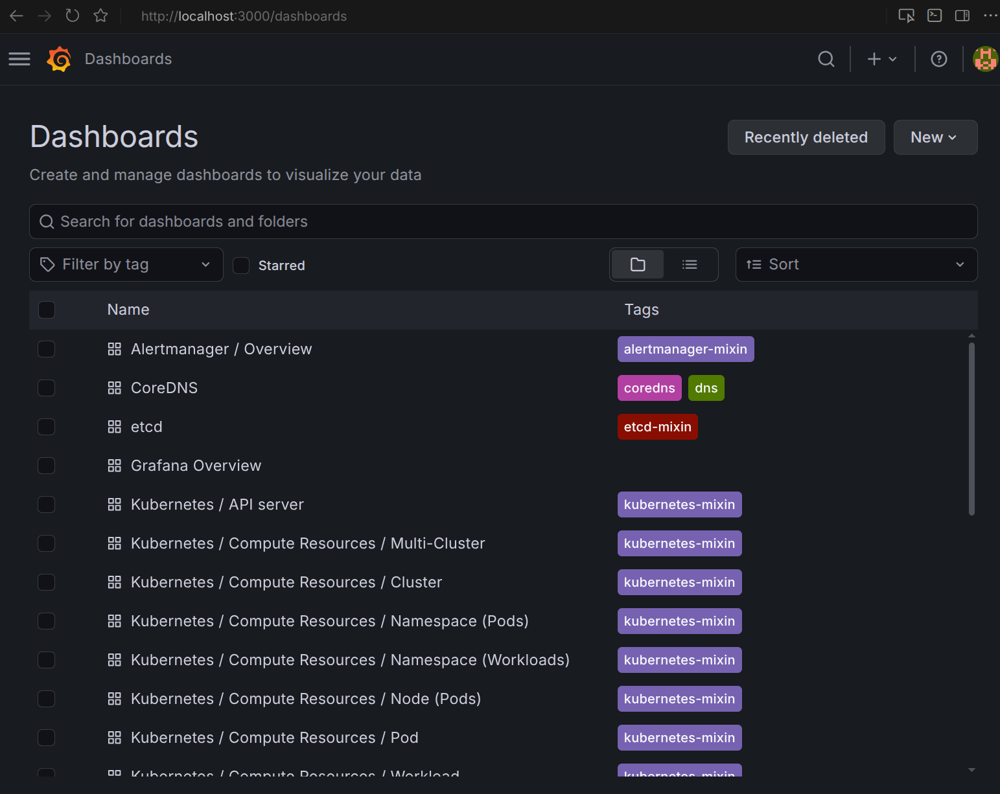

# Lab 16 — Kubernetes Monitoring & Init Containers

## 1) Stack Components

- **Prometheus Operator**: manages Prometheus/Alertmanager CRDs and reconciles configs.
- **Prometheus**: scrapes metrics from cluster/app targets and stores time-series data.
- **Alertmanager**: receives firing alerts from Prometheus and groups/routes notifications.
- **Grafana**: visualization layer for metrics dashboards.
- **kube-state-metrics**: exposes Kubernetes object state metrics (pods, deployments, etc.).
- **node-exporter**: exposes node-level OS metrics (CPU, memory, filesystem, network).

## 2) Installation Evidence

Commands:

```bash
docker compose -f k8s/docker-compose.yml up -d
docker compose -f k8s/docker-compose.yml exec k8s-dev bash -lc '
  kubectl config use-context kind-devops-lab
  helm repo add prometheus-community https://prometheus-community.github.io/helm-charts
  helm repo update
  helm upgrade --install monitoring prometheus-community/kube-prometheus-stack \
    --namespace monitoring --create-namespace
  kubectl rollout status statefulset/prometheus-monitoring-kube-prometheus-prometheus -n monitoring
  kubectl get po,svc -n monitoring
'
```

Evidence:

```text
NAME                                                     READY   STATUS    RESTARTS   AGE
alertmanager-monitoring-kube-prometheus-alertmanager-0   2/2     Running   0          2m16s
monitoring-grafana-786ff8546f-g4ht8                      3/3     Running   0          2m46s
monitoring-kube-prometheus-operator-54f68d65b4-fdrvn     1/1     Running   0          2m46s
monitoring-kube-state-metrics-5957bd45bc-b8s5b           1/1     Running   0          2m46s
monitoring-prometheus-node-exporter-5q854                1/1     Running   0          2m46s
prometheus-monitoring-kube-prometheus-prometheus-0       2/2     Running   0          2m16s

NAME                                              TYPE        CLUSTER-IP      PORT(S)
service/monitoring-grafana                        ClusterIP   10.96.126.253   80/TCP
service/monitoring-kube-prometheus-alertmanager   ClusterIP   10.96.249.248   9093/TCP,8080/TCP
service/monitoring-kube-prometheus-prometheus     ClusterIP   10.96.48.99     9090/TCP,8080/TCP
service/monitoring-kube-state-metrics             ClusterIP   10.96.59.152    8080/TCP
service/monitoring-prometheus-node-exporter       ClusterIP   10.96.112.27    9100/TCP
```

## 3) Dashboard Questions (Answered)

Used Prometheus API (same data source as Grafana dashboards):

```bash
kubectl -n monitoring port-forward svc/monitoring-kube-prometheus-prometheus 9090:9090
# then query /api/v1/query
```

1. **Pod resources (StatefulSet `devops-info`)**
   - CPU:
     - `devops-info-0`: `0.0009154` cores
     - `devops-info-1`: `0.0009008` cores
     - `devops-info-2`: `0.0010090` cores
   - Memory:
     - `devops-info-0`: `37425152` bytes
     - `devops-info-1`: `37449728` bytes
     - `devops-info-2`: `37408768` bytes

2. **Namespace analysis (default namespace CPU)**
   - Most CPU: `devops-info-2` (`0.0010094`)
   - Least CPU: `devops-info-1` (`0.0009008`)

3. **Node metrics**
   - Memory usage: `68.1214%`
   - Memory used: `10341.4297 MB`
   - CPU cores: `12`

4. **Kubelet managed workload size**
   - Pods observed: `44` (`count(kube_pod_info)`)
   - Containers observed: `48` (`count(kube_pod_container_info)`)

5. **Network traffic (default namespace)**
   - RX bytes/sec:
     - `devops-info-0`: `57.1080`
     - `devops-info-1`: `62.8595`
     - `devops-info-2`: `57.7733`
   - TX bytes/sec:
     - `devops-info-0`: `60.1680`
     - `devops-info-1`: `67.5433`
     - `devops-info-2`: `61.4833`

6. **Alerts (Alertmanager)**
   - Active alerts: `1`
   - Alertmanager API shows active `Watchdog` alert.

Evidence snippets:

```text
## q6_active_alerts
{"status":"success","data":{"resultType":"vector","result":[{"metric":{},"value":[1778168019.752,"1"]}]}}

## alertmanager_alerts
[{"labels":{"alertname":"Watchdog","severity":"none"},"status":{"state":"active"}}]
```

## 4) Init Containers

Implementation file:

- `k8s/monitoring/lab16-init-containers.yaml`

Included patterns:
- `wait-for-service` init container with `nslookup` loop.
- `init-download` init container that downloads `https://example.com` to shared `emptyDir`.
- Main container mounts same volume at `/data`.

Commands:

```bash
kubectl apply -f k8s/monitoring/lab16-init-containers.yaml
kubectl logs -n lab16 <pod> -c wait-for-service
kubectl logs -n lab16 <pod> -c init-download
kubectl exec -n lab16 <pod> -- ls -la /data
kubectl exec -n lab16 <pod> -- wc -c /data/index.html
```

Evidence:

```text
Name:	lab16-dependency.lab16.svc.cluster.local
Address: 10.96.131.6

saving to '/work-dir/index.html'
'/work-dir/index.html' saved

total 12
-rw-r--r--    1 root root 528 May  7 15:34 index.html
528 /data/index.html
```

## 5) Bonus — ServiceMonitor

Implemented:
- `k8s/devops-info/templates/servicemonitor.yaml`
- `serviceMonitor.*` values in chart values
- Enabled in `k8s/devops-info/values-statefulset.yaml`

Verification:

```text
NAMESPACE  NAME         AGE
default    devops-info  10s

## up_job_contains_devops
... "job":"devops-info","service":"devops-info","value":[..., "1"] ...
... "job":"devops-info-headless","service":"devops-info-headless","value":[..., "1"] ...
```





