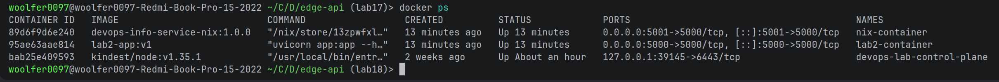
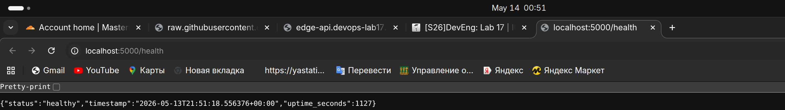
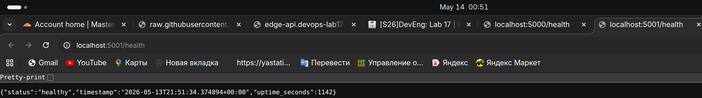
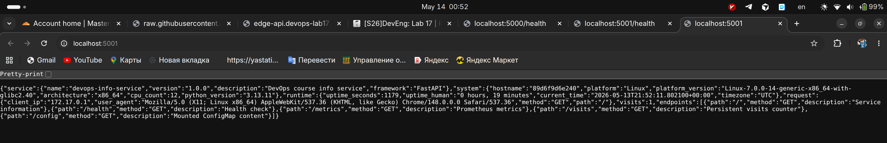

# Lab 18 Submission - Reproducible Builds with Nix

## Environment and Nix Verification

Repository path:

```bash
$ pwd
/home/woolfer0097/Code/DevOps-Core-Course1
```

Host environment evidence:

```bash
$ uname -a
Linux woolfer0097-Redmi-Book-Pro-15-2022 7.0.0-14-generic ... x86_64 GNU/Linux

$ docker --version
Docker version 29.3.1, build c2be9cc

$ docker info --format '{{.ServerVersion}}'
29.3.1
```

Host Nix was not installed at the start of this lab run:

```bash
$ command -v nix || true

$ nix --version || true
/usr/bin/bash: line 1: nix: command not found

$ sudo -n true && echo sudo-passwordless-ok || echo sudo-needs-password-or-unavailable
sudo: interactive authentication is required
sudo-needs-password-or-unavailable
```

Because installing Nix on the host requires interactive sudo authentication, the real Nix build evidence below was gathered with the official `nixos/nix:latest` container:

```bash
$ docker run --rm nixos/nix:latest nix --version
nix (Nix) 2.34.7
```

For final course submission, run the host installer locally and add a screenshot or terminal capture:

```bash
curl --proto '=https' --tlsv1.2 -sSf -L https://install.determinate.systems/nix | sh -s -- install
nix --version
```

## Task 1 - Reproducible Python App

The Lab 1 FastAPI app was copied into:

```text
labs/lab18/app_python/
```

Relevant source files:

```text
labs/lab18/app_python/app.py
labs/lab18/app_python/requirements.txt
labs/lab18/app_python/default.nix
```

The original `requirements.txt` pins only direct Python dependencies:

```text
fastapi==0.115.0
uvicorn[standard]==0.32.0
prometheus-client==0.23.1
```

### default.nix

```nix
{ pkgs ? import <nixpkgs> {} }:

let
  pythonEnv = pkgs.python3.withPackages (ps: with ps; [
    fastapi
    prometheus-client
    uvicorn
  ]);
in
pkgs.stdenvNoCC.mkDerivation rec {
  pname = "devops-info-service";
  version = "1.0.0";

  src = pkgs.lib.cleanSourceWith {
    src = ./.;
    filter = path: type:
      let
        base = builtins.baseNameOf path;
      in
        !(base == "result"
          || base == "venv"
          || base == ".venv"
          || base == "__pycache__"
          || base == ".pytest_cache"
          || pkgs.lib.hasSuffix ".pyc" base);
  };

  dontBuild = true;

  nativeBuildInputs = [
    pkgs.makeWrapper
  ];

  installPhase = ''
    runHook preInstall

    mkdir -p $out/share/${pname} $out/bin
    cp app.py $out/share/${pname}/app.py

    makeWrapper ${pythonEnv}/bin/uvicorn $out/bin/devops-info-service \
      --chdir $out/share/${pname} \
      --set-default HOST 0.0.0.0 \
      --set-default PORT 5000 \
      --set-default DATA_DIR /tmp/devops-info-service-data \
      --set-default CONFIG_FILE /tmp/devops-info-service-config.json \
      --add-flags "app:app --host 0.0.0.0 --port 5000"

    runHook postInstall
  '';

  meta = {
    description = "FastAPI DevOps information service built reproducibly with Nix";
    mainProgram = "devops-info-service";
  };
}
```

Field explanations:

| Field | Purpose |
|---|---|
| `pythonEnv` | Builds a Python runtime with FastAPI, Uvicorn, and prometheus-client from nixpkgs. |
| `stdenvNoCC.mkDerivation` | Creates a derivation for this app without compiling C/C++ code. |
| `pname` / `version` | Names the Nix output as `devops-info-service-1.0.0`. |
| `src` | Uses the current app directory while excluding generated build outputs and virtualenv/cache directories. |
| `nativeBuildInputs` | Adds `makeWrapper` so the executable can run with the pinned Python environment. |
| `installPhase` | Copies `app.py` into the Nix output and creates `bin/devops-info-service`. |
| `meta.mainProgram` | Identifies the default executable for tools that inspect the package. |

### Build Evidence

Command run inside the Nix validation container:

```bash
$ docker exec lab18-nix-work sh -lc 'nix-build --version && nix-build && readlink result && nix-hash --type sha256 result'
nix-build (Nix) 2.34.7
/nix/store/13zpwfxllibzdz13x1qdyfky3q86czc2-devops-info-service-1.0.0
a3b589463e640bf741460406f58642e6ba48d925cf99cb6218c7b2051027ace5
```

Normal rebuild produced the same store path and output hash:

```bash
$ orig=$(readlink result)
$ rm result
$ nix-build
$ rebuilt=$(readlink result)
$ test "$orig" = "$rebuilt" && echo "store-paths-match=yes"
store-paths-match=yes

$ nix-hash --type sha256 result
a3b589463e640bf741460406f58642e6ba48d925cf99cb6218c7b2051027ace5
```

Forced rebuild after deleting the output from the Nix store also produced the same path:

```bash
$ store=$(readlink result)
$ rm result
$ nix-store --delete "$store"
1 store paths deleted, 27.7 KiB freed

$ nix-build
$ readlink result
/nix/store/13zpwfxllibzdz13x1qdyfky3q86czc2-devops-info-service-1.0.0

$ nix-hash --type sha256 result
a3b589463e640bf741460406f58642e6ba48d925cf99cb6218c7b2051027ace5
```

### App Runtime Evidence

The Nix-built app was started and queried inside the Nix validation container:

```bash
$ ./result/bin/devops-info-service

$ curl -sS http://127.0.0.1:5000/health
{"status":"healthy","timestamp":"2026-05-13T21:29:16.036499+00:00","uptime_seconds":1}

$ curl -sS http://127.0.0.1:5000/ | head -c 500
{"service":{"name":"devops-info-service","version":"1.0.0","description":"DevOps course info service","framework":"FastAPI"},"system":{"hostname":"8492b002c9ad","platform":"Linux","platform_version":"Linux-7.0.0-14-generic-x86_64-with-glibc2.40","architecture":"x86_64","cpu_count":12,"python_version":"3.13.11"}...
```

### pip/venv vs Nix

The Lab 2 Docker build using `pip install -r requirements.txt` resolved these transitive dependencies on this run:

```bash
$ docker run --rm lab2-app:v1 pip freeze | sort
PyYAML==6.0.3
annotated-types==0.7.0
anyio==4.13.0
click==8.3.3
fastapi==0.115.0
h11==0.16.0
httptools==0.7.1
idna==3.15
prometheus_client==0.23.1
pydantic==2.13.4
pydantic_core==2.46.4
python-dotenv==1.2.2
starlette==0.38.6
typing-inspection==0.4.2
typing_extensions==4.15.0
uvicorn==0.32.0
uvloop==0.22.1
watchfiles==1.1.1
websockets==16.0
```

`requirements.txt` directly pins `fastapi`, `uvicorn`, and `prometheus-client`, but it does not pin exact artifacts or hashes for transitive dependencies such as `starlette`, `pydantic`, `click`, `h11`, `uvloop`, and `websockets`. Nix stores the whole dependency closure in immutable `/nix/store/...` paths, so the build result depends on all inputs, not only the three direct package names.

## Task 2 - Reproducible Docker Images

### docker.nix

```nix
{ pkgs ? import <nixpkgs> {} }:

let
  app = import ./default.nix { inherit pkgs; };
in
pkgs.dockerTools.buildLayeredImage {
  name = "devops-info-service-nix";
  tag = "1.0.0";

  contents = [
    app
  ];

  extraCommands = ''
    mkdir -p tmp
    chmod 1777 tmp
  '';

  config = {
    Cmd = [ "${app}/bin/devops-info-service" ];
    ExposedPorts = {
      "5000/tcp" = {};
    };
    Env = [
      "HOST=0.0.0.0"
      "PORT=5000"
      "DATA_DIR=/tmp/devops-info-service-data"
      "CONFIG_FILE=/tmp/devops-info-service-config.json"
    ];
    User = "1000:1000";
  };

  created = "1970-01-01T00:00:01Z";
}
```

Field explanations:

| Field | Purpose |
|---|---|
| `app` | Imports the exact app derivation from `default.nix`. |
| `buildLayeredImage` | Builds a Docker image from Nix store paths instead of a mutable base image. |
| `contents` | Includes the app and its runtime closure. |
| `extraCommands` | Creates writable `/tmp` for the non-root app process. |
| `config.Cmd` | Runs the Nix-built app binary. |
| `config.ExposedPorts` | Documents that the service listens on container port 5000. |
| `config.User` | Runs as UID/GID 1000 instead of root. |
| `created` | Fixes image creation time for reproducible image metadata. |

### Nix Docker Build Evidence

```bash
$ nix-build docker.nix
/nix/store/f6v8d6ngl0kp4wir3scj4cibgg8jy65c-devops-info-service-nix.tar.gz

$ sha256sum result
7972c69afda841b09d53b4db12d76a7d29cb91dac3798eaaf8ffb5ec3112b607  result

$ rm result && nix-build docker.nix && sha256sum result
/nix/store/f6v8d6ngl0kp4wir3scj4cibgg8jy65c-devops-info-service-nix.tar.gz
7972c69afda841b09d53b4db12d76a7d29cb91dac3798eaaf8ffb5ec3112b607  result
```

Loaded into the host Docker daemon:

```bash
$ docker exec lab18-nix-work sh -lc 'cat result' | docker load
Loaded image: devops-info-service-nix:1.0.0
```

Nix image metadata:

```bash
$ docker inspect -f 'nix-image Created={{.Created}} Id={{.Id}} Size={{.Size}} User={{.Config.User}} Cmd={{json .Config.Cmd}}' devops-info-service-nix:1.0.0
nix-image Created=1970-01-01T00:00:01Z Id=sha256:f1b831fdd83c510e264fcb5d64b4f6edb3a51c56026ac15e11085bf033352f28 Size=198772106 User=1000:1000 Cmd=["/nix/store/13zpwfxllibzdz13x1qdyfky3q86czc2-devops-info-service-1.0.0/bin/devops-info-service"]
```

### Traditional Dockerfile Comparison

The original Lab 2 image was rebuilt twice with `--no-cache`.

```bash
$ docker inspect -f 'lab2-app:v1 Created={{.Created}} Id={{.Id}} Size={{.Size}}' lab2-app:v1
lab2-app:v1 Created=2026-05-14T00:31:23.410627226+03:00 Id=sha256:23b9ca17de1383f7a4d5f13654113bf7beecc7aba8948f1f86c1e2ba0d4c590f Size=164309363

$ docker inspect -f 'lab2-app:v2 Created={{.Created}} Id={{.Id}} Size={{.Size}}' lab2-app:v2
lab2-app:v2 Created=2026-05-14T00:31:46.644693329+03:00 Id=sha256:5b1906678ce04a61974e5c6efd370f360490954be86a55d7c8cb4c68deed1568 Size=164309363
```

Saved image hashes differed:

```bash
$ docker save lab2-app:v1 | sha256sum
1ef8e327ce41ebf1cf9d2b0f15bdd3a65c073492f9749abe22f1059dec70a73e  -

$ docker save lab2-app:v2 | sha256sum
ab33e2ecc714f040f85b02c3fcefd9672c8358380f6b5d112348cffadd27a08b  -
```

Image sizes from the real Docker daemon:

```bash
$ docker images --format '{{.Repository}}:{{.Tag}} {{.ID}} {{.Size}}' | grep -E '^(lab2-app|devops-info-service-nix):'
lab2-app:v2 5b1906678ce0 164MB
lab2-app:v1 23b9ca17de13 164MB
devops-info-service-nix:1.0.0 f1b831fdd83c 199MB
```

In this run the Nix image is larger than the traditional Dockerfile image because it carries the full Nix Python runtime closure. The important result is reproducibility: the Nix image tarball hash repeated exactly, while two traditional Docker builds produced different image IDs and saved-image hashes.

### Side-by-Side Runtime Evidence

```bash
$ docker run -d -p 5000:5000 --name lab2-container lab2-app:v1
95ae63aae81443d1caab02ce94783b79eb3f55bd9d36d4823a6fd4e6ace0b420

$ docker run -d -p 5001:5000 --name nix-container devops-info-service-nix:1.0.0
89d6f9d6e240f62ea0dc0564794e17767fa67d673da109a9761d0bf3b1f233a1

$ curl -sS http://localhost:5000/health
{"status":"healthy","timestamp":"2026-05-13T21:32:33.689993+00:00","uptime_seconds":2}

$ curl -sS http://localhost:5001/health
{"status":"healthy","timestamp":"2026-05-13T21:32:33.701320+00:00","uptime_seconds":1}

$ docker ps --filter name=lab2-container --filter name=nix-container --format '{{.Names}} {{.Image}} {{.Status}} {{.Ports}}'
nix-container devops-info-service-nix:1.0.0 Up 2 seconds 0.0.0.0:5001->5000/tcp, [::]:5001->5000/tcp
lab2-container lab2-app:v1 Up 3 seconds 0.0.0.0:5000->5000/tcp, [::]:5000->5000/tcp
```

### Layer History

Traditional Dockerfile layers show build-time relative timestamps:

```bash
$ docker history lab2-app:v1 | head -n 12
IMAGE          CREATED              CREATED BY                                      SIZE      COMMENT
23b9ca17de13   About a minute ago   CMD ["uvicorn" "app:app" "--host" "0.0.0.0" ... 0B        buildkit.dockerfile.v0
<missing>      About a minute ago   EXPOSE [5000/tcp]                               0B        buildkit.dockerfile.v0
<missing>      About a minute ago   USER appuser                                    0B        buildkit.dockerfile.v0
<missing>      About a minute ago   RUN /bin/sh -c chown -R appuser:appgroup /ap... 11kB      buildkit.dockerfile.v0
<missing>      About a minute ago   COPY app.py . # buildkit                        10.9kB    buildkit.dockerfile.v0
<missing>      About a minute ago   RUN /bin/sh -c pip install --no-cache-dir -r... 46.6MB    buildkit.dockerfile.v0
```

Nix image layers are content/store-path based:

```bash
$ docker history devops-info-service-nix:1.0.0 | head -n 12
IMAGE          CREATED   CREATED BY   SIZE      COMMENT
f1b831fdd83c   N/A                    195B      store paths: ['/nix/store/n0x7zsmpny8l9zx5z0df7hwqn3245sjv-devops-info-service-nix-customisation-layer']
<missing>      N/A                    11.4kB    store paths: ['/nix/store/13zpwfxllibzdz13x1qdyfky3q86czc2-devops-info-service-1.0.0']
<missing>      N/A                    215kB     store paths: ['/nix/store/m0gw2iq6nz12lamhczk79b71kdxzjmzq-python3-3.13.11-env']
<missing>      N/A                    1.58MB    store paths: ['/nix/store/ricxh92clq2d5r1l7awb2mj897vcq5ff-python3.13-fastapi-0.116.1']
<missing>      N/A                    5.44MB    store paths: ['/nix/store/6hzf4hjfg2my2hq6wldqzd2va3mrb19b-python3.13-pydantic-2.11.7']
```

### Why Traditional Dockerfiles Are Not Bit-for-Bit Reproducible

Traditional Dockerfiles are usually deterministic only at the source-file level, not at the final image byte level. This lab's evidence shows:

- Build timestamps changed between `lab2-app:v1` and `lab2-app:v2`.
- Image IDs changed even though the Dockerfile and app source did not.
- `pip install` resolved transitive dependencies at build time from PyPI.
- The base image tag `python:3.13-slim` points to external registry content, not a Nix-style locked dependency graph.

Nix improves this by hashing the complete build graph and using immutable store paths for the app, Python runtime, and dependencies.

## Bonus - Nix Flakes

### flake.nix

```nix
{
  description = "DevOps Info Service - reproducible Nix build";

  inputs = {
    nixpkgs.url = "github:NixOS/nixpkgs/nixos-24.11";
  };

  outputs = { self, nixpkgs }:
    let
      system = "x86_64-linux";
      pkgs = import nixpkgs { inherit system; };
      app = import ./default.nix { inherit pkgs; };
    in
    {
      packages.${system} = {
        default = app;
        dockerImage = import ./docker.nix { inherit pkgs; };
      };

      apps.${system}.default = {
        type = "app";
        program = "${app}/bin/devops-info-service";
      };

      devShells.${system}.default = pkgs.mkShell {
        packages = [
          (pkgs.python3.withPackages (ps: with ps; [
            fastapi
            prometheus-client
            uvicorn
          ]))
        ];
      };
    };
}
```

### flake.lock Evidence

`nix flake update` generated `labs/lab18/app_python/flake.lock`.

```json
{
  "locked": {
    "lastModified": 1751274312,
    "narHash": "sha256-/bVBlRpECLVzjV19t5KMdMFWSwKLtb5RyXdjz3LJT+g=",
    "owner": "NixOS",
    "repo": "nixpkgs",
    "rev": "50ab793786d9de88ee30ec4e4c24fb4236fc2674",
    "type": "github"
  },
  "original": {
    "owner": "NixOS",
    "ref": "nixos-24.11",
    "repo": "nixpkgs",
    "type": "github"
  }
}
```

Flake build evidence:

```bash
$ nix --extra-experimental-features "nix-command flakes" flake update
Added input 'nixpkgs':
  github:NixOS/nixpkgs/50ab793786d9de88ee30ec4e4c24fb4236fc2674?narHash=sha256-/bVBlRpECLVzjV19t5KMdMFWSwKLtb5RyXdjz3LJT%2Bg%3D

$ nix --extra-experimental-features "nix-command flakes" build
default=/nix/store/18myrbvnj0zy5qi2m22hqfkd01i6dx9f-devops-info-service-1.0.0

$ nix --extra-experimental-features "nix-command flakes" build .#dockerImage
dockerImage=/nix/store/h6d50q43yyb3sn0h8ifl0sn8q7skkrwm-devops-info-service-nix.tar.gz

$ sha256sum result
24ecb357121894db168f71d41544282506942e960197239366eca12cff1e93b1  result
```

Development shell evidence:

```bash
$ nix develop --command python -c 'import sys, importlib.metadata as m; print(sys.version.split()[0]); print(m.version("fastapi")); print(m.version("uvicorn")); print(m.version("prometheus-client"))'
3.12.8
0.115.3
0.32.0
0.21.0
```

The flake build uses the locked `nixos-24.11` nixpkgs revision, so it resolves a Python 3.12 dependency set. The non-flake `nix-build` in the `nixos/nix:latest` container used that container's default nixpkgs and resolved a Python 3.13 dependency set. This difference is exactly why `flake.lock` matters.

## Lab 10 Helm Comparison

From `k8s/devops-info/values.yaml`:

```yaml
image:
  repository: woolfer0097kek/devops-info-python
  pullPolicy: IfNotPresent
  tag: "latest"
```

From `k8s/devops-info/values-prod.yaml`:

```yaml
image:
  tag: "1.0.0"
```

Comparison:

| Aspect | Lab 1 venv + requirements.txt | Lab 10 Helm values | Lab 18 Nix Flake |
|---|---|---|---|
| Python version | Comes from local system or base image | Hidden inside image | Locked by nixpkgs revision |
| Direct dependencies | Pinned by package version | Hidden inside image | Resolved from locked nixpkgs |
| Transitive dependencies | Resolved by pip at install time | Hidden inside image | Locked in Nix closure |
| Build tools | Not locked | Not locked | Locked by nixpkgs |
| Deployment target | Local process | Kubernetes manifests | Build artifact and dev shell |
| Reproducibility | Approximate | Depends on mutable image tag/digest | Content-addressed and lock-file based |

Helm is good at declaring Kubernetes deployment shape, but `values.yaml` does not prove what is inside the image. A tag like `latest` is mutable, and even `1.0.0` can be overwritten unless deployment uses an immutable digest. Nix flakes lock the build inputs before the image exists, so the image can then be pushed and referenced by digest from Helm.

## Reflections

Nix would have helped in Lab 1 by replacing local Python and virtualenv assumptions with a single derivation. A teammate could build the same app with the same Python runtime and dependency closure without matching my system Python or manually recreating a virtual environment.

Nix would have helped in Lab 2 by replacing mutable base-image and `pip install` steps with a Docker image generated from immutable store paths. The Nix Docker image also fixed the creation timestamp to `1970-01-01T00:00:01Z`, which removes one common source of non-reproducible image hashes.

In CI/CD, this matters for rollback and auditing. If a production incident happens, the build output can be tied back to exact Nix inputs and store paths instead of "whatever PyPI and the base image registry returned at build time."

## Screenshots




