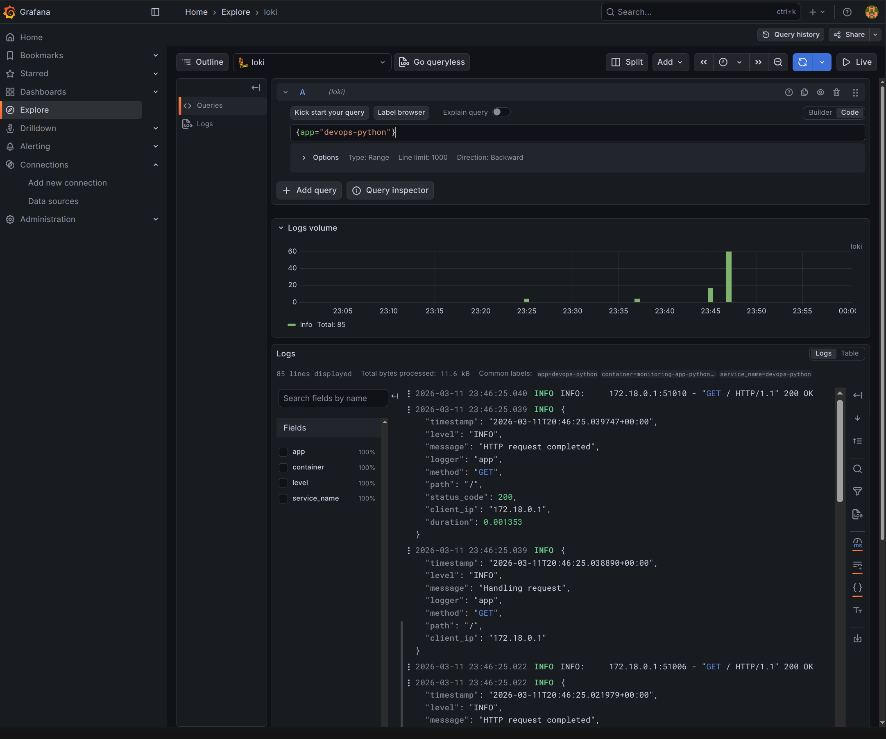
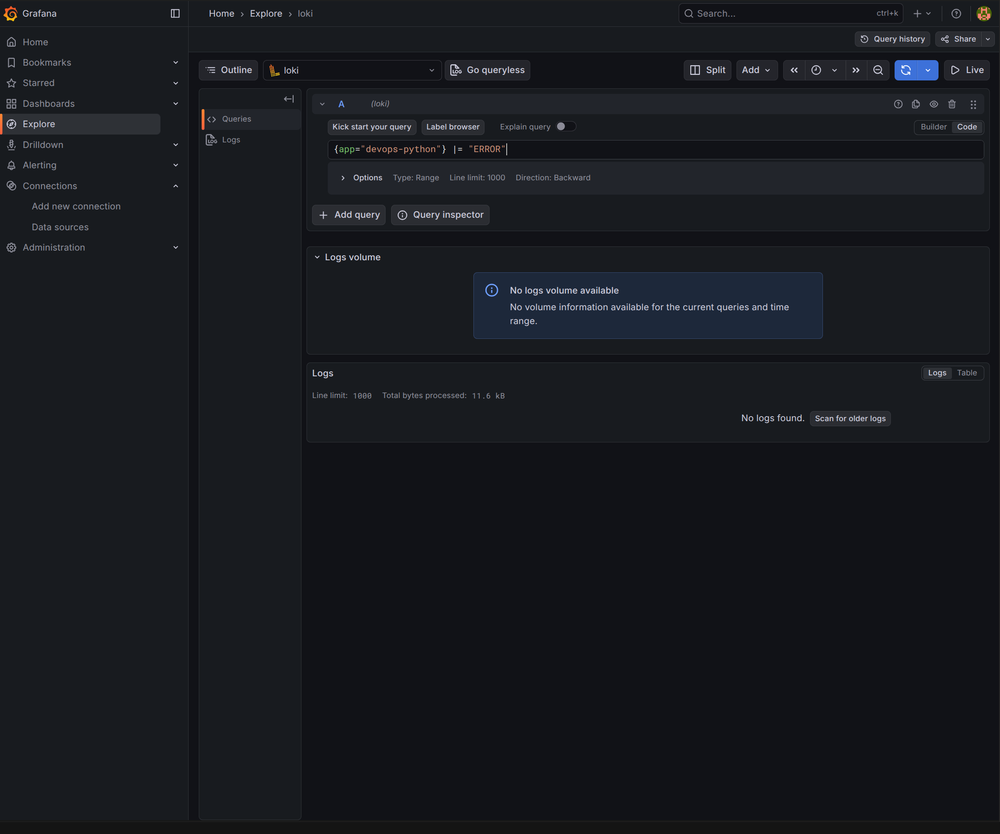
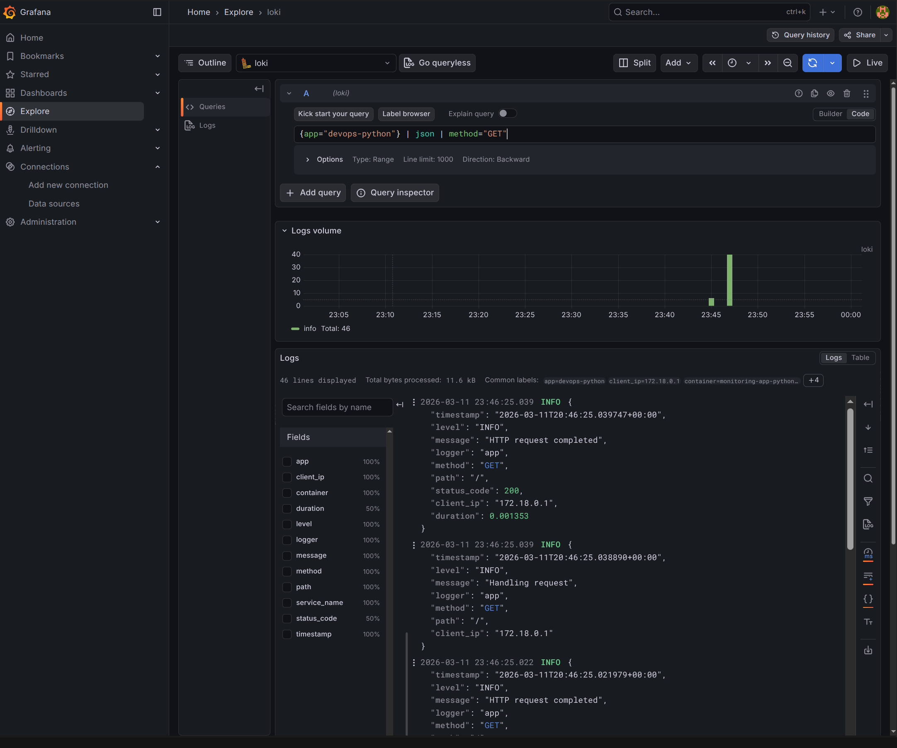
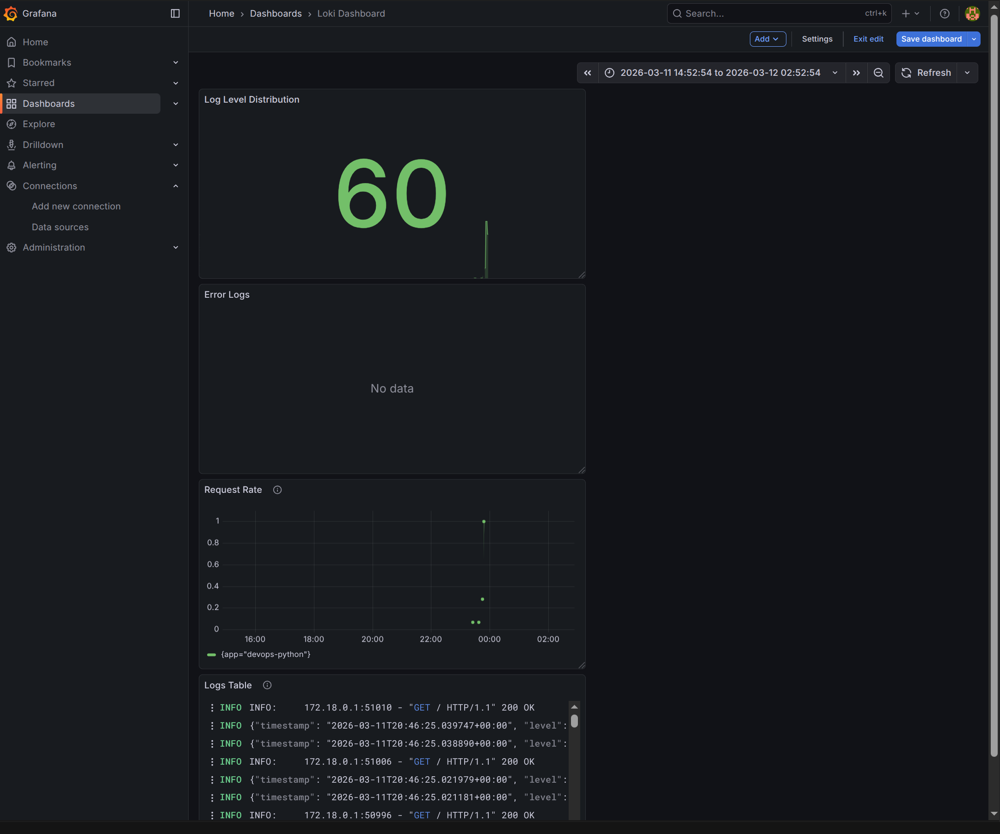

## Lab 7 — Loki Stack Monitoring

### Architecture

```
┌──────────┐  ┌──────────┐
│app-python│  │  app-go  │
│  :8000   │  │  :8001   │
└────┬─────┘  └────┬─────┘
     │  Docker logs │
     ▼              ▼
┌──────────────────────┐
│  Promtail  (:9080)   │  Docker SD → filters label logging=promtail
│  relabel: container, │
│           app        │
└──────────┬───────────┘
           │ /loki/api/v1/push
           ▼
┌──────────────────────┐
│   Loki  (:3100)      │  TSDB + filesystem, schema v13
│   retention: 168h    │
└──────────┬───────────┘
           │
           ▼
┌──────────────────────┐
│  Grafana  (:3000)    │  Loki data source → Explore / Dashboards
└──────────────────────┘
```

All services share a `logging` bridge network.

### Setup Guide

```bash
cd monitoring
docker compose up -d
docker compose ps
```

```
woolfer0097@woolfer0097-Redmi-Book-Pro-15-2022 ~/C/D/monitoring (lab7)> docker compose ps -a
NAME                      IMAGE                    COMMAND                  SERVICE      CREATED         STATUS                        PORTS
monitoring-app-go-1       monitoring-app-go        "/app/devops-info-se…"   app-go       2 minutes ago   Up 2 minutes                  0.0.0.0:8001->8001/tcp, [::]:8001->8001/tcp, 8080/tcp
monitoring-app-python-1   monitoring-app-python    "uvicorn app:app --h…"   app-python   2 minutes ago   Up 2 minutes                  5000/tcp, 0.0.0.0:8000->8000/tcp, [::]:8000->8000/tcp
monitoring-grafana-1      grafana/grafana:12.3.1   "/run.sh"                grafana      2 minutes ago   Up About a minute (healthy)   0.0.0.0:3000->3000/tcp, [::]:3000->3000/tcp
monitoring-loki-1         grafana/loki:3.0.0       "/usr/bin/loki -conf…"   loki         2 minutes ago   Up 2 minutes (healthy)        0.0.0.0:3100->3100/tcp, [::]:3100->3100/tcp
monitoring-promtail-1     grafana/promtail:3.0.0   "/usr/bin/promtail -…"   promtail     2 minutes ago   Up About a minute (healthy)   
```

Then in Grafana (`http://localhost:3000`): **Connections → Data sources → Add Loki** with URL `http://loki:3100`.

### Configuration

**Loki** (`loki/config.yml`) — key choices:

```yaml
schema_config:
  configs:
    - from: 2024-01-01
      store: tsdb            # 10x faster queries vs boltdb-shipper
      object_store: filesystem
      schema: v13

limits_config:
  retention_period: 168h     # 7-day retention

compactor:
  retention_enabled: true
  delete_request_store: filesystem
```

TSDB chosen over boltdb-shipper for better query performance and lower memory. Filesystem object store is sufficient for single-node deployment.

**Promtail** (`promtail/config.yml`) — key choices:

```yaml
scrape_configs:
  - job_name: docker
    docker_sd_configs:
      - host: unix:///var/run/docker.sock
        refresh_interval: 5s
        filters:
          - name: label
            values: ["logging=promtail"]   # only scrape labeled containers
    relabel_configs:
      - source_labels: ["__meta_docker_container_name"]
        target_label: container
        regex: "/?(.+)"
      - source_labels: ["__meta_docker_container_label_app"]
        target_label: app
```

Docker SD discovers containers via the Docker socket. The `filters` entry restricts discovery at the API level to only containers with `logging=promtail` label. Relabeling extracts the container name (stripping the leading `/`) and the `app` label for use in LogQL queries.

### Application Logging

**Python app** uses `logging` with a custom `JSONFormatter` outputting structured JSON to stdout:

```json
{"timestamp": "2026-03-11T20:37:18Z", "level": "INFO", "message": "GET /", "method": "GET", "path": "/", "status_code": 200, "client_ip": "172.18.0.1"}
```

Logged events: startup, each HTTP request (method, path, status, client IP), errors/exceptions.

### Dashboard

Four panels:

| Panel | Visualization | Query | Purpose |
|-------|--------------|-------|---------|
| Logs Table | Logs | `{app=~"devops-.*"}` | Live tail of all app logs |
| Request Rate | Time series | `sum by (app) (rate({app=~"devops-.*"}[1m]))` | Logs/sec per app — spot traffic spikes |
| Error Logs | Logs | `{app=~"devops-.*"} \| json \| level="ERROR"` | Filter to errors only for quick triage |
| Log Level Distribution | Stat/Pie | `sum by (level) (count_over_time({app=~"devops-.*"} \| json [5m]))` | Ratio of INFO vs ERROR over 5 min |

### Production Config

**Resource limits** — `deploy.resources` on every service:

| Service | CPU limit | Memory limit |
|---------|-----------|-------------|
| Loki | 1.0 | 1G |
| Promtail | 1.0 | 512M |
| Grafana | 1.0 | 1G |
| app-python / app-go | 0.5 | 512M |

**Health checks** — Loki (`wget --spider /ready`), Promtail (`bash /dev/tcp`), Grafana (`curl /api/health`). Promtail and Grafana use `depends_on: loki: condition: service_healthy` to wait for Loki readiness.

**Security** — for production: set `GF_AUTH_ANONYMOUS_ENABLED=false`, configure admin password via `.env` file (not committed).

**Retention** — 7-day (`168h`) via `limits_config.retention_period` + compactor with `retention_enabled: true`.

### Testing

# Verify services

```bash
woolfer0097@woolfer0097-Redmi-Book-Pro-15-2022 ~/C/D/monitoring (lab7)> curl http://localhost:3100/ready
ready
woolfer0097@woolfer0097-Redmi-Book-Pro-15-2022 ~/C/D/monitoring (lab7)> curl http://localhost:8000
{"service":{"name":"devops-info-service","version":"1.0.0","description":"DevOps course info service","framework":"FastAPI"},"system":{"hostname":"16ca50c6e103","platform":"Linux","platform_version":"Linux-6.17.0-14-generic-x86_64-with-glibc2.41","architecture":"x86_64","cpu_count":12,"python_version":"3.13.12"},"runtime":{"uptime_seconds":28,"uptime_human":"0 hours, 0 minutes","current_time":"2026-03-11T20:44:50.554678+00:00","timezone":"UTC"},"request":{"client_ip":"172.18.0.1","user_agent":"curl/8.14.1","method":"GET","path":"/"},"endpoints":[{"path":"/","method":"GET","description":"Service information"},{"path":"/health","method":"GET","description":"Health check"}]}⏎                                                                                                       
woolfer0097@woolfer0097-Redmi-Book-Pro-15-2022 ~/C/D/monitoring (lab7)> curl http://localhost:8001
{"service":{"name":"devops-info-service","version":"1.0.0","description":"DevOps course info service (Go)","framework":"net/http"},"system":{"hostname":"69f3124f122e","platform":"linux","architecture":"amd64","cpu_count":12,"go_version":"go1.22.12","operating_system":"linux"},"runtime":{"uptime_seconds":480,"uptime_human":"0 hours, 8 minutes","current_time":"2026-03-11T20:44:52.816353771Z","timezone":"UTC"},"request":{"client_ip":"172.18.0.1","user_agent":"curl/8.14.1","method":"GET","path":"/"},"endpoints":[{"path":"/","method":"GET","description":"Service information"},{"path":"/health","method":"GET","description":"Health check"}]}
```

```
for i in {1..20}; do curl -s http://localhost:8000/; done
for i in {1..20}; do curl -s http://localhost:8000/health; done
```

LogQL queries in Grafana Explore:

- `{app="devops-python"}` — all logs from the Python app

- `{app="devops-python"} |= "ERROR"` — text filter for error substring

- `{app="devops-python"} | json | method="GET"` — parse JSON, filter by HTTP method


# Dashboard overview


### Challenges

| Problem | Solution |
|---------|----------|
| Loki healthcheck always `unhealthy` | Alpine-based image has no `curl`; switched to `wget --spider` |
| Promtail healthcheck stuck at `health: starting` | Debian-based image has neither `curl` nor `wget`; used `bash -c '</dev/tcp/localhost/9080'` |
| Promtail error: "at least one label pair is required per stream" | Removed `pipeline_stages: - docker: {}` (incompatible with `docker_sd_configs` which delivers pre-parsed logs) and added Docker API-level `filters` instead of relabel `keep` |
| Promtail mount error on snap Docker | Mapped `/var/snap/docker/common/var-lib-docker/containers` to `/var/lib/docker/containers` inside the container |
