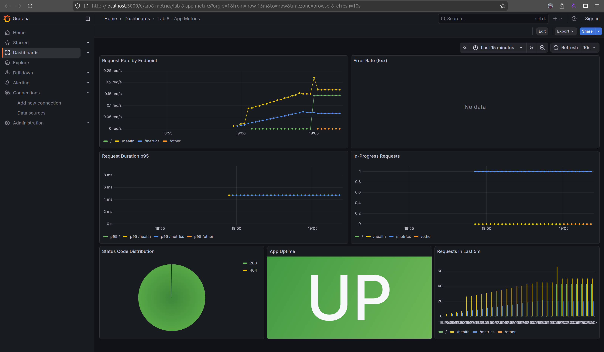

## Lab 8 — Metrics & Monitoring with Prometheus

### Architecture

```text
app-python (:5000, /metrics)
              │
              ▼
      Prometheus (:9090)
   scrape interval: 15s
              │
              ▼
      Grafana (:3000)
data sources: Loki + Prometheus
```

All services run in the shared `logging` Docker network.

### What Was Implemented

- Added Prometheus instrumentation to `app_python/app.py`.
- Added `prometheus-client` dependency in `app_python/requirements.txt`.
- Added Prometheus service and retention config to `monitoring/docker-compose.yml`.
- Added scrape config in `monitoring/prometheus/prometheus.yml`.
- Enabled Grafana internal metrics scraping (`GF_METRICS_ENABLED=true`).
- Added health checks for `app-python`, `app-go`, and `prometheus`.

### Application Instrumentation

Implemented metrics in `app_python/app.py`:

- `http_requests_total{method,endpoint,status_code}` (Counter)
- `http_request_duration_seconds{method,endpoint}` (Histogram)
- `http_requests_in_progress{method,endpoint}` (Gauge)
- `devops_info_endpoint_calls_total{endpoint}` (Counter)
- `devops_info_system_collection_seconds` (Histogram)

Endpoint labels are normalized (`/`, `/health`, `/metrics`, `/other`) to avoid high-cardinality labels.

`/metrics` endpoint is exposed for Prometheus:

```python
@app.get("/metrics")
async def metrics() -> Response:
    return Response(content=generate_latest(), media_type=CONTENT_TYPE_LATEST)
```

### Prometheus Configuration

File: `monitoring/prometheus/prometheus.yml`

- Global scrape/evaluation interval: `15s`
- Jobs configured:
  - `prometheus` (`localhost:9090`)
  - `app-python` (`app-python:5000/metrics`)
  - `loki` (`loki:3100/metrics`)
  - `grafana` (`grafana:3000/metrics`)

Retention configured in `docker-compose.yml`:

- `--storage.tsdb.retention.time=15d`
- `--storage.tsdb.retention.size=10GB`

### Dashboard Panels (Prometheus)

Create a Grafana dashboard with at least these panels:

1. Request rate by endpoint  
   `sum by (endpoint) (rate(http_requests_total[5m]))`
2. Error rate (5xx)  
   `sum(rate(http_requests_total{status_code=~"5.."}[5m]))`
3. p95 request duration  
   `histogram_quantile(0.95, sum by (le, endpoint) (rate(http_request_duration_seconds_bucket[5m])))`
4. In-progress requests  
   `sum by (endpoint) (http_requests_in_progress)`
5. Status code distribution  
   `sum by (status_code) (rate(http_requests_total[5m]))`
6. Service uptime status  
   `up{job="app-python"}`

Ready import file included:

- `monitoring/docs/grafana-lab8-dashboard.json`

Import path in Grafana:

1. Dashboards -> New -> Import
2. Upload `grafana-lab8-dashboard.json`
3. Select your Prometheus data source
4. Click Import

### PromQL Examples

1. All monitored targets up:
   `up`
2. App request throughput:
   `sum(rate(http_requests_total[5m]))`
3. 5xx error ratio:
   `sum(rate(http_requests_total{status_code=~"5.."}[5m])) / sum(rate(http_requests_total[5m]))`
4. p95 latency:
   `histogram_quantile(0.95, sum by (le) (rate(http_request_duration_seconds_bucket[5m])))`
5. Active requests:
   `sum(http_requests_in_progress)`

### Production Hardening

In `monitoring/docker-compose.yml`:

- Health checks for key services (`loki`, `promtail`, `prometheus`, `grafana`, `app-python`, `app-go`)
- CPU and memory limits for each service
- Persistent volumes:
  - `loki-data`
  - `grafana-data`
  - `prometheus-data`
- Retention policy for Prometheus time-series data (15d / 10GB cap)

### Validation Commands

```bash
cd monitoring
docker compose up -d --build
docker compose ps
curl -s http://localhost:8000/metrics | sed -n '1,40p'
curl -s http://localhost:9090/-/healthy
curl -s "http://localhost:9090/api/v1/query?query=up"
```

Generate traffic for charts:

```bash
for i in {1..40}; do curl -s http://localhost:8000/ >/dev/null; done
for i in {1..20}; do curl -s http://localhost:8000/health >/dev/null; done
```

### Evidence



### Challenges & Notes

- If `grafana` target is `DOWN`, verify `GF_METRICS_ENABLED=true` and restart Grafana.
- If app metrics are empty, generate traffic before querying.
- If a target is `DOWN`, test from Prometheus network path and verify correct service port/path.
